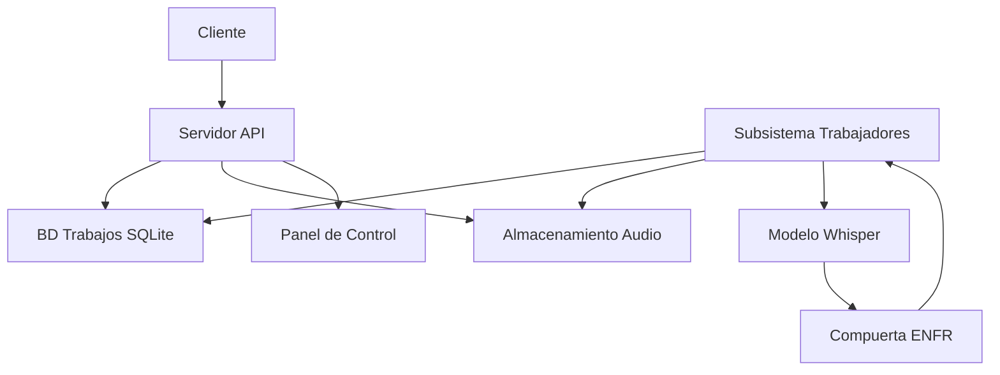
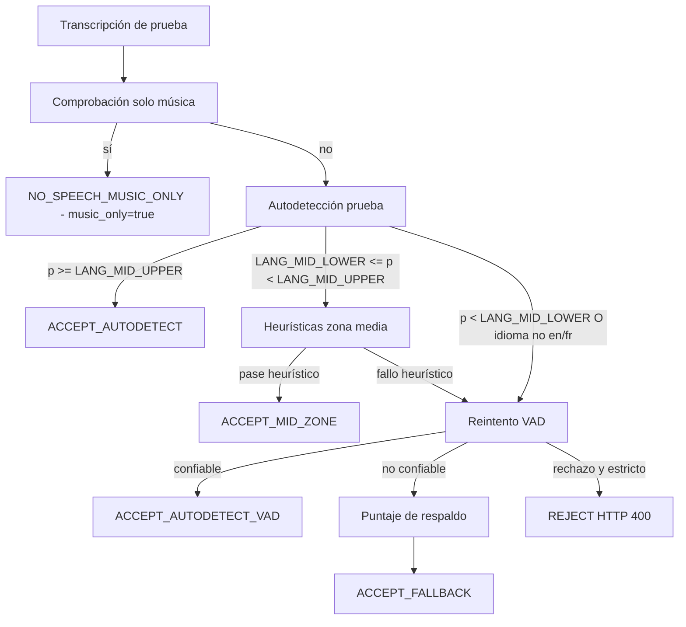
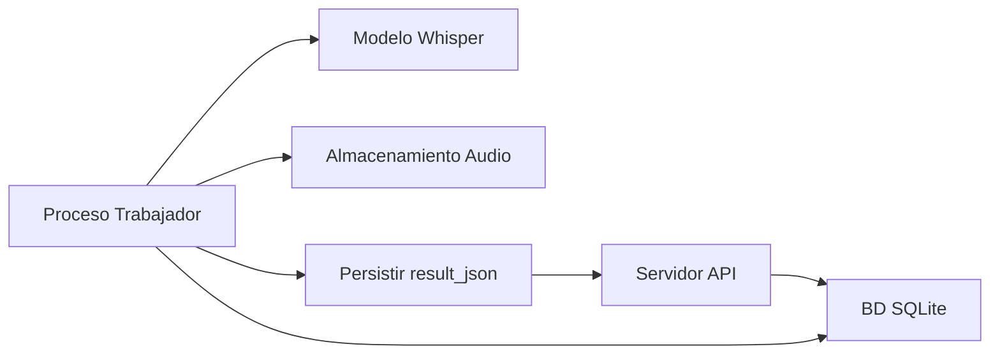
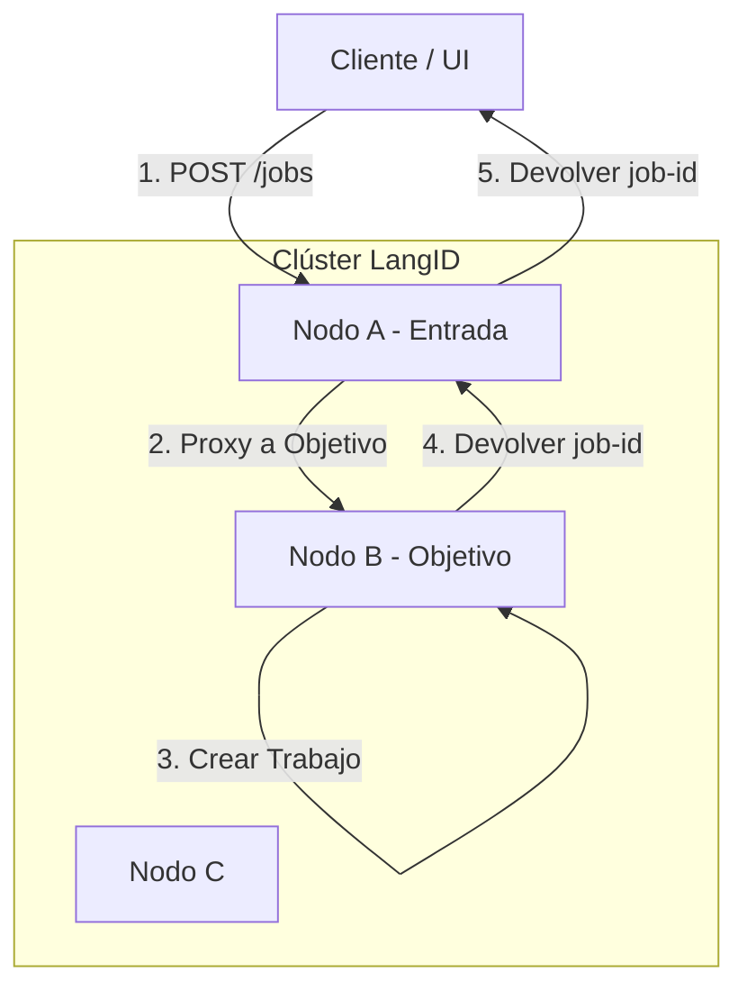
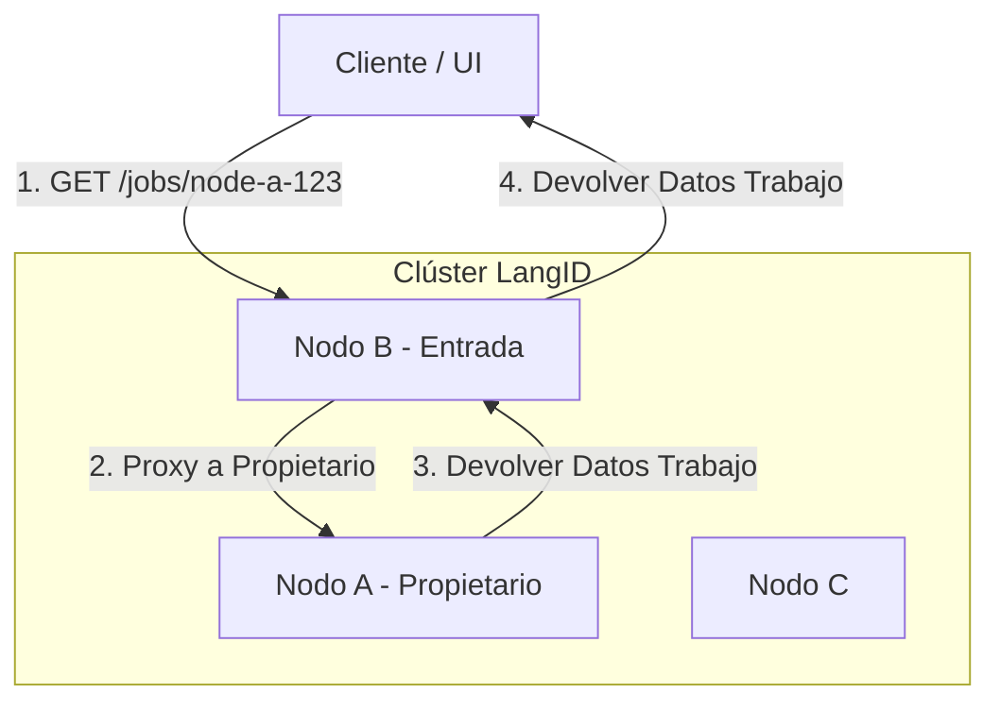

# Servicio LangID - README Técnico para Windows Server

## 1. Descripción General del Proyecto

El Servicio LangID es un microservicio multihilo de alto rendimiento diseñado para la identificación de idiomas y la transcripción opcional de archivos de audio, optimizado para su despliegue en **Windows Server**. Expone una API RESTful para enviar clips de audio, que luego son procesados por un grupo de trabajadores en segundo plano aprovechando la biblioteca `faster-whisper`.

**Propósito Principal:**
1.  **Detección de Idioma:** Identificar rápida y precisamente el idioma hablado en un archivo de audio.
2.  **Transcripción (Opcional):** Proporcionar una transcripción de texto del audio.

**Módulos Internos:**
*   `app\main.py`: El punto de entrada de la aplicación FastAPI, definiendo los endpoints de la API y el ciclo de vida del trabajador.
*   `app\services\detector.py`: La lógica central para interactuar con el modelo `faster-whisper`.
*** Comienzo del README Unificado ***

# Servicio LangID — README Unificado

## Tabla de Contenidos
- [A. Descripción General](#a-descripción-general)
- [B. Arquitectura](#b-arquitectura)
- [C. Tubería Completa de Compuerta EN/FR](#c-tubería-completa-de-compuerta-enfr)
- [D. Detalles del Modelo Whisper + GPU](#d-detalles-del-modelo-whisper--gpu)
- [E. Sistema de Trabajadores](#e-sistema-de-trabajadores)
- [F. Configuración (.env)](#f-configuración-env)
- [G. Referencia de la API](#g-referencia-de-la-api)
- [H. Almacenamiento + Diseño de BD](#h-almacenamiento--diseño-de-bd)
- [I. Instalación y Ejecución](#i-instalación-y-ejecución)
- [I. Ejemplos](#i-ejemplos)
- [J. Despliegue en Windows](#j-despliegue-en-windows)
- [K. Arquitectura de Clúster HA Interno](#k-arquitectura-de-clúster-ha-interno)
- [L. Métricas de Prometheus y Monitoreo](#l-métricas-de-prometheus-y-monitoreo)
- [M. Configuración de Códigos de Idioma](#m-configuración-de-códigos-de-idioma)

## A. Descripción General

El Servicio LangID es un microservicio backend que realiza la detección de idioma Inglés vs Francés y transcripción opcional para archivos de audio. El servicio acepta audio vía carga de archivos o URL, ejecuta una pasada corta de autodetección usando Whisper, aplica una compuerta EN/FR conservadora (incluyendo un detector de solo música), reintenta opcionalmente la detección con una prueba recortada por VAD, y produce un resultado JSON estructurado persistido con el registro del trabajo.

Idiomas soportados: Inglés (`en`) y Francés (`fr`) solamente. El audio que no es EN/FR es forzado a través de un puntaje de respaldo o rechazado cuando el modo estricto está habilitado.

Límites del sistema:
- Ingesta de audio: Cargas API HTTP o recuperación por URL.
- Detección de idioma: Prueba de autodetección Whisper (primera pasada sin VAD).
- Lógica de compuerta: aceptación de alta confianza, heurística de zona media, reintento VAD, puntaje de respaldo, cortocircuito de solo música.
- Transcripción: realizada solo cuando la compuerta acepta el habla.
- Resultados: `result_json` estructurado persistido en BD y devuelto por la API.

## B. Arquitectura

Componentes de alto nivel:
- Servidor API: Aplicación FastAPI, endpoints de trabajos, salud y métricas.
- Subsistema de trabajadores: procesos en segundo plano que realizan detección y transcripción.
- Inferencia Whisper: `faster-whisper` usado para autodetección y transcripción.
- Compuerta de idioma EN/FR: encapsula toda la lógica de decisión de idioma.
- Almacenamiento: `STORAGE_DIR` local para audio y artefactos.
- Base de datos: SQLite por defecto; usada para cola de trabajos y persistencia.

Diagrama de arquitectura Mermaid:



## C. Tubería Completa de Compuerta EN/FR

Esta sección documenta el comportamiento y configuración de la compuerta.

Prueba de autodetección
- La prueba es una ventana corta de audio decodificada y pasada a Whisper con `vad_filter=False` para la detección inicial.
- Whisper devuelve una transcripción y un idioma predicho con probabilidad.

Detección de solo música (ejecutada antes de comprobaciones de aceptación)
- Normalización: minúsculas, eliminar corchetes externos coincidentes ([], (), {}), recortar espacios en blanco.
- Reemplazar marcadores Unicode musicales (♪ ♫ ♩ ♬ ♭ ♯) con el token `music`.
- Tokenizar y eliminar tokens de relleno (ejemplos: `intro`, `outro`, `playing`, `background`, `soft`, `de`, `fond`, `only`, `song`, `theme`, `jingle`, `play`).
- Si los tokens restantes contienen solo `music` o `musique` más rellenos permitidos, cortocircuitar a `NO_SPEECH_MUSIC_ONLY` con `language = "none"`, `music_only = true`.

Aceptación de alta confianza
- Si la probabilidad de autodetección >= `LANG_MID_UPPER` y el idioma predicho es `en` o `fr`, aceptar inmediatamente sin VAD.

Lógica de zona media
- Si `LANG_MID_LOWER <= probabilidad < LANG_MID_UPPER` y el idioma predicho es `en` o `fr`, calcular proporciones de palabras vacías (stopwords) para EN y FR.
- Heurística: requerir `token_count >= LANG_MIN_TOKENS` y `dominant_ratio - other_ratio >= LANG_STOPWORD_MARGIN` y `dominant_ratio >= LANG_MIN_STOPWORD_{EN|FR}` para aceptar zona media.

Reintento VAD
- Si la heurística de zona media falla, o la autodetección inicial está por debajo de `LANG_MID_LOWER`, re-ejecutar detección usando prueba recortada por VAD (`vad_filter=True`).
- Si el reintento VAD produce un EN/FR confiable según `LANG_DETECT_MIN_PROB`, aceptar.

Puntaje de respaldo
- Si el reintento VAD es insuficiente y `ENFR_STRICT_REJECT` es falso, realizar puntuación/transcripción de bajo costo para EN y FR y elegir el idioma con mejor puntuación (`method = fallback`). El respaldo puede no proporcionar una probabilidad calibrada.

Rechazo estricto
- Si `ENFR_STRICT_REJECT` es verdadero y ninguna ruta produjo una decisión EN/FR confiable, devolver HTTP 400 / Reject.

Diagrama de árbol de decisión Mermaid:



Salidas de la compuerta en `result_json`:
- `gate_decision` (enum), `gate_meta` (metadatos detallados), `music_only` (bool), `use_vad` (bool).

## D. Detalles del Modelo Whisper + GPU

Modelos soportados: `tiny`, `base`, `small`, `medium`, `large-v3`.

Selección de dispositivo vía `WHISPER_DEVICE`: `cpu`, `cuda`, o `auto`.
`WHISPER_COMPUTE` controla la precisión: `int8`, `float16`, `float32`.

Notas para Windows:
- El soporte de GPU en Windows depende de los controladores y el tiempo de ejecución (CTranslate2/ctranslate2 bindings). La operación solo CPU es la opción más portátil en Windows Server.
- GPUs muy antiguas (Pascal o anteriores) pueden carecer de la capacidad de cómputo requerida para núcleos optimizados.

Configuraciones recomendadas:

| Caso de Uso | Modelo | Dispositivo | Cómputo |
|---|---:|---:|---:|
| GPU Linux baja latencia | `small`/`base` | `cuda` | `float16`/`int8` |
| CPU-only Linux/Windows | `base` | `cpu` | `int8` |
| Máxima precisión | `large-v3` | `cuda` | `float16` |

Si la GPU no es soportada, establezca `WHISPER_DEVICE=cpu` y use `WHISPER_COMPUTE=int8` donde la cuantización de CPU sea soportada.

## E. Sistema de Trabajadores

Comportamiento del trabajador:
- Cada proceso trabajador consulta la BD por trabajos en cola, reclama un trabajo, establece `status=processing`, y ejecuta detección/transcripción.
- Configuraciones de concurrencia: `MAX_WORKERS` controla el conteo de procesos; `MAX_CONCURRENT_JOBS` controla el paralelismo por trabajador.

Notas de reclamo/actualización de trabajo:
- Usar actualizaciones transaccionales de BD para reclamar y actualizar trabajos. Preferir modo SQLite WAL para mejor concurrencia.
- Persistir `result_json` atómicamente para evitar escrituras parciales.

Flujo de trabajador Mermaid:



## F. Configuración (.env)

Variables de entorno importantes y valores predeterminados recomendados:

| Variable | Por defecto | Descripción |
|---|---|---|
| `LOG_DIR` | `./logs` | Directorio de salida de registros |
| `STORAGE_DIR` | `./storage` | Directorio de almacenamiento de audio |
| `DB_URL` | `sqlite:///./langid.sqlite` | URL de BD SQLAlchemy |
| `MAX_WORKERS` | `2` | Número de procesos trabajadores |
| `MAX_CONCURRENT_JOBS` | `1` | Trabajos por proceso trabajador |
| `MAX_RETRIES` | `3` | Máx reintentos por trabajo |
| `WHISPER_MODEL_SIZE` | `base` | Tamaño del modelo |
| `WHISPER_DEVICE` | `auto` | `cpu` / `cuda` / `auto` |
| `WHISPER_COMPUTE` | `int8` | Precisión de cómputo |
| `LANG_MID_LOWER` | `0.60` | Límite inferior rango medio |
| `LANG_MID_UPPER` | `0.79` | Límite superior rango medio |
| `LANG_MIN_STOPWORD_EN` | `0.15` | Razón mín palabras vacías para EN en zona media |
| `LANG_MIN_STOPWORD_FR` | `0.15` | Razón mín palabras vacías para FR en zona media |
| `LANG_STOPWORD_MARGIN` | `0.05` | Margen requerido entre razones |
| `LANG_MIN_TOKENS` | `10` | Mín tokens para heurísticas |
| `LANG_DETECT_MIN_PROB` | `0.60` | Prob mín para aceptar autodetección VAD |
| `ENFR_STRICT_REJECT` | `false` | Si verdadero, rechazar audio no EN/FR |
| `APP_HOST` | `0.0.0.0` | Host API |
| `APP_PORT` | `8080` | Puerto API |

Ajuste estos valores en producción de acuerdo a la capacidad de CPU/GPU y volumen de trabajos esperado.

## G. Referencia de la API

URL Base: `http://<host>:<port>` (por defecto `http://0.0.0.0:8080`).

POST /jobs
- Subir archivo de audio. Devuelve `EnqueueResponse` con `job_id`.

```bash
curl -X POST "http://localhost:8080/jobs" -F "file=@/path/to/audio.wav"
```

POST /jobs/by-url
- Enviar audio por URL.

```bash
curl -X POST "http://localhost:8080/jobs/by-url" -H "Content-Type: application/json" -d '{"url":"https://example.com/audio.wav"}'
```

GET /jobs
- Listar trabajos recientes.

GET /jobs/{job_id}
- Obtener estado y metadatos del trabajo.

GET /jobs/{job_id}/result
- Obtener JSON de resultado final para trabajo completado.

GET /metrics
- Obtener métricas del servicio.

GET /healthz
- Endpoint de comprobación de salud.

## H. Almacenamiento + Diseño de BD

Estructura de almacenamiento:
- `STORAGE_DIR/<job_id>/input.*` — audio fuente subido o descargado.
- `STORAGE_DIR/<job_id>/probe.wav` — ventana de audio de prueba.
- `STORAGE_DIR/<job_id>/result.json` — copia persistida opcional de `result_json`.

Campos de tabla de trabajos SQLite (resumen): `id`, `input_path`, `status`, `progress`, `result_json`, `created_at`, `updated_at`, `attempts`, `error`.


## I. Ejemplos

Buena salida en Inglés:

```json
{
  "job_id": "...",
  "language": "en",
  "probability": 0.98,
  "transcript_snippet": "Hello and welcome...",
  "gate_decision": "ACCEPT_AUTODETECT",
  "music_only": false
}
```

Ejemplo de salida solo música:

```json
{
  "job_id": "...",
  "language": "none",
  "gate_decision": "NO_SPEECH_MUSIC_ONLY",
  "music_only": true,
  "transcript_snippet": ""
}
```


## Solución de Problemas y Notas

- Para concurrencia SQLite, habilitar modo WAL y ajustar `MAX_WORKERS` para coincidir con capacidad E/S.

### Modo SQLite WAL

Para mejorar la concurrencia cuando múltiples procesos trabajadores actualizan la tabla de trabajos:

1. **Habilitar modo WAL**
   El modo diario SQLite puede habilitarse permanentemente ejecutando:

   ```bash
   sqlite3 langid.sqlite "PRAGMA journal_mode=WAL;"
   ```

   O asegurar que se aplique automáticamente en `_db_connect()`:

   ```python
   conn.execute("PRAGMA journal_mode=WAL;")
   conn.execute("PRAGMA busy_timeout = 5000;")
   ```

2. **Por qué ayuda WAL**
   - Los lectores ya no bloquean a los escritores.
   - Los escritores mayormente no bloquean a los lectores.
   - Reduce grandemente errores `database is locked` bajo trabajadores concurrentes.

3. **Ajuste recomendado de trabajadores**
   - Mantener `MAX_WORKERS` bajo a menos que se ejecute en SSD rápido.
   - Configuración estable típica:
     - `MAX_WORKERS=2`
     - `MAX_CONCURRENT_JOBS=1`

- Usar registros estructurados en `LOG_DIR` y exponer métricas Prometheus para monitoreo.


## K. Arquitectura de Clúster HA Interno

Esta sección detalla la arquitectura de clúster de Alta Disponibilidad (HA) interno diseñada para despliegues en Windows Server donde no hay balanceadores de carga externos disponibles.

### 1. Descripción General

El clúster HA LangID es una arquitectura completamente distribuida y sin compartición donde múltiples nodos de servicio LangID cooperan para proporcionar una interfaz de servicio unificada.

**Conceptos Clave:**
- **Sin Balanceador de Carga Externo:** El clúster no depende de F5, NGINX o Kubernetes Ingress.
- **Distribución de Carga Interna:** Un programador round-robin interno distribuye nuevos envíos de trabajos a través de todos los nodos saludables.
- **Nodos Simétricos:** Cada nodo ejecuta el servicio FastAPI idéntico y lógica de trabajador.
- **Enrutamiento Determinista:** La propiedad del trabajo está determinada por el prefijo del ID del trabajo.
- **Proxy Interno:** Cualquier nodo puede aceptar una solicitud para cualquier trabajo; si el trabajo pertenece a otro nodo, la solicitud se transfiere transparentemente internamente.
- **Panel de Control Distribuido:** El estado de todo el clúster y el historial de trabajos se agregan bajo demanda desde todos los nodos alcanzables.

**Diagrama de Clúster (Distribución de Carga):**



**Cómo Funciona la Distribución de Carga:**

El flujo de Distribución de Carga demuestra cómo el clúster distribuye nuevos envíos de trabajos a través de todos los nodos saludables sin requerir un balanceador de carga externo.

**Conceptos Clave:**
- **Nodo de Entrada:** El nodo que recibe la solicitud inicial del cliente. Este puede ser cualquier nodo en el clúster.
- **Nodo Objetivo:** El nodo seleccionado por el programador round-robin para crear y poseer realmente el trabajo.
- **Selección Round-Robin:** Cada nodo de entrada mantiene un índice de rotación compartido, ciclando a través de todos los nodos saludables para distribuir la carga uniformemente.
- **Proxy Transparente:** Si el objetivo no es el nodo de entrada, la solicitud se transfiere internamente sin conocimiento del cliente.

**Explicación del Flujo:**
1. **Solicitud del Cliente:** El cliente envía `POST /jobs` con archivo de audio al Nodo A (que resulta ser el punto de entrada en este ejemplo).
2. **Selección de Objetivo:** El programador round-robin del Nodo A determina que el Nodo B debe manejar este trabajo. El programador omite nodos no saludables automáticamente.
3. **Proxy Interno:** El Nodo A reenvía la solicitud completa al Nodo B con un parámetro de consulta `?internal=1` para prevenir bucles de enrutamiento infinitos.
4. **Creación de Trabajo:** El Nodo B crea el trabajo localmente, asignándole un ID de trabajo prefijado con su nombre de nodo (ej., `node-b-abc123`). El trabajo se almacena en la base de datos local del Nodo B y es procesado por los trabajadores del Nodo B.
5. **Cadena de Respuesta:** El Nodo B devuelve el ID de trabajo al Nodo A, que lo reenvía al cliente.

**Notas Importantes:**
- El cliente no es consciente de que ocurrió un proxy; solo ve una única solicitud/respuesta.
- El prefijo del ID de trabajo (`node-b-`) asegura que todas las solicitudes futuras para este trabajo se enruten al Nodo B.
- Si el Nodo B no es saludable, el programador selecciona automáticamente el siguiente nodo saludable (ej., Nodo C).
- Si el objetivo es igual a la entrada (ej., Nodo A selecciona Nodo A), no ocurre proxy—el trabajo se crea localmente.

**Diagrama de Clúster (Flujo Lectura/Estado):**



**Cómo Funciona el Enrutamiento de Lectura/Estado:**

El flujo de Lectura/Estado ilustra cómo el clúster enruta solicitudes de lectura (comprobaciones de estado, resultados, eliminaciones) al nodo propietario correcto basado en prefijos de ID de trabajo.

**Conceptos Clave:**
- **Nodo Propietario:** El nodo que creó y posee un trabajo específico. Identificado por el prefijo del ID de trabajo (ej., `node-a-123` es propiedad del Nodo A).
- **Enrutamiento Determinista:** El clúster usa análisis de ID de trabajo para enrutar solicitudes al nodo propietario correcto sin un registro central.
- **Cualquier Nodo como Punto de Entrada:** Los clientes pueden consultar cualquier nodo por cualquier trabajo; el clúster maneja el enrutamiento transparentemente.
- **Datos Consistentes:** Los datos de cada trabajo (registro de base de datos, archivos de audio, resultados) existen solo en su nodo propietario.

**Explicación del Flujo:**
1. **Solicitud del Cliente:** El cliente envía `GET /jobs/node-a-123/result` al Nodo B (quizás por balanceo de carga o razones geográficas).
2. **Detección de Propietario:** El Nodo B analiza el prefijo del ID de trabajo (`node-a-`) y determina que el Nodo A posee este trabajo.
3. **Proxy Interno:** El Nodo B reenvía la solicitud al Nodo A con `?internal=1` para prevenir re-enrutamiento.
4. **Recuperación de Datos:** El Nodo A busca el trabajo en su base de datos local, formatea la respuesta (incluyendo formato de código de idioma según `LANG_CODE_FORMAT`), y la devuelve al Nodo B.
5. **Reenvío de Respuesta:** El Nodo B retransmite la respuesta al cliente sin cambios.

**Notas Importantes:**
- Si el cliente solicita `GET /jobs/node-b-456/status` desde el Nodo B, no ocurre proxy—el Nodo B lo maneja localmente.
- Si el nodo propietario es inalcanzable, la solicitud falla con `503 Service Unavailable`. No hay conmutación por error automática para trabajos existentes ya que los datos no se replican.
- Esto aplica a todos los endpoints específicos de trabajo: `/jobs/{id}`, `/jobs/{id}/result`, `/jobs/{id}/status`, `/jobs/{id}/audio`, `DELETE /jobs/{id}`.
- La bandera `?internal=1` previene bucles de proxy infinitos si ocurren errores de configuración.

**Comparación:**

| Aspecto | Distribución de Carga | Enrutamiento Lectura/Estado |
|--------|-------------------|---------------------|
| **Disparador** | `POST /jobs` (creación nuevo trabajo) | `GET /jobs/{id}/*` (acceso trabajo existente) |
| **Selección Objetivo** | Round-robin a través de nodos saludables | Determinista por prefijo ID trabajo |
| **Conmutación por Error** | Sí - reintentar siguiente nodo saludable | No - solicitud falla si propietario caído |
| **Datos Creados** | Nuevo registro trabajo en nodo objetivo | Sin nuevos datos, solo lectura |
| **Conciencia Cliente** | Opaco - cliente ve respuesta única | Opaco - cliente ve respuesta única |


### 2. Configuración del Clúster

Cada nodo se configura vía un archivo JSON especificado por la variable de entorno `LANGID_CLUSTER_CONFIG_FILE`. Si no se establece, recurre a `cluster_config.json`.

**Ejemplo `cluster_config.json`:**

```json
{
  "self_name": "node-a",
  "nodes": {
    "node-a": "http://node-a.internal:8080",
    "node-b": "http://node-b.internal:8080",
    "node-c": "http://node-c.internal:8080"
  },
  "health_check_interval_seconds": 5,
  "internal_request_timeout_seconds": 5,
  "enable_round_robin": true,
  "rr_state_file": "/tmp/langid_rr_state.json",
  "rr_strategy": "global"
}
```

**Referencia de Configuración:**

| Campo | Tipo | Descripción |
| :--- | :--- | :--- |
| `self_name` | string | **Requerido.** Identificador único para este nodo (ej., "node-a"). Debe coincidir con una clave en `nodes`. |
| `nodes` | dict | **Requerido.** Mapa de `node_name` -> `base_url`. Define la membresía del clúster. |
| `health_check_interval_seconds` | int | Intervalo para comprobaciones de salud en segundo plano (por defecto: 30). |
| `internal_request_timeout_seconds` | int | Tiempo de espera para solicitudes proxy entre nodos (por defecto: 10). |
| `enable_round_robin` | bool | Habilitar distribución de carga interna (por defecto: false). |
| `rr_state_file` | string | (Opcional) Ruta para persistir el último índice round-robin usado a través de reinicios. |
| `rr_strategy` | string | "global" (todos los nodos comparten secuencia) o "per-node" (rotación independiente). Por defecto: "global". |

### 3. Prefijado de ID de Trabajo y Propiedad

Los IDs de trabajo son globalmente únicos y codifican la identidad del nodo propietario.

*   **Formato:** `<node-name>-<uuid>`
*   **Ejemplo:** `node-a-550e8400-e29b-41d4-a716-446655440000`
*   **Lógica:**
    *   Cuando un nodo crea un trabajo (localmente o vía proxy), **debe** prefijar el ID con su propio `self_name`.
    *   Cualquier nodo que reciba una solicitud para un ID de trabajo analiza el prefijo para determinar el propietario.

### 4. Enrutamiento de Solicitudes Internas y Proxy

El enrutador intercepta solicitudes a endpoints específicos de trabajo (`/jobs/{id}`, `/jobs/{id}/result`, `DELETE /jobs/{id}`).

**Lógica de Enrutamiento:**
1.  **Analizar ID:** Extraer `owner_node` de `job_id`.
2.  **Comprobar Localidad:**
    *   Si `owner_node == self_name`: Manejar solicitud localmente.
    *   Si `owner_node != self_name`: Proxy solicitud a `owner_node`.
3.  **Proxy:**
    *   Usa `httpx.AsyncClient`.
    *   Añade `?internal=1` a params de consulta para prevenir bucles de recursión infinitos.
    *   Reenvía método, encabezados (excluyendo host), y cuerpo.
    *   **Tiempo de espera:** Devuelve `503 Service Unavailable` si el nodo propietario es inalcanzable o expira el tiempo.

**Estrategia de Fallo de Proxy:**
- Si el **Nodo Objetivo** para un nuevo trabajo (`POST /jobs`) es inalcanzable, el Nodo de Entrada **reintentará con el siguiente nodo saludable** en la rotación.
- Si un **Nodo Propietario** para un trabajo existente es inalcanzable, la solicitud falla con `503`.

### 5. Distribución de Carga Round-Robin

El clúster implementa un **Programador Round-Robin Interno** para distribuir carga sin un balanceador externo.

#### Comportamiento del Programador
- **Rotación Determinista:** El programador cicla a través de la lista de nodos (ordenados alfabéticamente por nombre) en un orden predecible.
- **Agnóstico de Entrada:** Un cliente puede enviar `POST /jobs` a *cualquier* nodo. Ese nodo (el "Nodo de Entrada") es responsable de asignar el trabajo a un nodo objetivo.
- **Conciencia de Salud:** Si un nodo objetivo se detecta como no saludable (vía comprobaciones de salud en segundo plano), el programador lo omite temporalmente y elige el siguiente nodo saludable.
- **Persistencia:** Si `rr_state_file` está configurado, el índice de rotación actual se guarda en disco, asegurando continuidad de distribución a través de reinicios del servicio.

#### Flujo de Creación de Trabajo (`POST /jobs`)

1.  **Solicitud Cliente:** Cliente envía `POST /jobs` al `Nodo A`.
2.  **Selección Objetivo:** Programador del `Nodo A` calcula el siguiente objetivo (ej., `Nodo B`).
3.  **Local vs. Remoto:**
    *   Si **Objetivo == Propio**: `Nodo A` crea el trabajo localmente.
    *   Si **Objetivo != Propio**: `Nodo A` transfiere la solicitud al `Nodo B` con `?internal=1`.
4.  **Ejecución:** `Nodo B` crea el trabajo, asignando ID `node-b-<uuid>`.
5.  **Respuesta:** `Nodo B` responde al `Nodo A`, que reenvía la respuesta al Cliente.

**Diagrama de Secuencia:**

```
Cliente      Nodo A (Entrada)      Nodo B (Objetivo)
  |                 |                     |
  |--- POST /jobs ->|                     |
  |                 |-- Siguiente Obj?    |
  |                 |   (Nodo B)          |
  |                 |                     |
  |                 |--- POST /jobs ----->|
  |                 |   (internal=1)      |
  |                 |                     |
  |                 |                     |-- Crear Trabajo --|
  |                 |                     | ID: node-b-123    |
  |                 |                     |-------------------|
  |                 |                     |
  |                 |<-- 200 OK ----------|
  |                 |   (node-b-123)      |
  |<-- 200 OK ------|                     |
  |   (node-b-123)  |                     |
```

### 6. Endpoints de Administración Local

Para soportar gestión de clúster y el panel de control, los nodos exponen endpoints "solo-local".

*   `GET /admin/jobs`: Devuelve **solo** trabajos almacenados en este nodo específico.
    *   **Nota:** La distribución round-robin no afecta esto. Los trabajos siempre son propiedad del nodo que los ejecutó.
    *   Soporta filtrado por `status` (queued, processing, completed, failed) y `since` (marca de tiempo).

### 7. Panel de Control de Todo el Clúster

El panel agrega datos de todo el clúster.

*   `GET /cluster/jobs`:
    1.  **Fan-out:** Envía solicitudes asíncronas paralelas a `GET /admin/jobs` en **todos** los nodos definidos en config.
    2.  **Agregar:** Recolecta todos los trabajos en una lista única.
    3.  **Ordenar:** Ordena por `created_at` descendente.
    4.  **Reporte de Estado:** Incluye un resumen de qué nodos fueron alcanzables.

*   **Estructura de Respuesta:**
    ```json
    {
      "items": [ ... trabajos mixtos de todos los nodos ... ],
      "nodes": [
        { "name": "node-a", "reachable": true, "job_count": 12 },
        { "name": "node-b", "reachable": false, "job_count": 0 }
      ]
    }
    ```

### 8. Salud del Clúster y Estado del Nodo

*   `GET /health`: Devuelve `{ "status": "ok", "node": "node-a" }`. Usado para comprobaciones internas.
*   `GET /cluster/nodes`: Devuelve el estado de salud de todos los nodos en el clúster.
    *   Sondea el endpoint `/health` de cada nodo.
    *   Devuelve marca de tiempo `last_seen` para cada nodo.
    *   Usado por el Motor de Distribución de Carga para omitir nodos no saludables.

### 9. Guía de Inicio

**Prerrequisitos:**
- Python 3.10+ instalado.
- Conectividad de red entre nodos en puerto 8080 (o puerto configurado).
- Reglas de firewall permitiendo tráfico interno.

**Procedimiento de Inicio (Windows Server):**

Por favor refiérase a la **Sección K. Despliegue en Windows** para instrucciones de instalación automatizada usando `nssm_install.ps1`.

1.  **Desplegar y Configurar:**
    *   Siga las instrucciones en la Sección J para instalar el servicio en cada nodo.
    *   Asegure que `cluster_config.json` sea creado en todos los servidores. La lista `nodes` debe ser idéntica, pero `self_name` debe ser único para cada servidor.
    *   Pase la ruta de configuración al instalador: `.\nssm_install.ps1 ... -ClusterConfig "C:\path\to\cluster_config.json"`

2.  **Verificar:**
    Abrir `http://node-a:8080/cluster/nodes` para confirmar que todos los nodos están "up".

**Procedimiento de Inicio (macOS/Linux):**

1.  **Desplegar Código:** Clonar repo o copiar archivos.
2.  **Configurar:** Crear/editar `cluster_config.json`.
3.  **Iniciar Nodo:**
    ```bash
    export LANGID_CLUSTER_CONFIG_FILE="/path/to/cluster_config.json"
    # Ejecutar desde la raíz del repositorio
    ./langid_service/.venv/bin/python -m uvicorn langid_service.app.main:app --host 0.0.0.0 --port 8080
    ```
    O en línea:
    ```bash
    LANGID_CLUSTER_CONFIG_FILE=./cluster_config.json ./langid_service/.venv/bin/python -m uvicorn langid_service.app.main:app --host 0.0.0.0 --port 8080
    ```

4.  **Iniciar Nodo B y C:** Repetir paso 3 en otros nodos.
5.  **Verificar:**
    Abrir `http://node-a:8080/cluster/nodes` para confirmar que todos los nodos están "up".

### 10. Monitoreo y Operaciones

*   **Registros:** Revisar salida estándar/error para fallos de proxy o errores de conexión.
*   **Panel de Control:** Usar `/cluster/jobs` para monitorear actividad general del clúster.
*   **Fallo de Nodo:**
    *   Si un nodo falla, sus trabajos se vuelven inaccesibles (`503`).
    *   El Programador Round-Robin omitirá automáticamente el nodo fallido para *nuevos* trabajos.
    *   Otros nodos continúan funcionando.
*   **Recuperación:**
    *   Reiniciar el nodo fallido.
    *   Se reunirá automáticamente al clúster (otros nodos lo verán como "saludable" de nuevo).
*   **Actualizaciones:**
    *   Realizar reinicios continuos.
    *   El programador enrutará alrededor del nodo siendo actualizado.

### 11. Casos Borde y Modos de Fallo

| Escenario | Comportamiento |
| :--- | :--- |
| **Nodo Offline (Propietario)** | Solicitudes para trabajos propiedad de este nodo devuelven `503 Service Unavailable`. |
| **Nodo Offline (Objetivo)** | `POST /jobs` reintenta con el siguiente nodo saludable. |
| **Partición de Red** | Nodos solo pueden ver/proxy a nodos en su partición. Panel muestra resultados parciales. |
| **Desajuste Config** | Si listas `nodes` difieren, pueden ocurrir bucles de enrutamiento o 404s. Asegurar consistencia de config. |
| **Límite Recursión** | La bandera `internal=1` previene bucles de proxy infinitos. |

### 12. Apéndice: Referencia de Endpoints

| Método | Endpoint | Descripción | Interno/Externo |
| :--- | :--- | :--- | :--- |
| `POST` | `/jobs` | Enviar trabajo (Distribuido vía Round-Robin) | Externo |
| `GET` | `/jobs/{id}` | Obtener estado (Proxy a propietario) | Externo |
| `GET` | `/jobs/{id}/result` | Obtener resultado (Proxy a propietario) | Externo |
| `DELETE` | `/jobs/{id}` | Eliminar trabajo (Proxy a propietario) | Externo |
| `GET` | `/admin/jobs` | Trabajos **Locales** solamente | Interno |
| `GET` | `/cluster/jobs` | Trabajos de clúster agregados | Externo |
| `GET` | `/cluster/nodes` | Estado de salud de nodos del clúster | Externo |
| `GET` | `/health` | Salud de nodo local | Interno/Externo |


## L. Métricas de Prometheus y Monitoreo

El servicio expone métricas de Prometheus para monitorear la salud del clúster, procesamiento de trabajos y distribución de carga.

### Endpoints de Métricas

| Endpoint | Formato | Descripción |
|----------|--------|-------------|
| `/metrics` | Prometheus | Endpoint de raspado Prometheus estándar con todas las métricas |
| `/metrics/json` | JSON | Representación JSON de métricas Prometheus para depuración |
| `/cluster/local-metrics` | JSON | Estado de métricas locales crudas para agregación |
| `/cluster/metrics-summary` | JSON | Resumen agregado de todo el clúster para paneles |

### Métricas Disponibles

#### 1. `langid_jobs_submitted_total`
- **Tipo:** Contador
- **Etiquetas:** `ingress_node`, `target_node`
- **Descripción:** Número total de trabajos enviados vía `POST /jobs`. Rastrea el flujo de envíos de trabajos a través del clúster.

**Casos de Uso:**
- Monitorear tasa total de envío de trabajos a través del clúster
- Identificar patrones de distribución de carga (qué nodos están recibiendo vs. procesando trabajos)
- Detectar patrones de tráfico desequilibrados

#### 2. `langid_jobs_owned_total`
- **Tipo:** Contador
- **Etiquetas:** `owner_node`
- **Descripción:** Número total de trabajos creados/poseídos por cada nodo. Esto incrementa cuando un nodo crea un trabajo localmente (ya sea directamente o vía solicitud proxy).

**Casos de Uso:**
- Monitorear qué nodos están procesando más trabajos
- Verificar que la distribución round-robin esté funcionando correctamente
- Rastrear carga de trabajo acumulada por nodo

#### 3. `langid_jobs_active`
- **Tipo:** Medidor (Gauge)
- **Etiquetas:** `owner_node`
- **Descripción:** Número actual de trabajos activos (en cola o ejecutándose) en cada nodo. Este medidor incrementa cuando se crea un trabajo y decrementa cuando se completa o falla.

**Casos de Uso:**
- Monitorear carga actual en cada nodo
- Identificar cuellos de botella o trabajos atascados
- Alertar sobre umbrales de profundidad de cola
- Planificación de capacidad

#### 4. `langid_node_up`
- **Tipo:** Medidor (Gauge)
- **Etiquetas:** `node`
- **Descripción:** Estado de salud de cada nodo en el clúster. Valor es `1` si el nodo es alcanzable y saludable, `0` si está caído o inalcanzable.

**Casos de Uso:**
- Monitorear disponibilidad del clúster
- Alertar sobre fallos de nodo
- Rastrear porcentaje de tiempo de actividad
- Visualizar topología del clúster

#### 5. `langid_node_last_health_timestamp_seconds`
- **Tipo:** Medidor (Gauge)
- **Etiquetas:** `node`
- **Descripción:** Marca de tiempo Unix (en segundos) de la última comprobación de salud exitosa para cada nodo. Actualizado por el bucle de comprobación de salud en segundo plano.

**Casos de Uso:**
- Detectar comprobaciones de salud obsoletas
- Monitorear frecuencia de comprobación de salud
- Alertar sobre nodos que no han sido vistos recientemente
- Calcular tiempo desde último contacto

### Endpoint de Resumen del Clúster

Para paneles de UI, un resumen JSON simplificado está disponible en `/cluster/metrics-summary`.

Este endpoint agrega métricas de todos los nodos alcanzables y proporciona una vista consolidada.

### Integración UI

El panel incluye una tarjeta "Salud y Carga del Clúster" que visualiza datos de métricas:

**Características del Panel:**
- **Estado del Nodo:** Indicadores UP/DOWN en tiempo real con codificación de color
- **Trabajos Activos:** Profundidad de cola actual por nodo
- **Total Trabajos Procesados:** Trabajos poseídos acumulados
- **Distribución de Carga:** Barra visual mostrando porcentaje de tráfico que cada nodo recibe
- **Última Salud:** Marca de tiempo legible por humanos del último contacto

### Mejores Prácticas de Monitoreo

**Alertas Recomendadas:**
(Ver sección original en inglés para ejemplos YAML)

**Consultas de Panel Grafana:**
(Ver sección original en inglés para ejemplos PromQL)

### Viendo Métricas

**Formato Prometheus:**
```bash
curl http://localhost:8080/metrics
```

**Formato JSON (para depuración):**
```bash
curl http://localhost:8080/metrics/json
```

**Resumen de Clúster (para paneles):**
```bash
curl http://localhost:8080/cluster/metrics-summary
```

**Métricas de Nodo Local (uso interno):**
```bash
curl http://localhost:8080/cluster/local-metrics
```

## M. Configuración de Códigos de Idioma

Puede configurar el formato de códigos de idioma devueltos por la API y mostrados en el panel usando la variable de entorno `LANG_CODE_FORMAT`.

Valores soportados:
- `iso639-1` (por defecto): códigos de 2 letras (ej., "en", "fr")
- `iso639-2b`: códigos bibliográficos de 3 letras (ej., "eng", "fre")
- `iso639-2t`: códigos terminológicos de 3 letras (ej., "eng", "fra")
- `iso639-3`: códigos de 3 letras (ej., "eng", "fra")

**Ejemplo (.env):**
```bash
LANG_CODE_FORMAT=iso639-3
```

**Efecto:**
- **Respuestas API:** campo `language` contendrá "eng" o "fra".
- **Panel:** Lista de trabajos mostrará "eng (English)" o "fra (French)".

## J. Despliegue en Windows

Proporcionamos scripts de PowerShell automatizados para desplegar tanto el servicio API como el Panel en Windows Server.

### 1. Servicio API (`nssm_install.ps1`)
Ubicado en `langid_service/scripts/windows/nssm_install.ps1`.

**Características:**
*   Auto-instala NSSM y Python (si falta).
*   Crea un entorno virtual e instala dependencias.
*   Configura el servicio con variables de entorno adecuadas.
*   Soporta configuración de clúster personalizada.

**Uso:**
Ejecutar como Administrador:
```powershell
cd langid_service\scripts\windows
.\nssm_install.ps1 -ServiceName "LangIdAPI" -Port 8080 -ClusterConfig "C:\path\to\cluster_config.json"
```

**Parámetros:**
*   `-ServiceName`: Nombre del servicio Windows (por defecto: `LangIdAPI`).
*   `-Port`: Puerto para vincular (por defecto: `8080`).
*   `-ClusterConfig`: (Opcional) Ruta absoluta a su `cluster_config.json`.
*   `-ModelSize`: Tamaño del modelo Whisper (por defecto: `base`).
*   `-Device`: `cpu` o `cuda` (por defecto: `cpu`).

### 2. Panel de Control (`Install-LangIdDashboard.ps1`)
Ubicado en `dashboard/launch-script/Install-LangIdDashboard.ps1`.

**Características:**
*   Auto-instala NVM y Node.js (si falta).
*   Construye la aplicación React (`npm run build`).
*   Instala un servidor de archivos estáticos ligero como servicio.

**Uso:**
Ejecutar como Administrador:
```powershell
cd dashboard\launch-script
.\Install-LangIdDashboard.ps1 -Port 3000
```

**Parámetros:**
*   `-ServiceName`: Nombre del servicio del panel (por defecto: `LangIdDashboard`).
*   `-Port`: Puerto para servir el panel (por defecto: `3000`).
*   `-DashboardDir`: (Opcional) Ruta al código fuente del panel.
