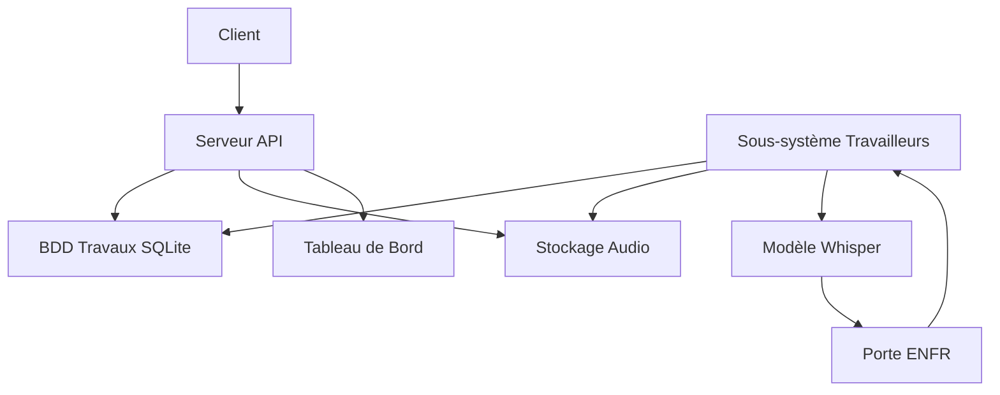
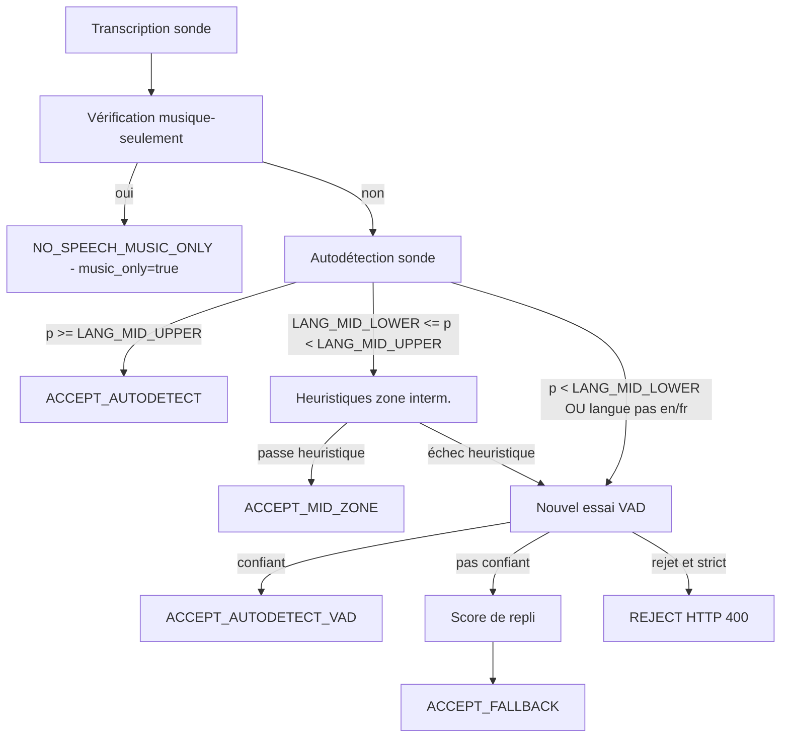
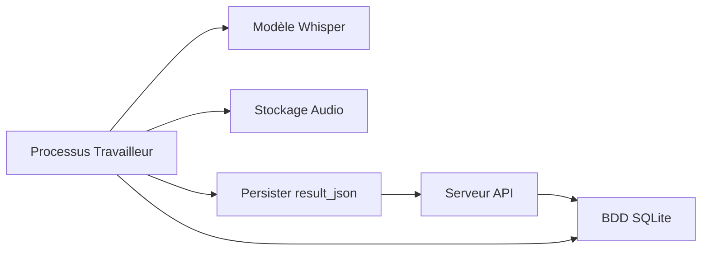
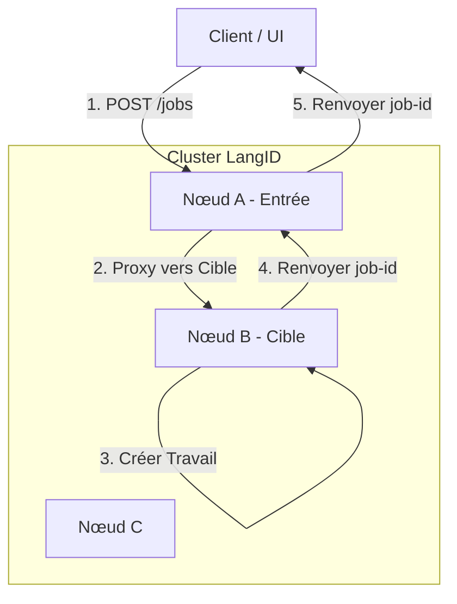
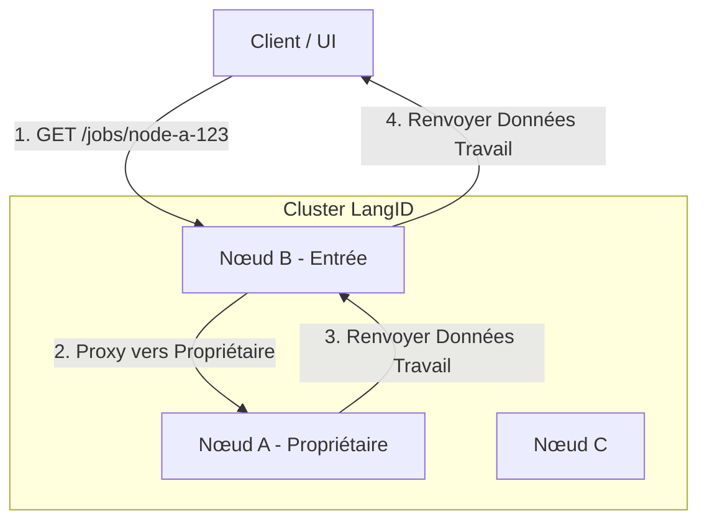

# Service LangID - README Technique pour Windows Server

## 1. Aperçu du Projet

Le Service LangID est un microservice multithread haute performance conçu pour l'identification de la langue et la transcription optionnelle de fichiers audio, optimisé pour le déploiement sur **Windows Server**. Il expose une API RESTful pour soumettre des clips audio, qui sont ensuite traités par un pool de travailleurs en arrière-plan exploitant la bibliothèque `faster-whisper`.

**Objectif Principal :**
1.  **Détection de Langue :** Identifier rapidement et précisément la langue parlée dans un fichier audio.
2.  **Transcription (Optionnelle) :** Fournir une transcription textuelle de l'audio.

**Modules Internes :**
*   `app\main.py` : Le point d'entrée de l'application FastAPI, définissant les endpoints de l'API et le cycle de vie des travailleurs.
*   `app\services\detector.py` : La logique centrale pour interagir avec le modèle `faster-whisper`.
*** Début du README Unifié ***

# Service LangID — README Unifié

## Table des Matières
- [A. Aperçu](#a-aperçu)
- [B. Architecture](#b-architecture)
- [C. Pipeline Complet de la Porte EN/FR](#c-pipeline-complet-de-la-porte-enfr)
- [D. Détails du Modèle Whisper + GPU](#d-détails-du-modèle-whisper--gpu)
- [E. Système de Travailleurs](#e-système-de-travailleurs)
- [F. Configuration (.env)](#f-configuration-env)
- [G. Référence API](#g-référence-api)
- [H. Stockage + Structure BDD](#h-stockage--structure-bdd)
- [I. Installation & Exécution](#i-installation--exécution)
- [J. Exemples](#j-exemples)
- [K. Architecture de Cluster HA Interne](#k-architecture-de-cluster-ha-interne)
- [L. Métriques Prometheus et Surveillance](#l-métriques-prometheus-et-surveillance)
- [M. Configuration des Codes de Langue](#m-configuration-des-codes-de-langue)

## A. Aperçu

Le Service LangID est un microservice backend qui effectue la détection de langue Anglais vs Français et la transcription optionnelle pour les fichiers audio. Le service accepte l'audio via téléchargement de fichier ou URL, exécute une courte passe d'autodétection utilisant Whisper, applique une porte EN/FR conservatrice (incluant un détecteur musique-seulement), réessaie optionnellement la détection avec une sonde découpée par VAD, et produit un résultat JSON structuré persisté avec l'enregistrement du travail.

Langues supportées : Anglais (`en`) et Français (`fr`) uniquement. L'audio non-EN/FR est soit forcé via un score de repli, soit rejeté lorsque le mode strict est activé.

Limites du système :
- Ingestion audio : Téléchargements API HTTP ou récupération par URL.
- Détection de langue : Sonde d'autodétection Whisper (première passe sans VAD).
- Logique de porte : acceptation haute confiance, heuristiques de zone intermédiaire, nouvel essai VAD, score de repli, court-circuit musique-seulement.
- Transcription : effectuée uniquement lorsque la porte accepte la parole.
- Résultats : `result_json` structuré persisté en BDD et renvoyé par l'API.

## B. Architecture

Composants de haut niveau :
- Serveur API : Application FastAPI, endpoints de travaux, santé et métriques.
- Sous-système de travailleurs : processus en arrière-plan qui effectuent la détection et la transcription.
- Inférence Whisper : `faster-whisper` utilisé pour l'autodétection et la transcription.
- Porte de langue EN/FR : encapsule toute la logique de décision de langue.
- Stockage : `STORAGE_DIR` local pour l'audio et les artefacts.
- Base de données : SQLite par défaut ; utilisée pour la file d'attente des travaux et la persistance.

Diagramme d'architecture Mermaid :



## C. Pipeline Complet de la Porte EN/FR

Cette section documente le comportement et la configuration de la porte.

Sonde d'autodétection
- La sonde est une courte fenêtre audio décodée et passée à Whisper avec `vad_filter=False` pour la détection initiale.
- Whisper renvoie une transcription et une langue prédite avec probabilité.

Détection musique-seulement (exécutée avant les vérifications d'acceptation)
- Normalisation : minuscules, suppression des crochets extérieurs correspondants ([], (), {}), suppression des espaces.
- Remplacer les marqueurs Unicode musicaux (♪ ♫ ♩ ♬ ♭ ♯) par le jeton `music`.
- Tokeniser et supprimer les jetons de remplissage (exemples : `intro`, `outro`, `playing`, `background`, `soft`, `de`, `fond`, `only`, `song`, `theme`, `jingle`, `play`).
- Si les jetons restants contiennent uniquement `music` ou `musique` plus des remplissages autorisés, court-circuiter à `NO_SPEECH_MUSIC_ONLY` avec `language = "none"`, `music_only = true`.

Acceptation haute confiance
- Si la probabilité d'autodétection >= `LANG_MID_UPPER` et la langue prédite est `en` ou `fr`, accepter immédiatement sans VAD.

Logique de zone intermédiaire
- Si `LANG_MID_LOWER <= probabilité < LANG_MID_UPPER` et la langue prédite est `en` ou `fr`, calculer les ratios de mots vides (stopwords) pour EN et FR.
- Heuristique : exiger `token_count >= LANG_MIN_TOKENS` et `dominant_ratio - other_ratio >= LANG_STOPWORD_MARGIN` et `dominant_ratio >= LANG_MIN_STOPWORD_{EN|FR}` pour accepter la zone intermédiaire.

Nouvel essai VAD
- Si l'heuristique de zone intermédiaire échoue, ou l'autodétection initiale est inférieure à `LANG_MID_LOWER`, ré-exécuter la détection en utilisant une sonde découpée par VAD (`vad_filter=True`).
- Si le nouvel essai VAD produit un EN/FR confiant selon `LANG_DETECT_MIN_PROB`, accepter.

Score de repli
- Si le nouvel essai VAD est insuffisant et `ENFR_STRICT_REJECT` est faux, effectuer une notation/transcription à faible coût pour EN et FR et choisir la langue avec le meilleur score (`method = fallback`). Le repli peut ne pas fournir une probabilité calibrée.

Rejet strict
- Si `ENFR_STRICT_REJECT` est vrai et aucune voie n'a produit une décision EN/FR confiante, renvoyer HTTP 400 / Reject.

Diagramme d'arbre de décision Mermaid :



Sorties de la porte dans `result_json` :
- `gate_decision` (enum), `gate_meta` (métadonnées détaillées), `music_only` (bool), `use_vad` (bool).

## D. Détails du Modèle Whisper + GPU

Modèles supportés : `tiny`, `base`, `small`, `medium`, `large-v3`.

Sélection du périphérique via `WHISPER_DEVICE` : `cpu`, `cuda`, ou `auto`.
`WHISPER_COMPUTE` contrôle la précision : `int8`, `float16`, `float32`.

Notes pour Windows :
- Le support GPU sur Windows dépend des pilotes et de l'exécution (CTranslate2/ctranslate2 bindings). L'opération CPU-only est l'option la plus portable sur Windows Server.
- Les GPU très anciens (Pascal ou antérieurs) peuvent manquer de la capacité de calcul requise pour les noyaux optimisés.

Configurations recommandées :

| Cas d'Usage | Modèle | Périphérique | Calcul |
|---|---:|---:|---:|
| GPU Linux faible latence | `small`/`base` | `cuda` | `float16`/`int8` |
| CPU-only Linux/Windows | `base` | `cpu` | `int8` |
| Précision maximale | `large-v3` | `cuda` | `float16` |

Si le GPU n'est pas supporté, définissez `WHISPER_DEVICE=cpu` et utilisez `WHISPER_COMPUTE=int8` là où la quantification CPU est supportée.

## E. Système de Travailleurs

Comportement du travailleur :
- Chaque processus travailleur interroge la BDD pour des travaux en file d'attente, réclame un travail, définit `status=processing`, et exécute la détection/transcription.
- Paramètres de concurrence : `MAX_WORKERS` contrôle le nombre de processus ; `MAX_CONCURRENT_JOBS` contrôle le parallélisme par travailleur.

Notes de réclamation/mise à jour de travail :
- Utiliser des mises à jour transactionnelles de BDD pour réclamer et mettre à jour les travaux. Préférer le mode SQLite WAL pour une meilleure concurrence.
- Persister `result_json` atomiquement pour éviter les écritures partielles.

Flux de travailleur Mermaid :



## F. Configuration (.env)

Variables d'environnement importantes et valeurs par défaut recommandées :

| Variable | Par défaut | Description |
|---|---|---|
| `LOG_DIR` | `./logs` | Répertoire de sortie des journaux |
| `STORAGE_DIR` | `./storage` | Répertoire de stockage audio |
| `DB_URL` | `sqlite:///./langid.sqlite` | URL BDD SQLAlchemy |
| `MAX_WORKERS` | `2` | Nombre de processus travailleurs |
| `MAX_CONCURRENT_JOBS` | `1` | Travaux par processus travailleur |
| `MAX_RETRIES` | `3` | Max tentatives par travail |
| `WHISPER_MODEL_SIZE` | `base` | Taille du modèle |
| `WHISPER_DEVICE` | `auto` | `cpu` / `cuda` / `auto` |
| `WHISPER_COMPUTE` | `int8` | Précision de calcul |
| `LANG_MID_LOWER` | `0.60` | Limite inférieure plage moyenne |
| `LANG_MID_UPPER` | `0.79` | Limite supérieure plage moyenne |
| `LANG_MIN_STOPWORD_EN` | `0.15` | Ratio min mots vides pour EN en zone interm. |
| `LANG_MIN_STOPWORD_FR` | `0.15` | Ratio min mots vides pour FR en zone interm. |
| `LANG_STOPWORD_MARGIN` | `0.05` | Marge requise entre ratios |
| `LANG_MIN_TOKENS` | `10` | Min jetons pour heuristiques |
| `LANG_DETECT_MIN_PROB` | `0.60` | Prob min pour accepter autodétection VAD |
| `ENFR_STRICT_REJECT` | `false` | Si vrai, rejeter audio non EN/FR |
| `APP_HOST` | `0.0.0.0` | Hôte API |
| `APP_PORT` | `8080` | Port API |

Ajustez ces valeurs en production selon la capacité CPU/GPU et le volume de travaux attendu.

## G. Référence API

URL de base : `http://<hôte>:<port>` (par défaut `http://0.0.0.0:8080`).

POST /jobs
- Télécharger un fichier audio. Renvoie `EnqueueResponse` avec `job_id`.

```bash
curl -X POST "http://localhost:8080/jobs" -F "file=@/path/to/audio.wav"
```

POST /jobs/by-url
- Soumettre audio par URL.

```bash
curl -X POST "http://localhost:8080/jobs/by-url" -H "Content-Type: application/json" -d '{"url":"https://example.com/audio.wav"}'
```

GET /jobs
- Lister les travaux récents.

GET /jobs/{job_id}
- Obtenir le statut et les métadonnées du travail.

GET /jobs/{job_id}/result
- Obtenir le JSON de résultat final pour un travail terminé.

GET /metrics
- Obtenir les métriques du service.

GET /healthz
- Endpoint de vérification de santé.

## H. Stockage + Structure BDD

Structure de stockage :
- `STORAGE_DIR/<job_id>/input.*` — audio source téléchargé ou récupéré.
- `STORAGE_DIR/<job_id>/probe.wav` — fenêtre audio de sonde.
- `STORAGE_DIR/<job_id>/result.json` — copie persistée optionnelle de `result_json`.

Champs de table de travaux SQLite (résumé) : `id`, `input_path`, `status`, `progress`, `result_json`, `created_at`, `updated_at`, `attempts`, `error`.

## I. Installation & Exécution

Démarrage rapide Linux :

```bash
git clone https://github.com/<org>/LangId-mr.git /path/to/project
cd /path/to/project/langid_service
python -m venv .venv
source .venv/bin/activate
pip install --upgrade pip
pip install -r requirements.txt
export WHISPER_DEVICE=auto
export WHISPER_MODEL_SIZE=base
python -m uvicorn app.main:app --host 0.0.0.0 --port 8080
```

Exemple de production avec `gunicorn` :

```bash
gunicorn -w 4 -k uvicorn.workers.UvicornWorker "app.main:app" -b 0.0.0.0:8080
```

Windows Server (résumé) :
- Installer Python 3.11 et Node 20.
- Créer `.venv`, `pip install -r requirements.txt`.
- Construire le tableau de bord (`cd dashboard && npm ci && npm run build`) et définir `public/config.js` en conséquence.
- Utiliser NSSM ou un autre gestionnaire de services pour enregistrer l'API et le service de tableau de bord statique optionnel.

## J. Exemples

Bonne sortie en Anglais :

```json
{
  "job_id": "...",
  "language": "en",
  "probability": 0.98,
  "transcript_snippet": "Hello and welcome...",
  "gate_decision": "ACCEPT_AUTODETECT",
  "music_only": false
}
```

Exemple de sortie musique-seulement :

```json
{
  "job_id": "...",
  "language": "none",
  "gate_decision": "NO_SPEECH_MUSIC_ONLY",
  "music_only": true,
  "transcript_snippet": ""
}
```


## Dépannage et Notes

- Pour la concurrence SQLite, activer le mode WAL et ajuster `MAX_WORKERS` pour correspondre à la capacité E/S.

### Mode SQLite WAL

Pour améliorer la concurrence lorsque plusieurs processus travailleurs mettent à jour la table des travaux :

1. **Activer le mode WAL**
   Le mode journal SQLite peut être activé de façon permanente en exécutant :

   ```bash
   sqlite3 langid.sqlite "PRAGMA journal_mode=WAL;"
   ```

   Ou s'assurer qu'il est appliqué automatiquement dans `_db_connect()` :

   ```python
   conn.execute("PRAGMA journal_mode=WAL;")
   conn.execute("PRAGMA busy_timeout = 5000;")
   ```

2. **Pourquoi WAL aide**
   - Les lecteurs ne bloquent plus les écrivains.
   - Les écrivains ne bloquent généralement pas les lecteurs.
   - Réduit considérablement les erreurs `database is locked` sous des travailleurs concurrents.

3. **Réglage recommandé des travailleurs**
   - Garder `MAX_WORKERS` bas à moins d'exécuter sur un SSD rapide.
   - Configuration stable typique :
     - `MAX_WORKERS=2`
     - `MAX_CONCURRENT_JOBS=1`

- Utiliser des journaux structurés dans `LOG_DIR` et exposer les métriques Prometheus pour la surveillance.


## K. Architecture de Cluster HA Interne

Cette section détaille l'architecture de cluster Haute Disponibilité (HA) interne conçue pour les déploiements Windows Server où aucun équilibreur de charge externe n'est disponible.

### 1. Aperçu

Le cluster HA LangID est une architecture entièrement distribuée et sans partage où plusieurs nœuds de service LangID coopèrent pour fournir une interface de service unifiée.

**Concepts Clés :**
- **Pas d'Équilibreur de Charge Externe :** Le cluster ne dépend pas de F5, NGINX ou Kubernetes Ingress.
- **Distribution de Charge Interne :** Un planificateur round-robin interne distribue les nouvelles soumissions de travaux à travers tous les nœuds sains.
- **Nœuds Symétriques :** Chaque nœud exécute le service FastAPI et la logique de travailleur identiques.
- **Routage Déterministe :** La propriété du travail est déterminée par le préfixe de l'ID du travail.
- **Proxy Interne :** Tout nœud peut accepter une demande pour n'importe quel travail ; si le travail appartient à un autre nœud, la demande est transférée de manière transparente en interne.
- **Tableau de Bord Distribué :** L'état de l'ensemble du cluster et l'historique des travaux sont agrégés à la demande depuis tous les nœuds joignables.

**Diagramme de Cluster (Distribution de Charge) :**



**Comment Fonctionne la Distribution de Charge :**

Le flux de Distribution de Charge démontre comment le cluster distribue les nouvelles soumissions de travaux à travers tous les nœuds sains sans nécessiter d'équilibreur de charge externe.

**Concepts Clés :**
- **Nœud d'Entrée :** Le nœud qui reçoit la demande initiale du client. Cela peut être n'importe quel nœud dans le cluster.
- **Nœud Cible :** Le nœud sélectionné par le planificateur round-robin pour créer et posséder réellement le travail.
- **Sélection Round-Robin :** Chaque nœud d'entrée maintient un index de rotation partagé, cyclant à travers tous les nœuds sains pour distribuer la charge uniformément.
- **Proxy Transparent :** Si la cible n'est pas le nœud d'entrée, la demande est transférée en interne sans que le client en soit conscient.

**Explication du Flux :**
1. **Demande Client :** Le client envoie `POST /jobs` avec un fichier audio au Nœud A (qui se trouve être le point d'entrée dans cet exemple).
2. **Sélection Cible :** Le planificateur round-robin du Nœud A détermine que le Nœud B doit gérer ce travail. Le planificateur ignore automatiquement les nœuds non sains.
3. **Proxy Interne :** Le Nœud A transfère la demande complète au Nœud B avec un paramètre de requête `?internal=1` pour empêcher les boucles de routage infinies.
4. **Création de Travail :** Le Nœud B crée le travail localement, lui attribuant un ID de travail préfixé par son nom de nœud (ex., `node-b-abc123`). Le travail est stocké dans la base de données locale du Nœud B et traité par les travailleurs du Nœud B.
5. **Chaîne de Réponse :** Le Nœud B renvoie l'ID de travail au Nœud A, qui le transfère au client.

**Notes Importantes :**
- Le client n'est pas conscient qu'un proxy a eu lieu ; il ne voit qu'une seule demande/réponse.
- Le préfixe de l'ID de travail (`node-b-`) garantit que toutes les demandes futures pour ce travail sont routées vers le Nœud B.
- Si le Nœud B n'est pas sain, le planificateur sélectionne automatiquement le prochain nœud sain (ex., Nœud C).
- Si la cible est égale à l'entrée (ex., Nœud A sélectionne Nœud A), aucun proxy n'a lieu—le travail est créé localement.

**Diagramme de Cluster (Flux Lecture/État) :**



**Comment Fonctionne le Routage de Lecture/État :**

Le flux de Lecture/État illustre comment le cluster route les demandes de lecture (vérifications d'état, résultats, suppressions) vers le bon nœud propriétaire basé sur les préfixes d'ID de travail.

**Concepts Clés :**
- **Nœud Propriétaire :** Le nœud qui a créé et possède un travail spécifique. Identifié par le préfixe de l'ID de travail (ex., `node-a-123` appartient au Nœud A).
- **Routage Déterministe :** Le cluster utilise l'analyse de l'ID de travail pour router les demandes vers le bon nœud propriétaire sans registre central.
- **Tout Nœud comme Point d'Entrée :** Les clients peuvent interroger n'importe quel nœud pour n'importe quel travail ; le cluster gère le routage de manière transparente.
- **Données Cohérentes :** Les données de chaque travail (enregistrement de base de données, fichiers audio, résultats) existent uniquement sur son nœud propriétaire.

**Explication du Flux :**
1. **Demande Client :** Le client envoie `GET /jobs/node-a-123/result` au Nœud B (peut-être pour l'équilibrage de charge ou des raisons géographiques).
2. **Détection Propriétaire :** Le Nœud B analyse le préfixe de l'ID de travail (`node-a-`) et détermine que le Nœud A possède ce travail.
3. **Proxy Interne :** Le Nœud B transfère la demande au Nœud A avec `?internal=1` pour empêcher le re-routage.
4. **Récupération de Données :** Le Nœud A récupère le travail dans sa base de données locale, formate la réponse (incluant le formatage du code de langue selon `LANG_CODE_FORMAT`), et la renvoie au Nœud B.
5. **Transfert de Réponse :** Le Nœud B relaie la réponse au client inchangée.

**Notes Importantes :**
- Si le client demande `GET /jobs/node-b-456/status` depuis le Nœud B, aucun proxy n'a lieu—le Nœud B le gère localement.
- Si le nœud propriétaire est injoignable, la demande échoue avec `503 Service Unavailable`. Il n'y a pas de basculement automatique pour les travaux existants car les données ne sont pas répliquées.
- Cela s'applique à tous les endpoints spécifiques au travail : `/jobs/{id}`, `/jobs/{id}/result`, `/jobs/{id}/status`, `/jobs/{id}/audio`, `DELETE /jobs/{id}`.
- Le drapeau `?internal=1` empêche les boucles de proxy infinies si des erreurs de configuration surviennent.

**Comparaison :**

| Aspect | Distribution de Charge | Routage Lecture/État |
|--------|-------------------|---------------------|
| **Déclencheur** | `POST /jobs` (création nouveau travail) | `GET /jobs/{id}/*` (accès travail existant) |
| **Sélection Cible** | Round-robin à travers nœuds sains | Déterministe par préfixe ID travail |
| **Basculement** | Oui - réessayer prochain nœud sain | Non - demande échoue si propriétaire en panne |
| **Données Créées** | Nouvel enregistrement travail sur nœud cible | Pas de nouvelles données, lecture seule |
| **Conscience Client** | Opaque - client voit réponse unique | Opaque - client voit réponse unique |


### 2. Configuration du Cluster

Chaque nœud est configuré via un fichier JSON spécifié par la variable d'environnement `LANGID_CLUSTER_CONFIG_FILE`. Si non défini, il revient à `cluster_config.json`.

**Exemple `cluster_config.json` :**

```json
{
  "self_name": "node-a",
  "nodes": {
    "node-a": "http://node-a.internal:8080",
    "node-b": "http://node-b.internal:8080",
    "node-c": "http://node-c.internal:8080"
  },
  "health_check_interval_seconds": 5,
  "internal_request_timeout_seconds": 5,
  "enable_round_robin": true,
  "rr_state_file": "/tmp/langid_rr_state.json",
  "rr_strategy": "global"
}
```

**Référence de Configuration :**

| Champ | Type | Description |
| :--- | :--- | :--- |
| `self_name` | string | **Requis.** Identifiant unique pour ce nœud (ex., "node-a"). Doit correspondre à une clé dans `nodes`. |
| `nodes` | dict | **Requis.** Carte de `node_name` -> `base_url`. Définit l'appartenance au cluster. |
| `health_check_interval_seconds` | int | Intervalle pour les vérifications de santé en arrière-plan (par défaut : 30). |
| `internal_request_timeout_seconds` | int | Délai d'attente pour les demandes proxy entre nœuds (par défaut : 10). |
| `enable_round_robin` | bool | Activer la distribution de charge interne (par défaut : false). |
| `rr_state_file` | string | (Optionnel) Chemin pour persister le dernier index round-robin utilisé à travers les redémarrages. |
| `rr_strategy` | string | "global" (tous les nœuds partagent la séquence) ou "per-node" (rotation indépendante). Par défaut : "global". |

### 3. Préfixage d'ID de Travail et Propriété

Les ID de travail sont globalement uniques et encodent l'identité du nœud propriétaire.

*   **Format :** `<node-name>-<uuid>`
*   **Exemple :** `node-a-550e8400-e29b-41d4-a716-446655440000`
*   **Logique :**
    *   Lorsqu'un nœud crée un travail (localement ou via proxy), il **doit** préfixer l'ID avec son propre `self_name`.
    *   Tout nœud recevant une demande pour un ID de travail analyse le préfixe pour déterminer le propriétaire.

### 4. Routage des Demandes Internes et Proxy

Le routeur intercepte les demandes vers les endpoints spécifiques au travail (`/jobs/{id}`, `/jobs/{id}/result`, `DELETE /jobs/{id}`).

**Logique de Routage :**
1.  **Analyser ID :** Extraire `owner_node` de `job_id`.
2.  **Vérifier Localité :**
    *   Si `owner_node == self_name` : Gérer la demande localement.
    *   Si `owner_node != self_name` : Proxy la demande vers `owner_node`.
3.  **Proxy :**
    *   Utilise `httpx.AsyncClient`.
    *   Ajoute `?internal=1` aux params de requête pour empêcher les boucles de récursion infinies.
    *   Transfère la méthode, les en-têtes (excluant l'hôte), et le corps.
    *   **Délai d'attente :** Renvoie `503 Service Unavailable` si le nœud propriétaire est injoignable ou expire.

**Stratégie d'Échec de Proxy :**
- Si le **Nœud Cible** pour un nouveau travail (`POST /jobs`) est injoignable, le Nœud d'Entrée **réessaiera avec le prochain nœud sain** dans la rotation.
- Si un **Nœud Propriétaire** pour un travail existant est injoignable, la demande échoue avec `503`.

### 5. Distribution de Charge Round-Robin

Le cluster implémente un **Planificateur Round-Robin Interne** pour distribuer la charge sans équilibreur externe.

#### Comportement du Planificateur
- **Rotation Déterministe :** Le planificateur cycle à travers la liste des nœuds (triés alphabétiquement par nom) dans un ordre prévisible.
- **Agnostique d'Entrée :** Un client peut envoyer `POST /jobs` à *n'importe quel* nœud. Ce nœud (le "Nœud d'Entrée") est responsable d'attribuer le travail à un nœud cible.
- **Conscience de Santé :** Si un nœud cible est détecté comme non sain (via vérifications de santé en arrière-plan), le planificateur l'ignore temporairement et choisit le prochain nœud sain.
- **Persistance :** Si `rr_state_file` est configuré, l'index de rotation actuel est enregistré sur disque, assurant la continuité de distribution à travers les redémarrages du service.

#### Flux de Création de Travail (`POST /jobs`)

1.  **Demande Client :** Client envoie `POST /jobs` au `Nœud A`.
2.  **Sélection Cible :** Planificateur du `Nœud A` calcule la prochaine cible (ex., `Nœud B`).
3.  **Local vs. Distant :**
    *   Si **Cible == Soi-même** : `Nœud A` crée le travail localement.
    *   Si **Cible != Soi-même** : `Nœud A` transfère la demande au `Nœud B` avec `?internal=1`.
4.  **Exécution :** `Nœud B` crée le travail, attribuant ID `node-b-<uuid>`.
5.  **Réponse :** `Nœud B` répond au `Nœud A`, qui transfère la réponse au Client.

**Diagramme de Séquence :**

```
Client      Nœud A (Entrée)      Nœud B (Cible)
  |                 |                     |
  |--- POST /jobs ->|                     |
  |                 |-- Prochaine Cible?  |
  |                 |   (Nœud B)          |
  |                 |                     |
  |                 |--- POST /jobs ----->|
  |                 |   (internal=1)      |
  |                 |                     |
  |                 |                     |-- Créer Travail --|
  |                 |                     | ID: node-b-123    |
  |                 |                     |-------------------|
  |                 |                     |
  |                 |<-- 200 OK ----------|
  |                 |   (node-b-123)      |
  |<-- 200 OK ------|                     |
  |   (node-b-123)  |                     |
```

### 6. Endpoints d'Administration Locale

Pour supporter la gestion de cluster et le tableau de bord, les nœuds exposent des endpoints "local-only".

*   `GET /admin/jobs` : Renvoie **uniquement** les travaux stockés sur ce nœud spécifique.
    *   **Note :** La distribution round-robin n'affecte pas cela. Les travaux sont toujours la propriété du nœud qui les a exécutés.
    *   Supporte le filtrage par `status` (queued, processing, completed, failed) et `since` (horodatage).

### 7. Tableau de Bord de Tout le Cluster

Le tableau de bord agrège les données de tout le cluster.

*   `GET /cluster/jobs` :
    1.  **Fan-out :** Envoie des demandes asynchrones parallèles à `GET /admin/jobs` sur **tous** les nœuds définis dans la config.
    2.  **Agrégation :** Collecte tous les travaux dans une liste unique.
    3.  **Tri :** Trie par `created_at` descendant.
    4.  **Rapport d'État :** Inclut un résumé de quels nœuds étaient joignables.

*   **Structure de Réponse :**
    ```json
    {
      "items": [ ... travaux mixtes de tous les nœuds ... ],
      "nodes": [
        { "name": "node-a", "reachable": true, "job_count": 12 },
        { "name": "node-b", "reachable": false, "job_count": 0 }
      ]
    }
    ```

### 8. Santé du Cluster et État du Nœud

*   `GET /health` : Renvoie `{ "status": "ok", "node": "node-a" }`. Utilisé pour les vérifications internes.
*   `GET /cluster/nodes` : Renvoie l'état de santé de tous les nœuds dans le cluster.
    *   Sonde l'endpoint `/health` de chaque nœud.
    *   Renvoie l'horodatage `last_seen` pour chaque nœud.
    *   Utilisé par le Moteur de Distribution de Charge pour ignorer les nœuds non sains.

### 9. Guide de Démarrage

**Prérequis :**
- Python 3.10+ installé.
- Connectivité réseau entre les nœuds sur le port 8080 (ou port configuré).
- Règles de pare-feu autorisant le trafic interne.

**Procédure de Démarrage (Windows Server) :**

1.  **Déployer Code :** Copier le code de l'application vers `C:\LangID` sur tous les serveurs.
2.  **Configurer :** Créer `C:\LangID\cluster_config.json` sur chaque serveur. S'assurer que la liste `nodes` est identique sur tous les serveurs.
3.  **Démarrer Nœud A :**
    ```powershell
    $env:LANGID_CLUSTER_CONFIG_FILE="C:\LangID\cluster_config.json"
    cd C:\LangID
    # Exécuter depuis le répertoire parent de langid_service ou s'assurer qu'il est dans PYTHONPATH
    # Il est recommandé d'exécuter depuis la racine du dépôt/déploiement
    .\.venv\Scripts\python.exe -m uvicorn langid_service.app.main:app --host 0.0.0.0 --port 8080
    ```
4.  **Démarrer Nœud B & C :** Répéter l'étape 3 sur les autres nœuds.
5.  **Vérifier :**
    Ouvrir `http://node-a:8080/cluster/nodes` pour confirmer que tous les nœuds sont "up".

**Procédure de Démarrage (macOS/Linux) :**

1.  **Déployer Code :** Cloner le dépôt ou copier les fichiers.
2.  **Configurer :** Créer/éditer `cluster_config.json`.
3.  **Démarrer Nœud :**
    ```bash
    export LANGID_CLUSTER_CONFIG_FILE="/path/to/cluster_config.json"
    # Exécuter depuis la racine du dépôt
    ./langid_service/.venv/bin/python -m uvicorn langid_service.app.main:app --host 0.0.0.0 --port 8080
    ```
    Ou en ligne :
    ```bash
    LANGID_CLUSTER_CONFIG_FILE=./cluster_config.json ./langid_service/.venv/bin/python -m uvicorn langid_service.app.main:app --host 0.0.0.0 --port 8080
    ```

4.  **Démarrer Nœud B & C :** Répéter l'étape 3 sur les autres nœuds.
5.  **Vérifier :**
    Ouvrir `http://node-a:8080/cluster/nodes` pour confirmer que tous les nœuds sont "up".

### 10. Surveillance et Opérations

*   **Journaux :** Vérifier la sortie standard/erreur pour les échecs de proxy ou erreurs de connexion.
*   **Tableau de Bord :** Utiliser `/cluster/jobs` pour surveiller l'activité globale du cluster.
*   **Échec de Nœud :**
    *   Si un nœud échoue, ses travaux deviennent inaccessibles (`503`).
    *   Le Planificateur Round-Robin ignorera automatiquement le nœud défaillant pour les *nouveaux* travaux.
    *   Les autres nœuds continuent de fonctionner.
*   **Récupération :**
    *   Redémarrer le nœud défaillant.
    *   Il rejoindra automatiquement le cluster (les autres nœuds le verront comme "sain" à nouveau).
*   **Mises à niveau :**
    *   Effectuer des redémarrages progressifs.
    *   Le planificateur routera autour du nœud en cours de mise à niveau.

### 11. Cas Limites et Modes d'Échec

| Scénario | Comportement |
| :--- | :--- |
| **Nœud Hors Ligne (Propriétaire)** | Les demandes pour les travaux appartenant à ce nœud renvoient `503 Service Unavailable`. |
| **Nœud Hors Ligne (Cible)** | `POST /jobs` réessaie avec le prochain nœud sain. |
| **Partition Réseau** | Les nœuds ne peuvent voir/proxy que vers les nœuds de leur partition. Le tableau de bord montre des résultats partiels. |
| **Désaccord Config** | Si les listes `nodes` diffèrent, des boucles de routage ou 404 peuvent survenir. Assurer la cohérence de la config. |
| **Limite Récursion** | Le drapeau `internal=1` empêche les boucles de proxy infinies. |

### 12. Annexe : Référence des Endpoints

| Méthode | Endpoint | Description | Interne/Externe |
| :--- | :--- | :--- | :--- |
| `POST` | `/jobs` | Soumettre travail (Distribué via Round-Robin) | Externe |
| `GET` | `/jobs/{id}` | Obtenir statut (Proxy vers propriétaire) | Externe |
| `GET` | `/jobs/{id}/result` | Obtenir résultat (Proxy vers propriétaire) | Externe |
| `DELETE` | `/jobs/{id}` | Supprimer travail (Proxy vers propriétaire) | Externe |
| `GET` | `/admin/jobs` | Travaux **Locaux** uniquement | Interne |
| `GET` | `/cluster/jobs` | Travaux de cluster agrégés | Externe |
| `GET` | `/cluster/nodes` | État de santé des nœuds du cluster | Externe |
| `GET` | `/health` | Santé du nœud local | Interne/Externe |


## L. Métriques Prometheus et Surveillance

Le service expose des métriques Prometheus pour surveiller la santé du cluster, le traitement des travaux et la distribution de charge.

### Endpoints de Métriques

| Endpoint | Format | Description |
|----------|--------|-------------|
| `/metrics` | Prometheus | Endpoint de scraping Prometheus standard avec toutes les métriques |
| `/metrics/json` | JSON | Représentation JSON des métriques Prometheus pour le débogage |
| `/cluster/local-metrics` | JSON | État des métriques locales brutes pour l'agrégation |
| `/cluster/metrics-summary` | JSON | Résumé agrégé à l'échelle du cluster pour les tableaux de bord |

### Métriques Disponibles

#### 1. `langid_jobs_submitted_total`
- **Type :** Compteur
- **Étiquettes :** `ingress_node`, `target_node`
- **Description :** Nombre total de travaux soumis via `POST /jobs`. Suit le flux de soumission des travaux à travers le cluster.

**Cas d'Usage :**
- Surveiller le taux total de soumission de travaux à travers le cluster
- Identifier les modèles de distribution de charge (quels nœuds reçoivent vs traitent les travaux)
- Détecter les modèles de trafic déséquilibrés

#### 2. `langid_jobs_owned_total`
- **Type :** Compteur
- **Étiquettes :** `owner_node`
- **Description :** Nombre total de travaux créés/possédés par chaque nœud. Cela s'incrémente lorsqu'un nœud crée un travail localement (soit directement soit via une demande proxy).

**Cas d'Usage :**
- Surveiller quels nœuds traitent le plus de travaux
- Vérifier que la distribution round-robin fonctionne correctement
- Suivre la charge de travail cumulée par nœud

#### 3. `langid_jobs_active`
- **Type :** Jauge (Gauge)
- **Étiquettes :** `owner_node`
- **Description :** Nombre actuel de travaux actifs (en file d'attente ou en cours d'exécution) sur chaque nœud. Cette jauge s'incrémente lorsqu'un travail est créé et se décrémente lorsqu'il se termine ou échoue.

**Cas d'Usage :**
- Surveiller la charge actuelle sur chaque nœud
- Identifier les goulots d'étranglement ou les travaux bloqués
- Alerter sur les seuils de profondeur de file d'attente
- Planification de la capacité

#### 4. `langid_node_up`
- **Type :** Jauge (Gauge)
- **Étiquettes :** `node`
- **Description :** État de santé de chaque nœud dans le cluster. La valeur est `1` si le nœud est joignable et sain, `0` s'il est en panne ou injoignable.

**Cas d'Usage :**
- Surveiller la disponibilité du cluster
- Alerter sur les pannes de nœud
- Suivre le pourcentage de temps de disponibilité
- Visualiser la topologie du cluster

#### 5. `langid_node_last_health_timestamp_seconds`
- **Type :** Jauge (Gauge)
- **Étiquettes :** `node`
- **Description :** Horodatage Unix (en secondes) de la dernière vérification de santé réussie pour chaque nœud. Mis à jour par la boucle de vérification de santé en arrière-plan.

**Cas d'Usage :**
- Détecter les vérifications de santé obsolètes
- Surveiller la fréquence de vérification de santé
- Alerter sur les nœuds qui n'ont pas été vus récemment
- Calculer le temps depuis le dernier contact

### Endpoint de Résumé du Cluster

Pour les tableaux de bord UI, un résumé JSON simplifié est disponible sur `/cluster/metrics-summary`.

Cet endpoint agrège les métriques de tous les nœuds joignables et fournit une vue consolidée.

### Intégration UI

Le tableau de bord inclut une carte "Santé et Charge du Cluster" qui visualise les données de métriques :

**Fonctionnalités du Tableau de Bord :**
- **État du Nœud :** Indicateurs UP/DOWN en temps réel avec code couleur
- **Travaux Actifs :** Profondeur de file d'attente actuelle par nœud
- **Total Travaux Traités :** Travaux possédés cumulés
- **Distribution de Charge :** Barre visuelle montrant le pourcentage de trafic que chaque nœud reçoit
- **Dernière Santé :** Horodatage lisible par l'homme du dernier contact

### Meilleures Pratiques de Surveillance

**Alertes Recommandées :**
(Voir section originale en anglais pour exemples YAML)

**Requêtes de Tableau de Bord Grafana :**
(Voir section originale en anglais pour exemples PromQL)

### Affichage des Métriques

**Format Prometheus :**
```bash
curl http://localhost:8080/metrics
```

**Format JSON (pour débogage) :**
```bash
curl http://localhost:8080/metrics/json
```

**Résumé de Cluster (pour tableaux de bord) :**
```bash
curl http://localhost:8080/cluster/metrics-summary
```

**Métriques de Nœud Local (usage interne) :**
```bash
curl http://localhost:8080/cluster/local-metrics
```

## M. Configuration des Codes de Langue

Vous pouvez configurer le format des codes de langue renvoyés par l'API et affichés dans le tableau de bord en utilisant la variable d'environnement `LANG_CODE_FORMAT`.

Valeurs supportées :
- `iso639-1` (par défaut) : codes à 2 lettres (ex., "en", "fr")
- `iso639-2b` : codes bibliographiques à 3 lettres (ex., "eng", "fre")
- `iso639-2t` : codes terminologiques à 3 lettres (ex., "eng", "fra")
- `iso639-3` : codes à 3 lettres (ex., "eng", "fra")

**Exemple (.env) :**
```bash
LANG_CODE_FORMAT=iso639-3
```

**Effet :**
- **Réponses API :** le champ `language` contiendra "eng" ou "fra".
- **Tableau de Bord :** La liste des travaux affichera "eng (English)" ou "fra (French)".

## K. Déploiement Windows

Nous fournissons des scripts PowerShell automatisés pour déployer à la fois le service API et le Tableau de Bord sur Windows Server.

### 1. Service API (`nssm_install.ps1`)
Situé dans `langid_service/scripts/windows/nssm_install.ps1`.

**Fonctionnalités :**
*   Auto-installe NSSM et Python (si manquant).
*   Crée un environnement virtuel et installe les dépendances.
*   Configure le service avec les variables d'environnement appropriées.
*   Supporte une configuration de cluster personnalisée.

**Utilisation :**
Exécuter en tant qu'Administrateur :
```powershell
cd langid_service\scripts\windows
.\nssm_install.ps1 -ServiceName "LangIdAPI" -Port 8080 -ClusterConfig "C:\path\to\cluster_config.json"
```

**Paramètres :**
*   `-ServiceName` : Nom du service Windows (par défaut : `LangIdAPI`).
*   `-Port` : Port à lier (par défaut : `8080`).
*   `-ClusterConfig` : (Optionnel) Chemin absolu vers votre `cluster_config.json`.
*   `-ModelSize` : Taille du modèle Whisper (par défaut : `base`).
*   `-Device` : `cpu` ou `cuda` (par défaut : `cpu`).

### 2. Tableau de Bord (`Install-LangIdDashboard.ps1`)
Situé dans `dashboard/launch-script/Install-LangIdDashboard.ps1`.

**Fonctionnalités :**
*   Auto-installe NVM et Node.js (si manquant).
*   Construit l'application React (`npm run build`).
*   Installe un serveur de fichiers statiques léger en tant que service.

**Utilisation :**
Exécuter en tant qu'Administrateur :
```powershell
cd dashboard\launch-script
.\Install-LangIdDashboard.ps1 -Port 3000
```

**Paramètres :**
*   `-ServiceName` : Nom du service de tableau de bord (par défaut : `LangIdDashboard`).
*   `-Port` : Port pour servir le tableau de bord (par défaut : `3000`).
*   `-DashboardDir` : (Optionnel) Chemin vers le code source du tableau de bord.
