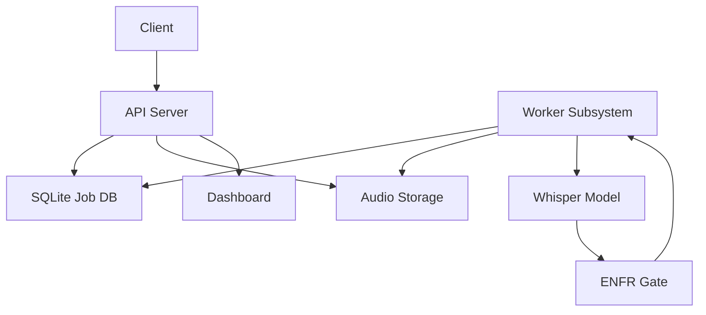
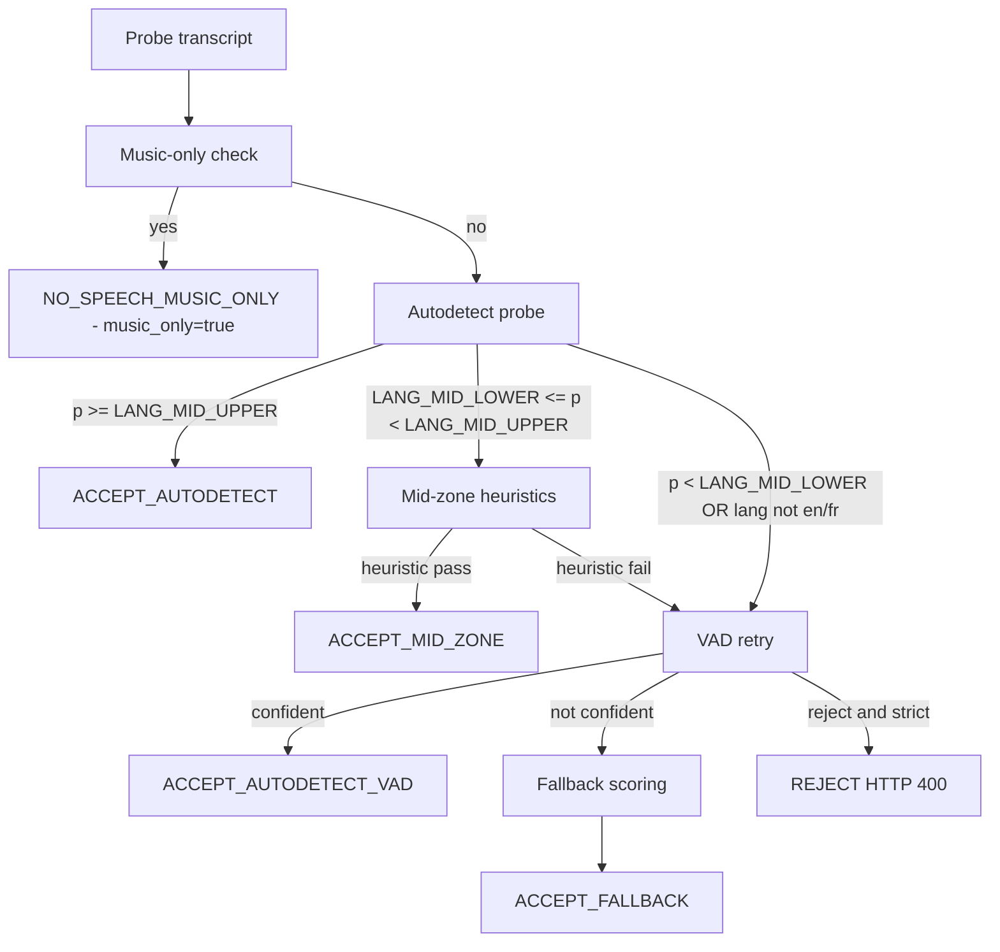
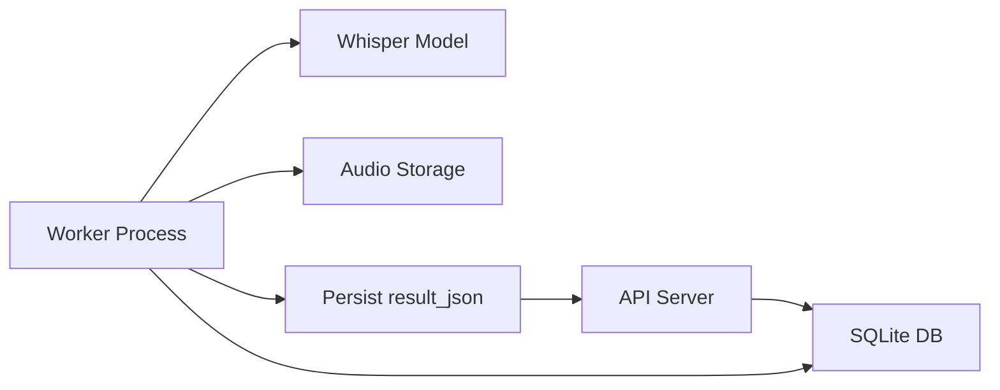
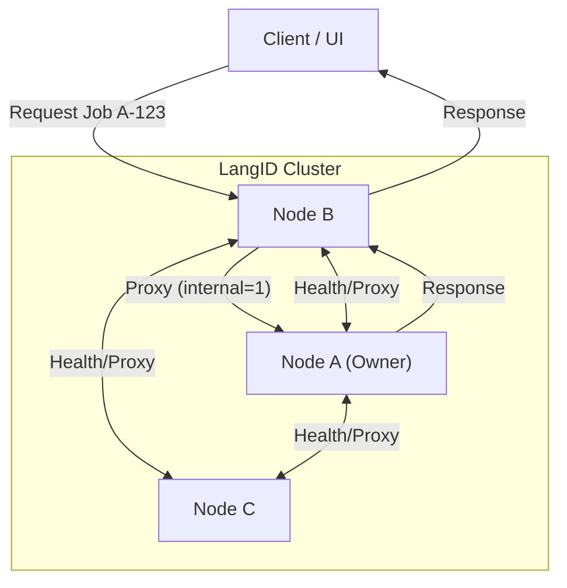

# LangID Service - Technical README for Windows Server

## 1. Project Overview

The LangID Service is a high-performance, multithreaded microservice designed for language identification and optional transcription of audio files, optimized for deployment on **Windows Server**. It exposes a RESTful API for submitting audio clips, which are then processed by a pool of background workers leveraging the `faster-whisper` library.

**Core Purpose:**
1.  **Language Detection:** Quickly and accurately identify the spoken language in an audio file.
2.  **Transcription (Optional):** Provide a text transcription of the audio.

**Internal Modules:**
*   `app\main.py`: The FastAPI application entry point, defining API endpoints and the worker lifecycle.
*   `app\services\detector.py`: The core logic for interacting with the `faster-whisper` model.
*** Begin Unified README ***

# LangID Service — Unified README

## A. Overview

The LangID Service is a backend microservice that performs English vs French language detection and optional transcription for audio files. The service accepts audio via file upload or URL, runs a short probe autodetection pass using Whisper, applies a conservative EN/FR gate (including a music-only detector), optionally retries detection with a VAD-trimmed probe, and produces a structured JSON result persisted with the job record.

Supported languages: English (`en`) and French (`fr`) only. Non-EN/FR audio is either coerced via a fallback scorer or rejected when strict mode is enabled.

System boundaries:
- Audio ingestion: HTTP API uploads or URL fetch.
- Language detection: Whisper autodetect probe (first pass without VAD).
- Gate logic: high-confidence accept, mid-zone heuristics, VAD retry, fallback scoring, music-only short-circuit.
- Transcription: performed only when the gate accepts speech.
- Results: structured `result_json` persisted in DB and returned by API.

## B. Architecture

High-level components:
- API server: FastAPI application, job endpoints, health and metrics.
- Worker subsystem: background processes that perform detection and transcription.
- Whisper inference: `faster-whisper` used for autodetect and transcription.
- EN/FR language gate: encapsulates all language decision logic.
- Storage: local `STORAGE_DIR` for audio and artifacts.
- Database: SQLite default; used for job queue and persistence.

Mermaid architecture diagram:



## C. Full EN/FR Gate Pipeline

This section documents the gate behavior and configuration.

Autodetect probe
- The probe is a short audio window decoded and passed to Whisper with `vad_filter=False` for the initial detection.
- Whisper returns a transcript and a predicted language with probability.

Music-only detection (executed before acceptance checks)
- Normalization: lowercase, remove matching outer brackets ([], (), {}), trim whitespace.
- Replace musical Unicode markers (♪ ♫ ♩ ♬ ♭ ♯) with token `music`.
- Tokenize and remove filler tokens (examples: `intro`, `outro`, `playing`, `background`, `soft`, `de`, `fond`, `only`, `song`, `theme`, `jingle`, `play`).
- If remaining tokens contain only `music` or `musique` plus allowed fillers, short-circuit to `NO_SPEECH_MUSIC_ONLY` with `language = "none"`, `music_only = true`.

High-confidence accept
- If autodetect probability >= `LANG_MID_UPPER` and predicted language is `en` or `fr`, accept immediately without VAD.

Mid-zone logic
- If `LANG_MID_LOWER <= probability < LANG_MID_UPPER` and predicted language is `en` or `fr`, compute stopword ratios for EN and FR.
- Heuristic: require `token_count >= LANG_MIN_TOKENS` and `dominant_ratio - other_ratio >= LANG_STOPWORD_MARGIN` and `dominant_ratio >= LANG_MIN_STOPWORD_{EN|FR}` to accept mid-zone.

VAD retry
- If the mid-zone heuristic fails, or initial autodetect is below `LANG_MID_LOWER`, re-run detection using VAD-trimmed probe (`vad_filter=True`).
- If VAD retry yields a confident EN/FR per `LANG_DETECT_MIN_PROB`, accept.

Fallback scoring
- If VAD retry is insufficient and `ENFR_STRICT_REJECT` is false, perform low-cost scoring/transcription for EN and FR and pick the better-scoring language (`method = fallback`). The fallback may not provide a calibrated probability.

Strict reject
- If `ENFR_STRICT_REJECT` is true and no path produced a confident EN/FR decision, return HTTP 400 / Reject.

Mermaid decision-tree diagram:



Gate outputs in `result_json`:
- `gate_decision` (enum), `gate_meta` (detailed metadata), `music_only` (bool), `use_vad` (bool).

## D. Whisper Model + GPU Details

Supported models: `tiny`, `base`, `small`, `medium`, `large-v3`.

Device selection via `WHISPER_DEVICE`: `cpu`, `cuda`, or `auto`.
`WHISPER_COMPUTE` controls precision: `int8`, `float16`, `float32`.

Notes for Windows:
- GPU support on Windows depends on drivers and the runtime (CTranslate2/ctranslate2 bindings). CPU-only operation is the most portable option on Windows Server.
- Very old GPUs (Pascal or earlier) may lack the required compute capability for optimized kernels.

Recommended configurations:

| Use Case | Model | Device | Compute |
|---|---:|---:|---:|
| Low-latency Linux GPU | `small`/`base` | `cuda` | `float16`/`int8` |
| CPU-only Linux/Windows | `base` | `cpu` | `int8` |
| Highest accuracy | `large-v3` | `cuda` | `float16` |

If GPU is unsupported, set `WHISPER_DEVICE=cpu` and use `WHISPER_COMPUTE=int8` where CPU quantization is supported.

## E. Worker System

Worker behavior:
- Each worker process polls the DB for queued jobs, claims a job, sets `status=processing`, and runs detection/transcription.
- Concurrency settings: `MAX_WORKERS` controls process count; `MAX_CONCURRENT_JOBS` controls per-worker parallelism.

Job claim/update notes:
- Use transactional DB updates to claim and update jobs. Prefer SQLite WAL mode for better concurrency.
- Persist `result_json` atomically to avoid partial writes.

Mermaid worker flow:



## F. Configuration (.env)

Important environment variables and recommended defaults:

| Variable | Default | Description |
|---|---|---|
| `LOG_DIR` | `./logs` | Log output directory |
| `STORAGE_DIR` | `./storage` | Audio storage directory |
| `DB_URL` | `sqlite:///./langid.sqlite` | SQLAlchemy DB URL |
| `MAX_WORKERS` | `2` | Number of worker processes |
| `MAX_CONCURRENT_JOBS` | `1` | Jobs per worker process |
| `MAX_RETRIES` | `3` | Max retries per job |
| `WHISPER_MODEL_SIZE` | `base` | Model size |
| `WHISPER_DEVICE` | `auto` | `cpu` / `cuda` / `auto` |
| `WHISPER_COMPUTE` | `int8` | Compute precision |
| `LANG_MID_LOWER` | `0.60` | Mid-range lower bound |
| `LANG_MID_UPPER` | `0.79` | Mid-range upper bound |
| `LANG_MIN_STOPWORD_EN` | `0.15` | Min stopword ratio for EN in mid-zone |
| `LANG_MIN_STOPWORD_FR` | `0.15` | Min stopword ratio for FR in mid-zone |
| `LANG_STOPWORD_MARGIN` | `0.05` | Required margin between ratios |
| `LANG_MIN_TOKENS` | `10` | Min tokens for heuristics |
| `LANG_DETECT_MIN_PROB` | `0.60` | Min prob to accept VAD autodetect |
| `ENFR_STRICT_REJECT` | `false` | If true, reject non-EN/FR audio |
| `APP_HOST` | `0.0.0.0` | API host |
| `APP_PORT` | `8080` | API port |

Adjust these values in production according to CPU/GPU capacity and expected job volume.

## G. API Reference

Base URL: `http://<host>:<port>` (defaults to `http://0.0.0.0:8080`).

POST /jobs
- Upload audio file. Returns `EnqueueResponse` with `job_id`.

```bash
curl -X POST "http://localhost:8080/jobs" -F "file=@/path/to/audio.wav"
```

POST /jobs/by-url
- Submit audio by URL.

```bash
curl -X POST "http://localhost:8080/jobs/by-url" -H "Content-Type: application/json" -d '{"url":"https://example.com/audio.wav"}'
```

GET /jobs
- List recent jobs.

GET /jobs/{job_id}
- Get job status and metadata.

GET /jobs/{job_id}/result
- Get final result JSON for completed job.

GET /metrics
- Get service metrics.

GET /healthz
- Health check endpoint.

## H. Storage + DB Layout

Storage structure:
- `STORAGE_DIR/<job_id>/input.*` — uploaded or downloaded source audio.
- `STORAGE_DIR/<job_id>/probe.wav` — probe audio window.
- `STORAGE_DIR/<job_id>/result.json` — optional persisted copy of `result_json`.

SQLite job table fields (summary): `id`, `input_path`, `status`, `progress`, `result_json`, `created_at`, `updated_at`, `attempts`, `error`.

## I. Installation & Running

Linux quick start:

```bash
git clone https://github.com/<org>/LangId-mr.git /path/to/project
cd /path/to/project/langid_service
python -m venv .venv
source .venv/bin/activate
pip install --upgrade pip
pip install -r requirements.txt
export WHISPER_DEVICE=auto
export WHISPER_MODEL_SIZE=base
python -m uvicorn app.main:app --host 0.0.0.0 --port 8080
```

Production example with `gunicorn`:

```bash
gunicorn -w 4 -k uvicorn.workers.UvicornWorker "app.main:app" -b 0.0.0.0:8080
```

Windows Server (summary):
- Install Python 3.11 and Node 20.
- Create `.venv`, `pip install -r requirements.txt`.
- Build the dashboard (`cd dashboard && npm ci && npm run build`) and set `public/config.js` accordingly.
- Use NSSM or another service manager to register the API and optional static dashboard service.

## J. Examples

Good English output:

```json
{
  "job_id": "...",
  "language": "en",
  "probability": 0.98,
  "transcript_snippet": "Hello and welcome...",
  "gate_decision": "ACCEPT_AUTODETECT",
  "music_only": false
}
```

Music-only output example:

```json
{
  "job_id": "...",
  "language": "none",
  "gate_decision": "NO_SPEECH_MUSIC_ONLY",
  "music_only": true,
  "transcript_snippet": ""
}
```


## Troubleshooting and Notes

- For SQLite concurrency, enable WAL mode and tune `MAX_WORKERS` to match I/O capacity.

### SQLite WAL Mode

To improve concurrency when multiple worker processes update the jobs table:

1. **Enable WAL mode**
   SQLite journal mode can be enabled permanently by running:

   ```bash
   sqlite3 langid.sqlite "PRAGMA journal_mode=WAL;"
   ```

   Or ensure it is automatically applied in `_db_connect()`:

   ```python
   conn.execute("PRAGMA journal_mode=WAL;")
   conn.execute("PRAGMA busy_timeout = 5000;")
   ```

2. **Why WAL helps**
   - Readers no longer block writers.
   - Writers mostly do not block readers.
   - Greatly reduces `database is locked` errors under concurrent workers.

3. **Recommended worker tuning**
   - Keep `MAX_WORKERS` low unless running on fast SSD.
   - Typical stable config:
     - `MAX_WORKERS=2`
     - `MAX_CONCURRENT_JOBS=1`

- Use structured logs in `LOG_DIR` and expose Prometheus metrics for monitoring.

## K. Internal HA Cluster Architecture

This section details the internal High Availability (HA) cluster architecture designed for Windows Server deployments where external load balancers are not available.

### 1. Overview

The LangID HA cluster is a fully distributed, shared-nothing architecture where multiple LangID service nodes cooperate to provide a unified service interface.

**Key Concepts:**
- **No External Load Balancer:** The cluster does not rely on F5, NGINX, or Kubernetes Ingress.
- **Symmetric Nodes:** Each node runs the identical FastAPI service and worker logic.
- **Deterministic Routing:** Job ownership is determined by the job ID prefix.
- **Internal Proxying:** Any node can accept a request for any job; if the job belongs to another node, the request is transparently proxied internally.
- **Distributed Dashboard:** Cluster-wide status and job history are aggregated on-demand from all reachable nodes.

**Cluster Diagram:**



### 2. Cluster Configuration

Each node is configured via a JSON file specified by the `LANGID_CLUSTER_CONFIG_FILE` environment variable. If not set, it falls back to `cluster_config.json`.

**Example `cluster_config.json`:**

```json
{
  "self_name": "node-a",
  "nodes": {
    "node-a": "http://node-a.internal:8080",
    "node-b": "http://node-b.internal:8080",
    "node-c": "http://node-c.internal:8080"
  },
  "health_check_interval_seconds": 5,
  "internal_request_timeout_seconds": 5
}
```

**Configuration Reference:**

| Field | Type | Description | Example |
|---|---|---|---|
| `self_name` | string | The unique identifier for this node. Must exist in `nodes`. | `"node-a"` |
| `nodes` | dict | Map of node names to their base URLs (http/https). | `{"node-a": "..."}` |
| `health_check_interval_seconds` | int | Interval for background health probes (if enabled). | `5` |
| `internal_request_timeout_seconds` | int | Timeout for internal proxy requests. | `5` |

**Requirements:**
1.  **Consistency:** All nodes should have the same `nodes` list.
2.  **Reachability:** The URLs in `nodes` must be resolvable and reachable from every other node.
3.  **Identity:** `self_name` must match the key in `nodes` corresponding to the local instance.

### 3. Job ID Prefixing & Ownership

To ensure stateless clients can interact with any node, job IDs encode their ownership.

**Format:** `<node-name>-<uuid>`

**Examples:**
- `node-a-7b22c3f1-88a1-4098-9923-0192837465` (Owned by **node-a**)
- `node-c-9012af99-1234-5678-9012-3456789012` (Owned by **node-c**)

**Logic:**
- **Generation:** When `POST /jobs` is called on `node-a`, it generates an ID starting with `node-a-`.
- **Parsing:** `parse_job_owner(job_id)` extracts the prefix (everything before the first dash).
- **Locality:** `is_local(job_id)` returns `True` if the prefix matches `self_name`.

**Error Handling:**
- If a job ID has an unknown prefix (not in `nodes`), the request fails with 400 Bad Request.
- If a job ID is malformed (no dash), it raises a validation error.

### 4. Internal Request Routing & Proxy

The internal router intercepts requests to job-specific endpoints.

**Proxy Logic:**
1.  **Check Ownership:** Determine owner from job ID.
2.  **Is Local?**
    *   **Yes:** Handle request locally (DB lookup, file access).
    *   **No:** Proxy request to owner node.
3.  **Proxying:**
    *   Look up owner's URL from config.
    *   Forward request (Method, Body, Headers) using `httpx`.
    *   Append `?internal=1` to query params to prevent infinite recursion loops.
    *   Return owner's response exactly as received.

**Proxied Endpoints:**
- `GET /jobs/{job_id}`
- `GET /jobs/{job_id}/result`
- `DELETE /jobs/{job_id}`

**Failure Response:**
If the owner node is down or times out, the proxy returns:
```json
HTTP 503 Service Unavailable
{
  "error": "owner_node_unreachable",
  "owner": "node-b"
}
```

**Request Flow Example:**
`UI` -> `node-b` (GET /jobs/node-a-123) -> `node-b` sees owner is `node-a` -> `node-b` proxies to `node-a` -> `node-a` returns JSON -> `node-b` returns JSON to UI.

### 5. Local Admin Endpoints

Each node exposes an admin endpoint to list *only* its local jobs. This is primarily used by the cluster aggregator.

**Endpoint:** `GET /admin/jobs`

**Parameters:**
- `status` (optional): Filter by job status (e.g., `queued`, `succeeded`).
- `since` (optional): ISO8601 timestamp to filter jobs created after a specific time.

**Response:**
```json
{
  "server": "node-a",
  "jobs": [
    {
      "job_id": "node-a-123...",
      "status": "succeeded",
      "created_at": "2023-10-27T10:00:00Z",
      "language": "en",
      "probability": 0.99
    }
  ]
}
```

### 6. Cluster-Wide Dashboard

The cluster dashboard endpoint provides a unified view of the entire system.

**Endpoint:** `GET /cluster/jobs`

**Behavior:**
1.  **Fan-out:** The receiving node sends parallel async requests to `GET /admin/jobs` on *every* node in the cluster configuration (including itself).
2.  **Aggregation:** It collects all job lists.
3.  **Sorting:** Merged list is sorted by `created_at` descending.
4.  **Status Reporting:** It reports which nodes were reachable.

**Response:**
```json
{
  "items": [
    { "job_id": "node-b-2", "status": "running", ... },
    { "job_id": "node-a-1", "status": "succeeded", ... }
  ],
  "nodes": [
    { "name": "node-a", "reachable": true, "job_count": 1 },
    { "name": "node-b", "reachable": true, "job_count": 1 },
    { "name": "node-c", "reachable": false, "job_count": 0 }
  ]
}
```

### 7. Health & Cluster Status

**Endpoint:** `GET /cluster/nodes`

Returns the health status of all configured nodes by probing their `/health` endpoints.

**Response:**
```json
[
  { "name": "node-a", "status": "up", "last_seen": "2023-10-27T10:05:00Z" },
  { "name": "node-b", "status": "up", "last_seen": "2023-10-27T10:05:00Z" },
  { "name": "node-c", "status": "down", "last_seen": "2023-10-27T09:00:00Z" }
]
```

### 8. Starting the Cluster

**Prerequisites:**
1.  Ensure all nodes have Python 3.11+ installed.
2.  Create a `cluster_config.json` file on **each** server.
    *   Update `self_name` to match the specific server.
    *   Ensure `nodes` list is identical on all servers.

**Startup Procedure (Windows PowerShell):**

1.  **Deploy Code:** Copy `langid_service` to `C:\LangID` on all nodes.
2.  **Configure:** Edit `C:\LangID\cluster_config.json`.
3.  **Start Node A:**
    ```powershell
    $env:LANGID_CLUSTER_CONFIG_FILE="C:\LangID\cluster_config.json"
    cd C:\LangID
    # Run from the parent directory of langid_service or ensure it is in PYTHONPATH
    # It is recommended to run from the root of the repository/deployment
    .\.venv\Scripts\python.exe -m uvicorn langid_service.app.main:app --host 0.0.0.0 --port 8080
    ```
4.  **Start Node B & C:** Repeat step 3 on other nodes.
5.  **Verify:**
    Open `http://node-a:8080/cluster/nodes` to confirm all nodes are "up".

### 9. Monitoring & Operations

**Monitoring:**
- Poll `GET /cluster/nodes` every minute to detect node failures.
- Monitor `GET /metrics` on each node for individual load stats.

**Node Failure:**
- If a node fails, its jobs become inaccessible (`503 Owner Unreachable`).
- The cluster dashboard will show the node as `reachable: false`.
- **Action:** Restart the failed node. No manual failover is needed; the node will resume serving its local DB upon restart.

**Rolling Upgrades:**
1.  Stop service on **node-a**.
2.  Deploy new code.
3.  Restart service.
4.  Verify `/health`.
5.  Repeat for **node-b**, etc.

### 10. Edge Cases & Failure Modes

| Scenario | Behavior | Client Action |
|---|---|---|
| **Owner Node Down** | Proxy returns `503`. | Retry later. |
| **Config Mismatch** | `parse_job_owner` may fail or routing loops may occur. | Ensure config consistency. |
| **Network Partition** | Nodes see peers as "down". Local jobs still work. | Wait for network recovery. |
| **Unknown Prefix** | Request returns `400 Bad Request`. | Check client job ID source. |

### 11. Appendix: Endpoint Reference

| Method | Endpoint | Description | HA Behavior |
|---|---|---|---|
| `POST` | `/jobs` | Submit new job | **Local**: Created on receiving node. |
| `GET` | `/jobs/{id}` | Get job status | **Proxied**: Forwards to owner if remote. |
| `GET` | `/jobs/{id}/result` | Get job result | **Proxied**: Forwards to owner if remote. |
| `DELETE` | `/jobs/{id}` | Delete job | **Proxied**: Forwards to owner if remote. |
| `GET` | `/admin/jobs` | List local jobs | **Local Only**: Used by aggregator. |
| `GET` | `/cluster/jobs` | Cluster dashboard | **Aggregated**: Fans out to all nodes. |
| `GET` | `/cluster/nodes` | Cluster health | **Aggregated**: Probes all nodes. |
| `GET` | `/health` | Node health | **Local**: Returns 200 OK. |


