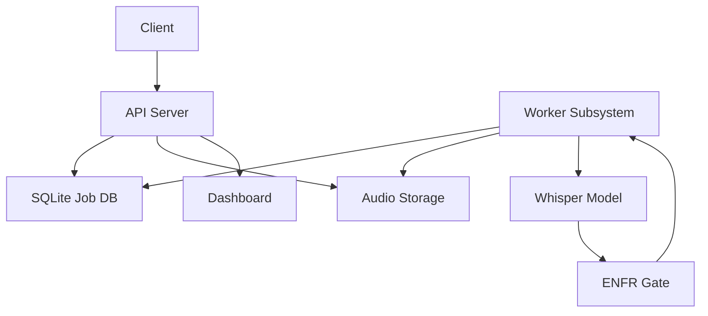
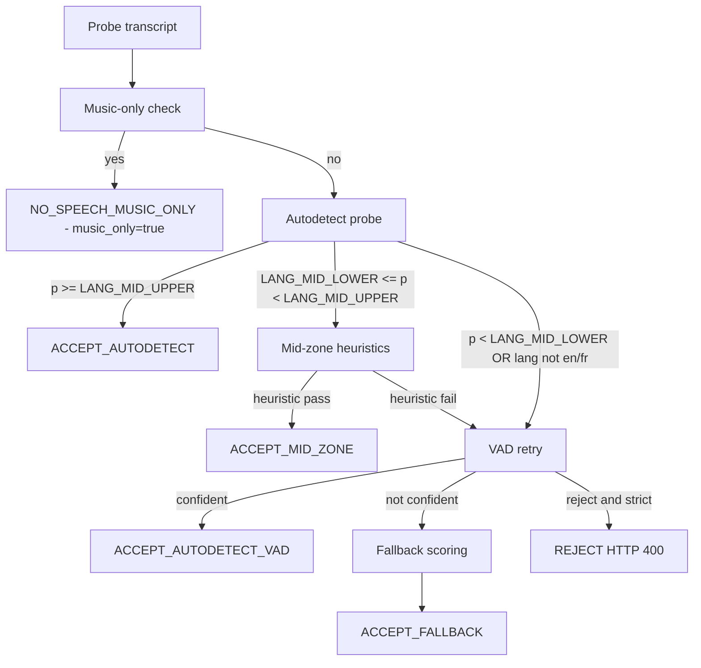
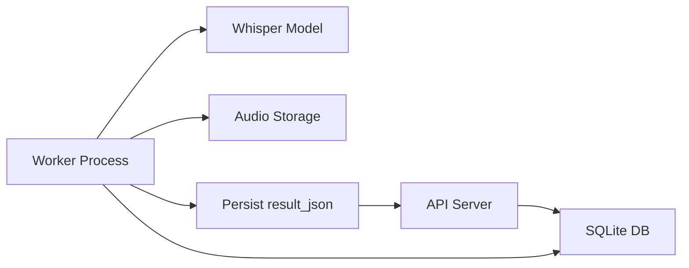
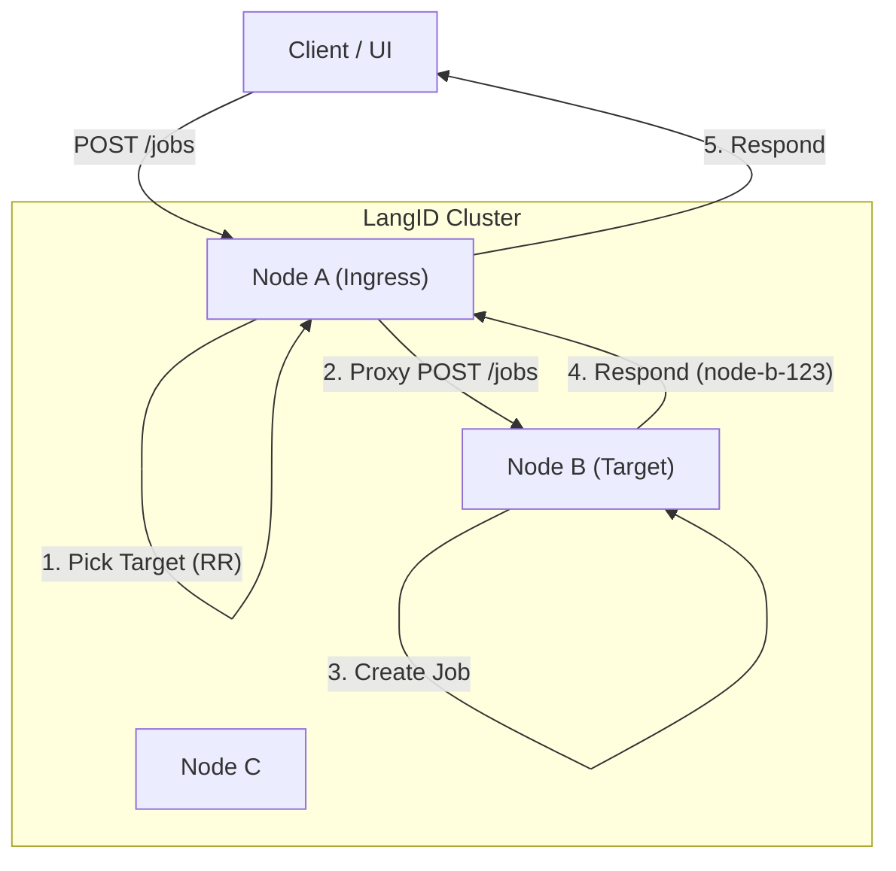
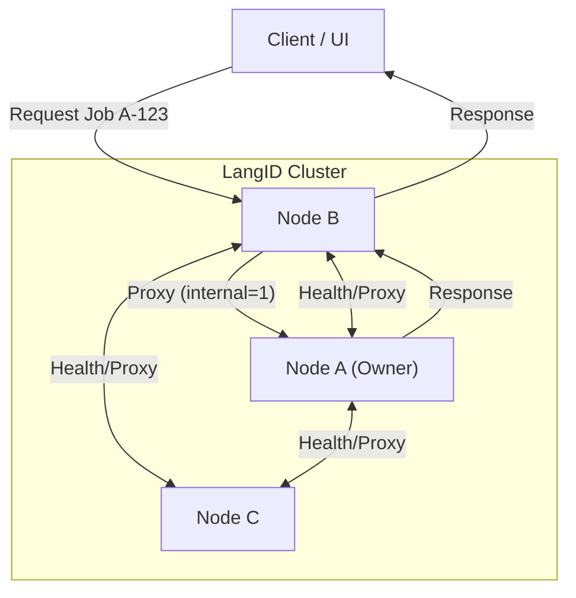

# LangID Service - Technical README for Windows Server

## 1. Project Overview

The LangID Service is a high-performance, multithreaded microservice designed for language identification and optional transcription of audio files, optimized for deployment on **Windows Server**. It exposes a RESTful API for submitting audio clips, which are then processed by a pool of background workers leveraging the `faster-whisper` library.

**Core Purpose:**
1.  **Language Detection:** Quickly and accurately identify the spoken language in an audio file.
2.  **Transcription (Optional):** Provide a text transcription of the audio.

**Internal Modules:**
*   `app\main.py`: The FastAPI application entry point, defining API endpoints and the worker lifecycle.
*   `app\services\detector.py`: The core logic for interacting with the `faster-whisper` model.
*** Begin Unified README ***

# LangID Service — Unified README

## Table of Contents
- [A. Overview](#a-overview)
- [B. Architecture](#b-architecture)
- [C. Full EN/FR Gate Pipeline](#c-full-enfr-gate-pipeline)
- [D. Whisper Model + GPU Details](#d-whisper-model--gpu-details)
- [E. Worker System](#e-worker-system)
- [F. Configuration (.env)](#f-configuration-env)
- [G. API Reference](#g-api-reference)
- [H. Storage + DB Layout](#h-storage--db-layout)
- [I. Installation & Running](#i-installation--running)
- [J. Examples](#j-examples)
- [K. Internal HA Cluster Architecture](#k-internal-ha-cluster-architecture)

## A. Overview

The LangID Service is a backend microservice that performs English vs French language detection and optional transcription for audio files. The service accepts audio via file upload or URL, runs a short probe autodetection pass using Whisper, applies a conservative EN/FR gate (including a music-only detector), optionally retries detection with a VAD-trimmed probe, and produces a structured JSON result persisted with the job record.

Supported languages: English (`en`) and French (`fr`) only. Non-EN/FR audio is either coerced via a fallback scorer or rejected when strict mode is enabled.

System boundaries:
- Audio ingestion: HTTP API uploads or URL fetch.
- Language detection: Whisper autodetect probe (first pass without VAD).
- Gate logic: high-confidence accept, mid-zone heuristics, VAD retry, fallback scoring, music-only short-circuit.
- Transcription: performed only when the gate accepts speech.
- Results: structured `result_json` persisted in DB and returned by API.

## B. Architecture

High-level components:
- API server: FastAPI application, job endpoints, health and metrics.
- Worker subsystem: background processes that perform detection and transcription.
- Whisper inference: `faster-whisper` used for autodetect and transcription.
- EN/FR language gate: encapsulates all language decision logic.
- Storage: local `STORAGE_DIR` for audio and artifacts.
- Database: SQLite default; used for job queue and persistence.

Mermaid architecture diagram:



## C. Full EN/FR Gate Pipeline

This section documents the gate behavior and configuration.

Autodetect probe
- The probe is a short audio window decoded and passed to Whisper with `vad_filter=False` for the initial detection.
- Whisper returns a transcript and a predicted language with probability.

Music-only detection (executed before acceptance checks)
- Normalization: lowercase, remove matching outer brackets ([], (), {}), trim whitespace.
- Replace musical Unicode markers (♪ ♫ ♩ ♬ ♭ ♯) with token `music`.
- Tokenize and remove filler tokens (examples: `intro`, `outro`, `playing`, `background`, `soft`, `de`, `fond`, `only`, `song`, `theme`, `jingle`, `play`).
- If remaining tokens contain only `music` or `musique` plus allowed fillers, short-circuit to `NO_SPEECH_MUSIC_ONLY` with `language = "none"`, `music_only = true`.

High-confidence accept
- If autodetect probability >= `LANG_MID_UPPER` and predicted language is `en` or `fr`, accept immediately without VAD.

Mid-zone logic
- If `LANG_MID_LOWER <= probability < LANG_MID_UPPER` and predicted language is `en` or `fr`, compute stopword ratios for EN and FR.
- Heuristic: require `token_count >= LANG_MIN_TOKENS` and `dominant_ratio - other_ratio >= LANG_STOPWORD_MARGIN` and `dominant_ratio >= LANG_MIN_STOPWORD_{EN|FR}` to accept mid-zone.

VAD retry
- If the mid-zone heuristic fails, or initial autodetect is below `LANG_MID_LOWER`, re-run detection using VAD-trimmed probe (`vad_filter=True`).
- If VAD retry yields a confident EN/FR per `LANG_DETECT_MIN_PROB`, accept.

Fallback scoring
- If VAD retry is insufficient and `ENFR_STRICT_REJECT` is false, perform low-cost scoring/transcription for EN and FR and pick the better-scoring language (`method = fallback`). The fallback may not provide a calibrated probability.

Strict reject
- If `ENFR_STRICT_REJECT` is true and no path produced a confident EN/FR decision, return HTTP 400 / Reject.

Mermaid decision-tree diagram:



Gate outputs in `result_json`:
- `gate_decision` (enum), `gate_meta` (detailed metadata), `music_only` (bool), `use_vad` (bool).

## D. Whisper Model + GPU Details

Supported models: `tiny`, `base`, `small`, `medium`, `large-v3`.

Device selection via `WHISPER_DEVICE`: `cpu`, `cuda`, or `auto`.
`WHISPER_COMPUTE` controls precision: `int8`, `float16`, `float32`.

Notes for Windows:
- GPU support on Windows depends on drivers and the runtime (CTranslate2/ctranslate2 bindings). CPU-only operation is the most portable option on Windows Server.
- Very old GPUs (Pascal or earlier) may lack the required compute capability for optimized kernels.

Recommended configurations:

| Use Case | Model | Device | Compute |
|---|---:|---:|---:|
| Low-latency Linux GPU | `small`/`base` | `cuda` | `float16`/`int8` |
| CPU-only Linux/Windows | `base` | `cpu` | `int8` |
| Highest accuracy | `large-v3` | `cuda` | `float16` |

If GPU is unsupported, set `WHISPER_DEVICE=cpu` and use `WHISPER_COMPUTE=int8` where CPU quantization is supported.

## E. Worker System

Worker behavior:
- Each worker process polls the DB for queued jobs, claims a job, sets `status=processing`, and runs detection/transcription.
- Concurrency settings: `MAX_WORKERS` controls process count; `MAX_CONCURRENT_JOBS` controls per-worker parallelism.

Job claim/update notes:
- Use transactional DB updates to claim and update jobs. Prefer SQLite WAL mode for better concurrency.
- Persist `result_json` atomically to avoid partial writes.

Mermaid worker flow:



## F. Configuration (.env)

Important environment variables and recommended defaults:

| Variable | Default | Description |
|---|---|---|
| `LOG_DIR` | `./logs` | Log output directory |
| `STORAGE_DIR` | `./storage` | Audio storage directory |
| `DB_URL` | `sqlite:///./langid.sqlite` | SQLAlchemy DB URL |
| `MAX_WORKERS` | `2` | Number of worker processes |
| `MAX_CONCURRENT_JOBS` | `1` | Jobs per worker process |
| `MAX_RETRIES` | `3` | Max retries per job |
| `WHISPER_MODEL_SIZE` | `base` | Model size |
| `WHISPER_DEVICE` | `auto` | `cpu` / `cuda` / `auto` |
| `WHISPER_COMPUTE` | `int8` | Compute precision |
| `LANG_MID_LOWER` | `0.60` | Mid-range lower bound |
| `LANG_MID_UPPER` | `0.79` | Mid-range upper bound |
| `LANG_MIN_STOPWORD_EN` | `0.15` | Min stopword ratio for EN in mid-zone |
| `LANG_MIN_STOPWORD_FR` | `0.15` | Min stopword ratio for FR in mid-zone |
| `LANG_STOPWORD_MARGIN` | `0.05` | Required margin between ratios |
| `LANG_MIN_TOKENS` | `10` | Min tokens for heuristics |
| `LANG_DETECT_MIN_PROB` | `0.60` | Min prob to accept VAD autodetect |
| `ENFR_STRICT_REJECT` | `false` | If true, reject non-EN/FR audio |
| `APP_HOST` | `0.0.0.0` | API host |
| `APP_PORT` | `8080` | API port |

Adjust these values in production according to CPU/GPU capacity and expected job volume.

## G. API Reference

Base URL: `http://<host>:<port>` (defaults to `http://0.0.0.0:8080`).

POST /jobs
- Upload audio file. Returns `EnqueueResponse` with `job_id`.

```bash
curl -X POST "http://localhost:8080/jobs" -F "file=@/path/to/audio.wav"
```

POST /jobs/by-url
- Submit audio by URL.

```bash
curl -X POST "http://localhost:8080/jobs/by-url" -H "Content-Type: application/json" -d '{"url":"https://example.com/audio.wav"}'
```

GET /jobs
- List recent jobs.

GET /jobs/{job_id}
- Get job status and metadata.

GET /jobs/{job_id}/result
- Get final result JSON for completed job.

GET /metrics
- Get service metrics.

GET /healthz
- Health check endpoint.

## H. Storage + DB Layout

Storage structure:
- `STORAGE_DIR/<job_id>/input.*` — uploaded or downloaded source audio.
- `STORAGE_DIR/<job_id>/probe.wav` — probe audio window.
- `STORAGE_DIR/<job_id>/result.json` — optional persisted copy of `result_json`.

SQLite job table fields (summary): `id`, `input_path`, `status`, `progress`, `result_json`, `created_at`, `updated_at`, `attempts`, `error`.

## I. Installation & Running

Linux quick start:

```bash
git clone https://github.com/<org>/LangId-mr.git /path/to/project
cd /path/to/project/langid_service
python -m venv .venv
source .venv/bin/activate
pip install --upgrade pip
pip install -r requirements.txt
export WHISPER_DEVICE=auto
export WHISPER_MODEL_SIZE=base
python -m uvicorn app.main:app --host 0.0.0.0 --port 8080
```

Production example with `gunicorn`:

```bash
gunicorn -w 4 -k uvicorn.workers.UvicornWorker "app.main:app" -b 0.0.0.0:8080
```

Windows Server (summary):
- Install Python 3.11 and Node 20.
- Create `.venv`, `pip install -r requirements.txt`.
- Build the dashboard (`cd dashboard && npm ci && npm run build`) and set `public/config.js` accordingly.
- Use NSSM or another service manager to register the API and optional static dashboard service.

## J. Examples

Good English output:

```json
{
  "job_id": "...",
  "language": "en",
  "probability": 0.98,
  "transcript_snippet": "Hello and welcome...",
  "gate_decision": "ACCEPT_AUTODETECT",
  "music_only": false
}
```

Music-only output example:

```json
{
  "job_id": "...",
  "language": "none",
  "gate_decision": "NO_SPEECH_MUSIC_ONLY",
  "music_only": true,
  "transcript_snippet": ""
}
```


## Troubleshooting and Notes

- For SQLite concurrency, enable WAL mode and tune `MAX_WORKERS` to match I/O capacity.

### SQLite WAL Mode

To improve concurrency when multiple worker processes update the jobs table:

1. **Enable WAL mode**
   SQLite journal mode can be enabled permanently by running:

   ```bash
   sqlite3 langid.sqlite "PRAGMA journal_mode=WAL;"
   ```

   Or ensure it is automatically applied in `_db_connect()`:

   ```python
   conn.execute("PRAGMA journal_mode=WAL;")
   conn.execute("PRAGMA busy_timeout = 5000;")
   ```

2. **Why WAL helps**
   - Readers no longer block writers.
   - Writers mostly do not block readers.
   - Greatly reduces `database is locked` errors under concurrent workers.

3. **Recommended worker tuning**
   - Keep `MAX_WORKERS` low unless running on fast SSD.
   - Typical stable config:
     - `MAX_WORKERS=2`
     - `MAX_CONCURRENT_JOBS=1`

- Use structured logs in `LOG_DIR` and expose Prometheus metrics for monitoring.


## K. Internal HA Cluster Architecture

This section details the internal High Availability (HA) cluster architecture designed for Windows Server deployments where external load balancers are not available.

### 1. Overview

The LangID HA cluster is a fully distributed, shared-nothing architecture where multiple LangID service nodes cooperate to provide a unified service interface.

**Key Concepts:**
- **No External Load Balancer:** The cluster does not rely on F5, NGINX, or Kubernetes Ingress.
- **Internal Load Distribution:** An internal round-robin scheduler distributes new job submissions across all healthy nodes.
- **Symmetric Nodes:** Each node runs the identical FastAPI service and worker logic.
- **Deterministic Routing:** Job ownership is determined by the job ID prefix.
- **Internal Proxying:** Any node can accept a request for any job; if the job belongs to another node, the request is transparently proxied internally.
- **Distributed Dashboard:** Cluster-wide status and job history are aggregated on-demand from all reachable nodes.

**Cluster Diagram (Load Distribution):**



**Cluster Diagram (Read/Status Flow):**



### 2. Cluster Configuration

Each node is configured via a JSON file specified by the `LANGID_CLUSTER_CONFIG_FILE` environment variable. If not set, it falls back to `cluster_config.json`.

**Example `cluster_config.json`:**

```json
{
  "self_name": "node-a",
  "nodes": {
    "node-a": "http://node-a.internal:8080",
    "node-b": "http://node-b.internal:8080",
    "node-c": "http://node-c.internal:8080"
  },
  "health_check_interval_seconds": 5,
  "internal_request_timeout_seconds": 5,
  "enable_round_robin": true,
  "rr_state_file": "/tmp/langid_rr_state.json",
  "rr_strategy": "global"
}
```

**Configuration Reference:**

| Field | Type | Description |
| :--- | :--- | :--- |
| `self_name` | string | **Required.** Unique identifier for this node (e.g., "node-a"). Must match a key in `nodes`. |
| `nodes` | dict | **Required.** Map of `node_name` -> `base_url`. Defines the cluster membership. |
| `health_check_interval_seconds` | int | Interval for background health checks (default: 30). |
| `internal_request_timeout_seconds` | int | Timeout for inter-node proxy requests (default: 10). |
| `enable_round_robin` | bool | Enable internal load distribution (default: false). |
| `rr_state_file` | string | (Optional) Path to persist the last-used round-robin index across restarts. |
| `rr_strategy` | string | "global" (all nodes share sequence) or "per-node" (independent rotation). Default: "global". |

### 3. Job ID Prefixing & Ownership

Job IDs are globally unique and encode the owner node's identity.

*   **Format:** `<node-name>-<uuid>`
*   **Example:** `node-a-550e8400-e29b-41d4-a716-446655440000`
*   **Logic:**
    *   When a node creates a job (locally or via proxy), it **must** prefix the ID with its own `self_name`.
    *   Any node receiving a request for a job ID parses the prefix to determine the owner.

### 4. Internal Request Routing & Proxy

The router intercepts requests to job-specific endpoints (`/jobs/{id}`, `/jobs/{id}/result`, `DELETE /jobs/{id}`).

**Routing Logic:**
1.  **Parse ID:** Extract `owner_node` from `job_id`.
2.  **Check Locality:**
    *   If `owner_node == self_name`: Handle request locally.
    *   If `owner_node != self_name`: Proxy request to `owner_node`.
3.  **Proxying:**
    *   Uses `httpx.AsyncClient`.
    *   Appends `?internal=1` to query params to prevent infinite recursion loops.
    *   Forwards method, headers (excluding host), and body.
    *   **Timeout:** Returns `503 Service Unavailable` if the owner node is unreachable or times out.

**Proxy Failure Strategy:**
- If the **Target Node** for a new job (`POST /jobs`) is unreachable, the Ingress Node will **retry with the next healthy node** in the rotation.
- If an **Owner Node** for an existing job is unreachable, the request fails with `503`.

### 5. Round-Robin Load Distribution

The cluster implements an **Internal Round-Robin Scheduler** to distribute load without an external balancer.

#### Scheduler Behavior
- **Deterministic Rotation:** The scheduler cycles through the list of nodes (sorted alphabetically by name) in a predictable order.
- **Ingress Agnostic:** A client can send `POST /jobs` to *any* node. That node (the "Ingress Node") is responsible for assigning the job to a target node.
- **Health Awareness:** If a target node is detected as unhealthy (via background health checks), the scheduler temporarily skips it and picks the next healthy node.
- **Persistence:** If `rr_state_file` is configured, the current rotation index is saved to disk, ensuring distribution continuity across service restarts.

#### Job Creation Flow (`POST /jobs`)

1.  **Client Request:** Client sends `POST /jobs` to `Node A`.
2.  **Target Selection:** `Node A`'s scheduler calculates the next target (e.g., `Node B`).
3.  **Local vs. Remote:**
    *   If **Target == Self**: `Node A` creates the job locally.
    *   If **Target != Self**: `Node A` proxies the request to `Node B` with `?internal=1`.
4.  **Execution:** `Node B` creates the job, assigning ID `node-b-<uuid>`.
5.  **Response:** `Node B` responds to `Node A`, which forwards the response to the Client.

**Sequence Diagram:**

```
Client       Node A (Ingress)      Node B (Target)
  |                 |                     |
  |--- POST /jobs ->|                     |
  |                 |-- Next Target?      |
  |                 |   (Node B)          |
  |                 |                     |
  |                 |--- POST /jobs ----->|
  |                 |   (internal=1)      |
  |                 |                     |
  |                 |                     |-- Create Job --|
  |                 |                     | ID: node-b-123 |
  |                 |                     |----------------|
  |                 |                     |
  |                 |<-- 200 OK ----------|
  |                 |   (node-b-123)      |
  |<-- 200 OK ------|                     |
  |   (node-b-123)  |                     |
```

### 6. Local Admin Endpoints

To support cluster management and the dashboard, nodes expose "local-only" endpoints.

*   `GET /admin/jobs`: Returns **only** jobs stored on this specific node.
    *   **Note:** Round-robin distribution does not affect this. Jobs are always owned by the node that executed them.
    *   Supports filtering by `status` (queued, processing, completed, failed) and `since` (timestamp).

### 7. Cluster-Wide Dashboard

The dashboard aggregates data from the entire cluster.

*   `GET /cluster/jobs`:
    1.  **Fan-out:** Sends parallel async requests to `GET /admin/jobs` on **all** nodes defined in config.
    2.  **Aggregate:** Collects all jobs into a single list.
    3.  **Sort:** Sorts by `created_at` descending.
    4.  **Status Report:** Includes a summary of which nodes were reachable.

*   **Response Structure:**
    ```json
    {
      "items": [ ... mixed jobs from all nodes ... ],
      "nodes": [
        { "name": "node-a", "reachable": true, "job_count": 12 },
        { "name": "node-b", "reachable": false, "job_count": 0 }
      ]
    }
    ```

### 8. Cluster Health & Node Status

*   `GET /health`: Returns `{ "status": "ok", "node": "node-a" }`. Used for internal checks.
*   `GET /cluster/nodes`: Returns the health status of all nodes in the cluster.
    *   Probes each node's `/health` endpoint.
    *   Returns `last_seen` timestamp for each node.
    *   Used by the Load Distribution Engine to skip unhealthy nodes.

### 9. Startup Guide

**Prerequisites:**
- Python 3.10+ installed.
- Network connectivity between nodes on port 8080 (or configured port).
- Firewall rules allowing internal traffic.

**Startup Procedure (Windows Server):**

1.  **Deploy Code:** Copy the application code to `C:\LangID` on all servers.
2.  **Configure:** Create `C:\LangID\cluster_config.json` on each server. Ensure `nodes` list is identical on all servers.
3.  **Start Node A:**
    ```powershell
    $env:LANGID_CLUSTER_CONFIG_FILE="C:\LangID\cluster_config.json"
    cd C:\LangID
    # Run from the parent directory of langid_service or ensure it is in PYTHONPATH
    # It is recommended to run from the root of the repository/deployment
    .\.venv\Scripts\python.exe -m uvicorn langid_service.app.main:app --host 0.0.0.0 --port 8080
    ```
4.  **Start Node B & C:** Repeat step 3 on other nodes.
5.  **Verify:**
    Open `http://node-a:8080/cluster/nodes` to confirm all nodes are "up".

**Startup Procedure (macOS/Linux):**

1.  **Deploy Code:** Clone repo or copy files.
2.  **Configure:** Create/edit `cluster_config.json`.
3.  **Start Node:**
    ```bash
    export LANGID_CLUSTER_CONFIG_FILE="/path/to/cluster_config.json"
    # Run from the root of the repository
    ./langid_service/.venv/bin/python -m uvicorn langid_service.app.main:app --host 0.0.0.0 --port 8080
    ```
    Or inline:
    ```bash
    LANGID_CLUSTER_CONFIG_FILE=./cluster_config.json ./langid_service/.venv/bin/python -m uvicorn langid_service.app.main:app --host 0.0.0.0 --port 8080
    ```

4.  **Start Node B & C:** Repeat step 3 on other nodes.
5.  **Verify:**
    Open `http://node-a:8080/cluster/nodes` to confirm all nodes are "up".

### 10. Monitoring & Operations

*   **Logs:** Check standard output/error for proxy failures or connection errors.
*   **Dashboard:** Use `/cluster/jobs` to monitor overall cluster activity.
*   **Node Failure:**
    *   If a node fails, its jobs become inaccessible (`503`).
    *   The Round-Robin Scheduler will automatically skip the failed node for *new* jobs.
    *   Other nodes continue to function.
*   **Recovery:**
    *   Restart the failed node.
    *   It will automatically rejoin the cluster (other nodes will see it as "healthy" again).
*   **Upgrades:**
    *   Perform rolling restarts.
    *   The scheduler will route around the node being upgraded.

### 11. Edge Cases & Failure Modes

| Scenario | Behavior |
| :--- | :--- |
| **Node Offline (Owner)** | Requests for jobs owned by this node return `503 Service Unavailable`. |
| **Node Offline (Target)** | `POST /jobs` retries with the next healthy node. |
| **Network Partition** | Nodes can only see/proxy to nodes in their partition. Dashboard shows partial results. |
| **Config Mismatch** | If `nodes` lists differ, routing loops or 404s may occur. Ensure config consistency. |
| **Recursion Limit** | The `internal=1` flag prevents infinite proxy loops. |

### 12. Appendix: Endpoint Reference

| Method | Endpoint | Description | Internal/External |
| :--- | :--- | :--- | :--- |
| `POST` | `/jobs` | Submit job (Distributed via Round-Robin) | External |
| `GET` | `/jobs/{id}` | Get status (Proxied to owner) | External |
| `GET` | `/jobs/{id}/result` | Get result (Proxied to owner) | External |
| `DELETE` | `/jobs/{id}` | Delete job (Proxied to owner) | External |
| `GET` | `/admin/jobs` | **Local** jobs only | Internal |
| `GET` | `/cluster/jobs` | Aggregated cluster jobs | External |
| `GET` | `/cluster/nodes` | Cluster node health status | External |
| `GET` | `/health` | Local node health | Internal/External |


