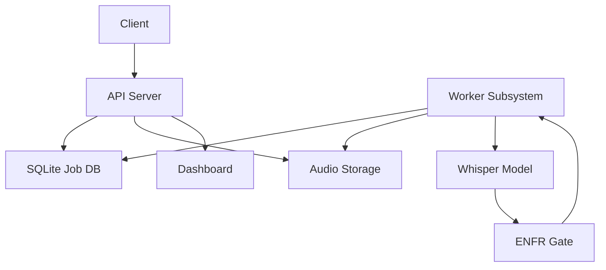
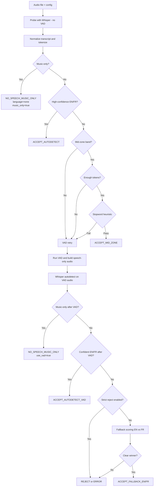
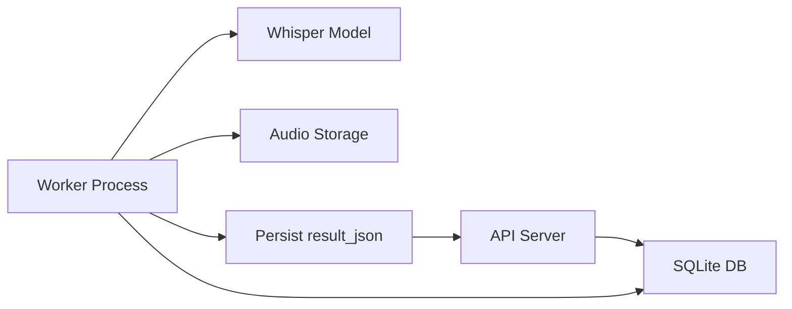
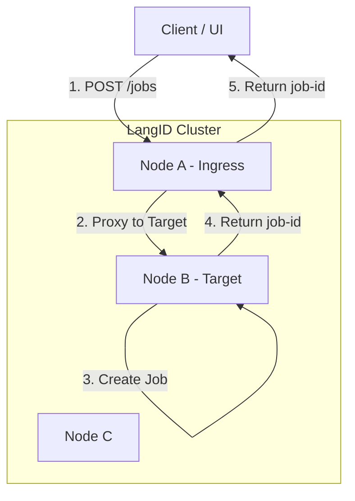
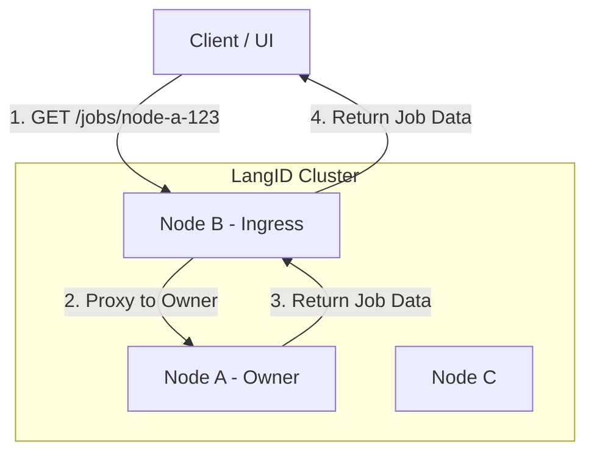

# LangID Service - Technical README for Windows Server

## 1. Project Overview

The LangID Service is a high-performance, multithreaded microservice designed for language identification and optional transcription of audio files, optimized for deployment on **Windows Server**. It exposes a RESTful API for submitting audio clips, which are then processed by a pool of background workers leveraging the `faster-whisper` library.

**Core Purpose:**
1.  **Language Detection:** Quickly and accurately identify the spoken language in an audio file.
2.  **Transcription (Optional):** Provide a text transcription of the audio.

**Internal Modules:**
*   `app\main.py`: The FastAPI application entry point, defining API endpoints and the worker lifecycle.
*   `app\services\detector.py`: The core logic for interacting with the `faster-whisper` model.
*** Begin Unified README ***

# LangID Service — Unified README

## Table of Contents
- [1. Overview](#1-overview)
- [2. Architecture](#2-architecture)
- [3. Full EN/FR Gate Pipeline](#3-full-enfr-gate-pipeline)
- [4. Whisper Model + GPU Details](#4-whisper-model--gpu-details)
- [5. Worker System](#5-worker-system)
- [6. Configuration (.env)](#6-configuration-env)
- [7. API Reference](#7-api-reference)
- [8. Storage + DB Layout](#8-storage--db-layout)
- [9. Examples](#9-examples)
- [10. Windows Deployment](#10-windows-deployment)
- [11. Internal HA Cluster Architecture](#11-internal-ha-cluster-architecture)
- [12. Prometheus Metrics and Monitoring](#12-prometheus-metrics-and-monitoring)
- [13. Language Code Configuration](#13-language-code-configuration)

## 1. Overview

The LangID Service is a backend microservice that performs English vs French language detection and optional transcription for audio files. The service accepts audio via file upload or URL, runs a short probe autodetection pass using Whisper, applies a conservative EN/FR gate (including a music-only detector), optionally retries detection with a VAD-trimmed probe, and produces a structured JSON result persisted with the job record.

Supported languages: English (`en`) and French (`fr`) only. Non-EN/FR audio is either coerced via a fallback scorer or rejected when strict mode is enabled.

System boundaries:
- Audio ingestion: HTTP API uploads or URL fetch.
- Language detection: Whisper autodetect probe (first pass without VAD).
- Gate logic: high-confidence accept, mid-zone heuristics, VAD retry, fallback scoring, music-only short-circuit.
- Transcription: performed only when the gate accepts speech.
- Results: structured `result_json` persisted in DB and returned by API.

## 2. Architecture

High-level components:
- API server: FastAPI application, job endpoints, health and metrics.
- Worker subsystem: background processes that perform detection and transcription.
- Whisper inference: `faster-whisper` used for autodetect and transcription.
- EN/FR language gate: encapsulates all language decision logic.
- Storage: local `STORAGE_DIR` for audio and artifacts.
- Database: SQLite default; used for job queue and persistence.

Mermaid architecture diagram:



## 3. Full EN/FR Gate Pipeline

This section describes, in excruciating detail, how the EN/FR gate turns an input audio file into a final decision:

- **English speech**
- **French speech**
- **No speech / music only**
- **Rejected / unsupported**

The gate sits on top of **faster-whisper** and adds a layer of deterministic logic so that the system is explainable and can be tuned for different operating points (strict vs permissive).

At a high level the pipeline does the following:

1. Load and normalize the audio.
2. Run a **first-pass Whisper autodetect** on a probe window (no VAD).
3. Normalize and tokenize the resulting transcript.
4. Run a **music-only detector** over the transcript tokens.
5. If not music-only, evaluate:
   - **High-confidence autodetect accept** (fast path).
   - **Mid-zone stopword heuristic** (EN vs FR based on token content).
6. If still uncertain, run a **VAD-based retry** (Whisper on speech-only audio).
7. If still uncertain and allowed, run a **fallback EN-vs-FR scorer**.
8. If strict mode is enabled and nothing is confident enough, **reject**.

The gate writes all intermediate decisions into `gate_decision`, `gate_meta`, `music_only`, and `use_vad` fields so that behavior is debuggable via logs and the API.

---

### 3.1 Step 0 – Inputs and Configuration

Each gate invocation receives:

- A **job ID** and the path to the audio file in `STORAGE_DIR`.
- A reference to a **loaded faster-whisper model**.
- A **configuration object** built from environment variables, including:

| Setting | Description |
|--------|-------------|
| `LANG_MID_LOWER` | Lower bound of the “mid-zone” probability band (e.g., 0.60). |
| `LANG_MID_UPPER` | Upper bound of the “mid-zone” probability band (e.g., 0.79). |
| `LANG_MIN_TOKENS` | Minimum number of tokens required to attempt mid-zone heuristics. |
| `LANG_MIN_STOPWORD_EN` | Minimum EN stopword ratio to accept EN in mid-zone. |
| `LANG_MIN_STOPWORD_FR` | Minimum FR stopword ratio to accept FR in mid-zone. |
| `LANG_STOPWORD_MARGIN` | Minimum gap between dominant vs other stopword ratios. |
| `LANG_DETECT_MIN_PROB` | Minimum probability to accept VAD-based autodetect. |
| `ENFR_STRICT_REJECT` | If `true`, reject low-confidence / non-EN/FR audio instead of coercing it. |
| `LANG_CODE_FORMAT` | How final language codes are formatted (ISO 639-1/2/3). |
| Internal music keyword lists | Tokens such as `music`, `musique`, `intro`, `outro`, `playing`, `background`, `fond`, etc. |

The gate **never modifies audio**; it only reads from `STORAGE_DIR` and produces a **pure JSON classification**.

---

### 3.2 Step 1 – Audio Loading and Probe Selection

**Goal:** feed a representative but cheap slice of audio into Whisper for an initial read.

1. **Audio load and normalization**
   - The worker reads the input file (e.g., `input.wav`) from disk.
   - Audio is converted to:
     - **Single channel** (mono) by downmixing if needed.
     - **Target sample rate** (typically 16 kHz), resampling if necessary.
   - The gate uses the normalized waveform internally as a NumPy array / tensor of floating-point samples in the range `[-1.0, 1.0]`.

2. **Probe window selection**
   - The gate takes a **probe segment** of fixed maximum duration (e.g., a few seconds) from the start of the file.
   - Very long assets (e.g., 60+ seconds) are truncated to reduce latency.
   - The probe segment may optionally be written as `probe.wav` to the job directory for debugging.

The probe audio is what is passed into Whisper for the **first-pass autodetect**.

---

### 3.3 Step 2 – First-Pass Whisper Autodetect (No VAD)

**Goal:** obtain a language probability distribution and a raw text transcript from the probe.

1. **faster-whisper invocation**
   - The gate calls the model in **transcription mode**:
     - `task = "transcribe"`
     - `language = None` (enable Whisper’s built-in language identification).
     - **No VAD filter** (`vad_filter = False` or equivalent).
   - Under the hood, faster-whisper:
     - Splits the audio into frames.
     - Extracts **log-mel spectrograms** from the waveform.
     - Feeds the spectrogram into the encoder-decoder architecture.
     - Runs a beam search decoder to generate text tokens.
     - Computes a **language probability vector** over all supported languages.

2. **Outputs from faster-whisper**
   - `segments`: list of time-stamped text segments (`start`, `end`, `text`).
   - `language_probs`: mapping from language code → probability (e.g., `"en": 0.88`, `"fr": 0.10`, …).
   - `language`: Whisper’s best-guess language code (e.g., `"en"`, `"fr"`, `"es"`, …).

3. **Autodetect summary used by the gate**
   - `autodetect_lang`: best-guess language from `language`.
   - `autodetect_prob`: `language_probs[autodetect_lang]`.
   - `autodetect_transcript`: concatenation of `segments[*].text` into a single string.

All subsequent logic (music detector, mid-zone heuristic, VAD retry, etc.) is built on top of this initial `(lang, prob, transcript)` triple.

---

### 3.4 Step 3 – Transcript Normalization and Tokenization

**Goal:** transform Whisper’s free-form text into a normalized token stream suitable for music detection and EN/FR stopword analysis.

1. **Unicode normalization**
   - Apply a standard normalization such as **NFKC** so that:
     - Combined characters (e.g., “é”) and decomposed forms are treated identically.
     - Compatibility characters (e.g., certain typographic quotes) become canonical forms.

2. **Case + whitespace normalization**
   - Convert the entire transcript to **lowercase** using a Unicode-aware routine.
   - Collapse any run of whitespace characters into a single ASCII space.
   - Trim leading and trailing whitespace.

3. **Bracket and caption marker handling**
   - If the transcript is wrapped in common caption-style markers (e.g., `[OUTRO MUSIC PLAYING]`, `(music)`, `{musique}`), the gate strips only the **outermost** brackets while preserving inner content.
   - Nested or repeated markers are normalized so the inner phrase is what gets tokenized.

4. **Music glyph expansion**
   - Replace any explicit music symbols by the literal token `music`, including:
     - `♪`, `♫`, `♩`, `♬`, `♭`, `♯`, and similar glyphs.
   - Example:
     - Raw text: `"[♪ OUTRO MUSIC PLAYING ♪]"`  
     - Normalized: `"music outro music playing music"`

5. **Tokenization**
   - Split on whitespace and simple punctuation boundaries.
   - Drop empty tokens; keep alphanumeric words and the synthetic `music` token.
   - Example:
     - Normalized text: `"music outro music playing music"`
     - Tokens: `["music", "outro", "music", "playing", "music"]`

6. **Preparation for stopword analysis**
   - The normalized tokens are later classified as:
     - **EN stopwords** (e.g., `the`, `and`, `for`, `is`, `to`, `of`, …).
     - **FR stopwords** (e.g., `le`, `la`, `et`, `de`, `pour`, `est`, …).
     - **Lexical content words** (everything else).
   - This enables approximate language dominance estimation (EN vs FR) independent of Whisper’s internal language scores.

The result of this step is:

- `norm_text`: normalized transcript.
- `tokens`: normalized token sequence.

These are fed into both the **music-only detector** and the **mid-zone heuristic**.

---

### 3.5 Step 4 – Music-Only Detector (Short-Circuit)

**Goal:** detect assets that are **background music only** (no usable spoken EN/FR content) and classify them as such, even if Whisper’s language autodetect leans toward EN/FR.

1. **Token classification**
   - The gate partitions `tokens` into three sets:
     - **Core music tokens** – words that explicitly indicate music:
       - Examples: `music`, `musique`, `instrumental`, `jingle`, `theme`, `thème`.
     - **Music-related filler tokens** – words that describe how music is used:
       - Examples: `intro`, `outro`, `playing`, `background`, `fond`, `soft`, `only`.
     - **Other tokens** – any lexical content that is not clearly about music:
       - Examples: `anthony`, `réseau`, `hello`, `bonjour`, `extraordinary`.

2. **Music-only predicate**
   - Let:
     - `core_count` = number of core music tokens.
     - `other_count` = number of “other” tokens.
   - The audio is classified as **music only** if:
     - `core_count >= 1` **and**
     - `other_count == 0` (after ignoring purely punctuational artifacts).

   In words: the transcript talks only about music, not about semantic content.

3. **Music-only classification**
   - If the predicate passes:
     - `gate_decision = "NO_SPEECH_MUSIC_ONLY"`
     - `music_only = true`
     - `language = "none"` (or equivalent sentinel; formatted per `LANG_CODE_FORMAT` if applicable).
     - `probability` may be set to `0.0` or left as `autodetect_prob` for debugging; the decision is not “English vs French” but “no speech”.
     - `detection_method = "autodetect"` (or `"autodetect-vad"` if the decision occurred after a VAD retry).
   - The gate **short-circuits** here: no mid-zone, no fallback. Downstream code and clients can reliably treat this as “this is music, not speech”.

4. **Failure of music-only predicate**
   - If `other_count > 0` (i.e., there are lexical tokens beyond music markers), the asset is **not** treated as pure music, and the gate proceeds to language-based logic.

This step is what prevents background-music-only assets with captions like `[OUTRO MUSIC PLAYING]` from being incorrectly classified as English or French.

---

### 3.6 Step 5 – High-Confidence Autodetect Accept

If the asset is **not** music-only, the next step is to see whether Whisper’s first-pass autodetect is confident enough to accept as-is without further work.

1. **Inputs**
   - `autodetect_lang` – best-guess language (e.g., `"en"`, `"fr"`, `"es"`).
   - `autodetect_prob` – probability assigned to `autodetect_lang`.
   - Threshold: `LANG_MID_UPPER`.

2. **Checks**
   - Only EN and FR are acceptable:
     - If `autodetect_lang` is not `"en"` or `"fr"`, the gate **cannot** accept here and must continue to the next step.
   - High-confidence threshold:
     - If `autodetect_prob >= LANG_MID_UPPER` and `autodetect_lang ∈ { "en", "fr" }`, the sample is considered **high-confidence**.

3. **Decision**
   - When the threshold is met:
     - `gate_decision = "ACCEPT_AUTODETECT"`
     - `music_only = false`
     - `language` is set to EN or FR, converted to the configured `LANG_CODE_FORMAT` (e.g., `"en"` → `"eng"` for ISO 639-3).
     - `probability = autodetect_prob`
     - `detection_method = "autodetect"`
     - `use_vad = false`
   - This is the **fast path**: most clean English/French recordings should be accepted here without VAD or heuristics.

If the gate cannot accept here (either low probability or non-EN/FR language), it moves into the **mid-zone heuristic**.

---

### 3.7 Step 6 – Mid-Zone Stopword Heuristic (EN vs FR)

The mid-zone is the “uncertain but not hopeless” region:

- `LANG_MID_LOWER <= autodetect_prob < LANG_MID_UPPER`, and
- `autodetect_lang ∈ { "en", "fr" }`.

In this region the model thinks it’s likely EN or FR, but not strongly enough to trust blindly. The gate therefore uses a **stopword-based heuristic** on the tokenized transcript.

1. **Token count requirement**
   - Let `token_count = len(tokens)`.
   - If `token_count < LANG_MIN_TOKENS`, the transcript is considered too short to reliably assess EN vs FR by stopwords.
   - In that case the mid-zone heuristic is **skipped**, and the pipeline proceeds directly to **VAD retry**.

2. **Stopword sets**
   - Two curated lists of high-frequency words are used:
     - `EN_STOPWORDS` – e.g., `the`, `and`, `for`, `is`, `to`, `of`, `in`, `on`, `with`, `that`, etc.
     - `FR_STOPWORDS` – e.g., `le`, `la`, `les`, `et`, `de`, `du`, `des`, `pour`, `est`, `que`, `qui`, etc.
   - These are **not** full dictionaries; they are heuristics to detect language dominance.

3. **Stopword counting**
   - For each token in `tokens`:
     - If token ∈ `EN_STOPWORDS`, increment `en_stopword_count`.
     - If token ∈ `FR_STOPWORDS`, increment `fr_stopword_count`.
   - Compute ratios:
     - `stopword_ratio_en = en_stopword_count / max(token_count, 1)`
     - `stopword_ratio_fr = fr_stopword_count / max(token_count, 1)`

4. **Dominant language and margin**
   - Determine which language is dominant:
     - If `stopword_ratio_en >= stopword_ratio_fr`, dominant language = EN.
     - Else dominant language = FR.
   - Let:
     - `dominant_ratio` = max(`stopword_ratio_en`, `stopword_ratio_fr`)
     - `other_ratio` = min(`stopword_ratio_en`, `stopword_ratio_fr`)

5. **Heuristic thresholds**
   - For EN dominance:
     - Require `dominant_ratio >= LANG_MIN_STOPWORD_EN`.
   - For FR dominance:
     - Require `dominant_ratio >= LANG_MIN_STOPWORD_FR`.
   - Additionally, enforce a margin:
     - `dominant_ratio - other_ratio >= LANG_STOPWORD_MARGIN`.

   Intuition: the transcript should clearly “look” more like English or French, not just barely.

6. **Decision**
   - If the heuristic passes:
     - `gate_decision = "ACCEPT_MID_ZONE"`
     - `language` = dominant language (mapped with `LANG_CODE_FORMAT`).
     - `music_only = false`
     - `use_vad = false`
     - `detection_method = "autodetect"`
   - If it fails (e.g., not enough tokens, ratios too close, or below thresholds), the gate does **not** decide here and moves to **VAD retry**.

---

### 3.8 Step 7 – VAD Retry (Speech-Only Autodetect)

If neither the high-confidence path nor the mid-zone heuristic produced a stable EN/FR label, the gate attempts to improve the signal-to-noise ratio by applying **Voice Activity Detection (VAD)** and re-running Whisper.

1. **VAD preprocessing**
   - The same original audio is passed through a VAD module with parameters such as:
     - `threshold` – minimum probability/energy to consider a frame as speech.
     - `min_speech_duration_ms` – minimum contiguous speech region duration.
     - `min_silence_duration_ms` – minimum silence between speech regions.
     - `speech_pad_ms` – padding added around detected speech segments.
   - Non-speech regions (e.g., background music, long silences) are removed, producing a shorter “speech-only” waveform.
   - The gate records this in `gate_meta.vad_used = true` and may log `duration_after_vad` vs original `duration`.

2. **Second-pass Whisper call**
   - The gate runs faster-whisper again, this time on the **VAD-trimmed** audio:
     - `task = "transcribe"`
     - `language = None` (autodetect again).
     - Either `vad_filter = True` or equivalent logic where pre-trimmed audio is supplied.
   - Outputs:
     - `vad_lang` – best-guess language on the speech-only audio.
     - `vad_prob` – probability corresponding to `vad_lang`.
     - `vad_transcript` – text produced from VAD-trimmed audio.

3. **Optional music-only re-check (implementation detail)**
   - The normalized `vad_transcript` can be run through the **same music-only detector** as in Step 4:
     - This is useful for assets where only music segments survive, or where Whisper transcribes e.g. `[OUTRO MUSIC PLAYING]` after VAD.
   - If that check passes, the gate again short-circuits with:
     - `gate_decision = "NO_SPEECH_MUSIC_ONLY"`
     - `music_only = true`
     - `use_vad = true`
     - `detection_method = "autodetect-vad"`

4. **VAD-based EN/FR accept**
   - If `vad_lang ∈ { "en", "fr" }` **and** `vad_prob >= LANG_DETECT_MIN_PROB`:
     - `gate_decision = "ACCEPT_AUTODETECT_VAD"`
     - `language` = `vad_lang` (formatted per `LANG_CODE_FORMAT`).
     - `probability = vad_prob`
     - `music_only = false`
     - `use_vad = true`
     - `detection_method = "autodetect-vad"`

5. **If still inconclusive**
   - If VAD-based autodetect is not confident (e.g., low probability, non-EN/FR label, empty transcript), the gate proceeds to **fallback scoring** (if allowed) or **strict reject**.

---

### 3.9 Step 8 – Fallback Scoring (Optional EN vs FR Coercion)

If VAD retry is inconclusive **and** `ENFR_STRICT_REJECT` is `false`, the gate is allowed to **coerce** the decision into EN or FR by running two constrained “what if” decodes.

1. **Constrained decodes**
   - The gate runs two short transcription passes (or scoring passes) using `faster-whisper`:
     - One with `language = "en"`.
     - One with `language = "fr"`.
   - Each pass computes an internal score (e.g., log-likelihood, normalized by token length, or other scalar quality measure).

2. **Score comparison**
   - Let `score_en` be the score for the EN-constrained decode.
   - Let `score_fr` be the score for the FR-constrained decode.
   - The gate compares the two:
     - If `score_en - score_fr` exceeds an internal margin, EN is chosen.
     - If `score_fr - score_en` exceeds the margin, FR is chosen.
     - If neither is clearly better, fallback is considered **inconclusive**.

3. **Decision**
   - If one language is clearly better:
     - `gate_decision = "ACCEPT_FALLBACK_EN"` or `"ACCEPT_FALLBACK_FR"`.
     - `language` is set to the chosen language (formatted per `LANG_CODE_FORMAT`).
     - `probability` may be synthesized or carried over from earlier stages, but is considered less calibrated than autodetect probabilities.
     - `music_only = false`
     - `detection_method = "fallback"`
   - If the fallback cannot distinguish EN vs FR, control passes to **strict reject** logic.

---

### 3.10 Step 9 – Strict Reject

Finally, the gate decides whether it is allowed to output **“none / rejected”** instead of forcing an EN/FR label.

1. **When strict reject is enabled**
   - If `ENFR_STRICT_REJECT = true` and no previous step yielded an acceptable EN/FR or music-only classification:
     - The gate raises a **validation-style failure** that may surface as:
       - HTTP 400 error on API endpoints, or
       - A `gate_decision = "REJECT"` with `language = "none"` in internal flows.
   - Typical reasons:
     - Very low language probability in both autodetect passes.
     - Whisper consistently returns a non-EN/FR language (e.g., Spanish).
     - Fallback scores for EN and FR are both poor or indistinguishable.

2. **When strict reject is disabled**
   - If `ENFR_STRICT_REJECT = false`, the gate prefers to emit **some** EN/FR label:
     - It may fall back to the best of autodetect, VAD, or fallback scoring, even if the probability is modest.
     - This is useful in environments where downstream systems expect a label for every asset and will handle low-confidence cases separately.

---

### 3.11 Gate Result and JSON Fields

Regardless of the path taken, the gate produces a **single, final result** that is stored in the database and served by the API:

Key fields in `result_json`:

- `language` – `"en"`, `"fr"`, `"none"` (mapped to configured `LANG_CODE_FORMAT`).
- `probability` – model probability for autodetect-based decisions, or a synthetic/confidence-like value for fallback.
- `detection_method` – `"autodetect"`, `"autodetect-vad"`, `"fallback"`, etc.
- `gate_decision` – symbolic label such as:
  - `"ACCEPT_AUTODETECT"`, `"ACCEPT_MID_ZONE"`, `"ACCEPT_AUTODETECT_VAD"`, `"ACCEPT_FALLBACK_EN"`, `"ACCEPT_FALLBACK_FR"`, `"NO_SPEECH_MUSIC_ONLY"`, `"REJECT"`.
- `music_only` – boolean flag indicating pure music / no speech.
- `use_vad` – `true` if the final decision came from a VAD-trimmed pass.
- `gate_meta` – structured metadata including:
  - `mid_zone` (bool), `stopword_ratio_en`, `stopword_ratio_fr`, `token_count`.
  - `vad_used`, `duration`, `duration_after_vad`.
  - Internal thresholds used and any debug flags.

This structure allows you to trace exactly **why** a particular file was labeled as English, French, music, or rejected.

---

### 3.12 Gate Decision Flow (Mermaid Diagram)

The following diagram summarizes the overall control flow of the gate:



## 4. Whisper Model + GPU Details

Supported models: `tiny`, `base`, `small`, `medium`, `large-v3`.

Device selection via `WHISPER_DEVICE`: `cpu`, `cuda`, or `auto`.
`WHISPER_COMPUTE` controls precision: `int8`, `float16`, `float32`.

Notes for Windows:
## 10. Windows Deployment

We provide automated PowerShell scripts for deploying both the API service and the Dashboard on Windows Server.

### 1. API Service (`nssm_install.ps1`)
Located in `langid_service/scripts/windows/nssm_install.ps1`.

**Features:**
*   Auto-installs NSSM and Python (if missing).
*   Creates a virtual environment and installs dependencies.
*   Configures the service with proper environment variables.
*   Supports custom cluster configuration.

**Usage:**
Run as Administrator:
```powershell
cd langid_service\scripts\windows
.\nssm_install.ps1 -ServiceName "LangIdAPI" -Port 8080 -ClusterConfig "C:\path\to\cluster_config.json"
```

**Parameters:**
*   `-ServiceName`: Name of the Windows service (default: `LangIdAPI`).
*   `-Port`: Port to bind to (default: `8080`).
*   `-ClusterConfig`: (Optional) Absolute path to your `cluster_config.json`.
*   `-ModelSize`: Whisper model size (default: `base`).
*   `-Device`: `cpu` or `cuda` (default: `cpu`).

### 2. Dashboard (`Install-LangIdDashboard.ps1`)
Located in `dashboard/launch-script/Install-LangIdDashboard.ps1`.

**Features:**
*   Auto-installs NVM and Node.js (if missing).
*   Builds the React application (`npm run build`).
*   Installs a lightweight static file server as a service.

**Usage:**
Run as Administrator:
```powershell
cd dashboard\launch-script
.\Install-LangIdDashboard.ps1 -Port 3000
```

**Parameters:**
*   `-ServiceName`: Name of the dashboard service (default: `LangIdDashboard`).
*   `-Port`: Port to serve the dashboard on (default: `3000`).
*   `-DashboardDir`: (Optional) Path to the dashboard source code. drivers and the runtime (CTranslate2/ctranslate2 bindings). CPU-only operation is the most portable option on Windows Server.
- Very old GPUs (Pascal or earlier) may lack the required compute capability for optimized kernels.

Recommended configurations:

| Use Case | Model | Device | Compute |
|---|---:|---:|---:|
| Low-latency Linux GPU | `small`/`base` | `cuda` | `float16`/`int8` |
| CPU-only Linux/Windows | `base` | `cpu` | `int8` |
| Highest accuracy | `large-v3` | `cuda` | `float16` |

If GPU is unsupported, set `WHISPER_DEVICE=cpu` and use `WHISPER_COMPUTE=int8` where CPU quantization is supported.

## 5. Worker System

Worker behavior:
- Each worker process polls the DB for queued jobs, claims a job, sets `status=processing`, and runs detection/transcription.
- Each worker process polls the DB for queued jobs, claims a job, sets `status=processing`, and runs detection/transcription.
- **Concurrency:** Each worker process handles exactly **one job at a time** (synchronously).
- **Scaling:** Total system concurrency is determined by `MAX_WORKERS`. For example, `MAX_WORKERS=4` means 4 jobs can be processed in parallel.

Job claim/update notes:
- Use transactional DB updates to claim and update jobs. Prefer SQLite WAL mode for better concurrency.
- Persist `result_json` atomically to avoid partial writes.

Mermaid worker flow:



## 6. Configuration (.env)

Important environment variables and recommended defaults:

| Variable | Default | Description |
|---|---|---|
| `LOG_DIR` | `./logs` | Log output directory |
| `STORAGE_DIR` | `./storage` | Audio storage directory |
| `DB_URL` | `sqlite:///./langid.sqlite` | SQLAlchemy DB URL |
| `MAX_WORKERS` | `2` | Number of worker processes |

| `MAX_RETRIES` | `3` | Max retries per job |
| `WHISPER_MODEL_SIZE` | `base` | Model size |
| `WHISPER_DEVICE` | `auto` | `cpu` / `cuda` / `auto` |
| `WHISPER_COMPUTE` | `int8` | Compute precision |
| `LANG_MID_LOWER` | `0.60` | Mid-range lower bound |
| `LANG_MID_UPPER` | `0.79` | Mid-range upper bound |
| `LANG_MIN_STOPWORD_EN` | `0.15` | Min stopword ratio for EN in mid-zone |
| `LANG_MIN_STOPWORD_FR` | `0.15` | Min stopword ratio for FR in mid-zone |
| `LANG_STOPWORD_MARGIN` | `0.05` | Required margin between ratios |
| `LANG_MIN_TOKENS` | `10` | Min tokens for heuristics |
| `LANG_DETECT_MIN_PROB` | `0.60` | Min prob to accept VAD autodetect |
| `ENFR_STRICT_REJECT` | `false` | If true, reject non-EN/FR audio |
| `APP_HOST` | `0.0.0.0` | API host |
| `APP_PORT` | `8080` | API port |

Adjust these values in production according to CPU/GPU capacity and expected job volume.

## 7. API Reference

Base URL: `http://<host>:<port>` (defaults to `http://0.0.0.0:8080`).

POST /jobs
- Upload audio file. Returns `EnqueueResponse` with `job_id`.

```bash
curl -X POST "http://localhost:8080/jobs" -F "file=@/path/to/audio.wav"
```

POST /jobs/by-url
- Submit audio by URL.

```bash
curl -X POST "http://localhost:8080/jobs/by-url" -H "Content-Type: application/json" -d '{"url":"https://example.com/audio.wav"}'
```

GET /jobs
- List recent jobs.

GET /jobs/{job_id}
- Get job status and metadata.

GET /jobs/{job_id}/result
- Get final result JSON for completed job.

GET /metrics
- Get service metrics.

GET /healthz
- Health check endpoint.

## 8. Storage + DB Layout

Storage structure:
- `STORAGE_DIR/<job_id>/input.*` — uploaded or downloaded source audio.
- `STORAGE_DIR/<job_id>/probe.wav` — probe audio window.
- `STORAGE_DIR/<job_id>/result.json` — optional persisted copy of `result_json`.

SQLite job table fields (summary): `id`, `input_path`, `status`, `progress`, `result_json`, `created_at`, `updated_at`, `attempts`, `error`.


## 9. Examples

Good English output:

```json
{
  "job_id": "...",
  "language": "en",
  "probability": 0.98,
  "transcript_snippet": "Hello and welcome...",
  "gate_decision": "ACCEPT_AUTODETECT",
  "music_only": false
}
```

Music-only output example:

```json
{
  "job_id": "...",
  "language": "none",
  "gate_decision": "NO_SPEECH_MUSIC_ONLY",
  "music_only": true,
  "transcript_snippet": ""
}
```


## Troubleshooting and Notes

- For SQLite concurrency, enable WAL mode and tune `MAX_WORKERS` to match I/O capacity.

### SQLite WAL Mode

To improve concurrency when multiple worker processes update the jobs table:

1. **Enable WAL mode**
   SQLite journal mode can be enabled permanently by running:

   ```bash
   sqlite3 langid.sqlite "PRAGMA journal_mode=WAL;"
   ```

   Or ensure it is automatically applied in `_db_connect()`:

   ```python
   conn.execute("PRAGMA journal_mode=WAL;")
   conn.execute("PRAGMA busy_timeout = 5000;")
   ```

2. **Why WAL helps**
   - Readers no longer block writers.
   - Writers mostly do not block readers.
1.  **Enable WAL mode**
    SQLite journal mode can be enabled permanently by running:

    ```bash
    sqlite3 langid.sqlite "PRAGMA journal_mode=WAL;"
    ```

    Or ensure it is automatically applied in `_db_connect()`:

    ```python
    conn.execute("PRAGMA journal_mode=WAL;")
    conn.execute("PRAGMA busy_timeout = 5000;")
    ```

2.  **Why WAL helps**
    - Readers no longer block writers.
    - Writers mostly do not block readers.
    - Greatly reduces `database is locked` errors under concurrent workers.

3.  **Recommended worker tuning**
    - Keep `MAX_WORKERS` low unless running on fast SSD.
    - Typical stable config:
      - `MAX_WORKERS=2` (or set to number of CPU cores)

- Use structured logs in `LOG_DIR` and expose Prometheus metrics for monitoring.


## 11. Internal HA Cluster Architecture

This section details the internal High Availability (HA) cluster architecture designed for Windows Server deployments where external load balancers are not available.

### 1. Overview

The LangID HA cluster is a fully distributed, shared-nothing architecture where multiple LangID service nodes cooperate to provide a unified service interface.

**Key Concepts:**
- **No External Load Balancer:** The cluster does not rely on F5, NGINX, or Kubernetes Ingress.
- **Internal Load Distribution:** An internal round-robin scheduler distributes new job submissions across all healthy nodes.
- **Symmetric Nodes:** Each node runs the identical FastAPI service and worker logic.
- **Deterministic Routing:** Job ownership is determined by the job ID prefix.
- **Internal Proxying:** Any node can accept a request for any job; if the job belongs to another node, the request is transparently proxied internally.
- **Distributed Dashboard:** Cluster-wide status and job history are aggregated on-demand from all reachable nodes.

**Cluster Diagram (Load Distribution):**



**How Load Distribution Works:**

The Load Distribution flow demonstrates how the cluster distributes new job submissions across all healthy nodes without requiring an external load balancer.

**Key Concepts:**
- **Ingress Node:** The node that receives the initial client request. This can be any node in the cluster.
- **Target Node:** The node selected by the round-robin scheduler to actually create and own the job.
- **Round-Robin Selection:** Each ingress node maintains a shared rotation index, cycling through all healthy nodes to distribute load evenly.
- **Transparent Proxying:** If the target is not the ingress node, the request is internally proxied without client awareness.

**Flow Explanation:**
1. **Client Request:** The client sends `POST /jobs` with audio file to Node A (which happens to be the ingress point in this example).
2. **Target Selection:** Node A's round-robin scheduler determines that Node B should handle this job. The scheduler skips unhealthy nodes automatically.
3. **Internal Proxy:** Node A forwards the complete request to Node B with an `?internal=1` query parameter to prevent infinite routing loops.
4. **Job Creation:** Node B creates the job locally, assigning it a job ID prefixed with its node name (e.g., `node-b-abc123`). The job is stored in Node B's local database and processed by Node B's workers.
5. **Response Chain:** Node B returns the job ID to Node A, which forwards it to the client.

**Important Notes:**
- The client is unaware that proxying occurred; it only sees a single request/response.
- The job ID prefix (`node-b-`) ensures all future requests for this job are routed to Node B.
- If Node B is unhealthy, the scheduler automatically selects the next healthy node (e.g., Node C).
- If the target equals the ingress (e.g., Node A selects Node A), no proxying occurs—the job is created locally.

**Cluster Diagram (Read/Status Flow):**



**How Read/Status Routing Works:**

The Read/Status flow illustrates how the cluster routes read requests (status checks, results, deletions) to the correct owner node based on job ID prefixes.

**Key Concepts:**
- **Owner Node:** The node that created and owns a specific job. Identified by the job ID prefix (e.g., `node-a-123` is owned by Node A).
- **Deterministic Routing:** The cluster uses job ID parsing to route requests to the correct owner without a central registry.
- **Any Node as Entry Point:** Clients can query any node for any job; the cluster handles routing transparently.
- **Consistent Data:** Each job's data (database record, audio files, results) exists only on its owner node.

**Flow Explanation:**
1. **Client Request:** The client sends `GET /jobs/node-a-123/result` to Node B (perhaps for load-balancing or geographic reasons).
2. **Owner Detection:** Node B parses the job ID prefix (`node-a-`) and determines Node A owns this job.
3. **Internal Proxy:** Node B forwards the request to Node A with `?internal=1` to prevent re-routing.
4. **Data Retrieval:** Node A fetches the job from its local database, formats the response (including language code formatting per `LANG_CODE_FORMAT`), and returns it to Node B.
5. **Response Forwarding:** Node B relays the response to the client unchanged.

**Important Notes:**
- If the client requests `GET /jobs/node-b-456/status` from Node B, no proxying occurs—Node B handles it locally.
- If the owner node is unreachable, the request fails with `503 Service Unavailable`. There is no automatic failover for existing jobs since data is not replicated.
- This applies to all job-specific endpoints: `/jobs/{id}`, `/jobs/{id}/result`, `/jobs/{id}/status`, `/jobs/{id}/audio`, `DELETE /jobs/{id}`.
- The `?internal=1` flag prevents infinite proxy loops if configuration errors occur.

**Comparison:**

| Aspect | Load Distribution | Read/Status Routing |
|--------|-------------------|---------------------|
| **Trigger** | `POST /jobs` (new job creation) | `GET /jobs/{id}/*` (existing job access) |
| **Target Selection** | Round-robin across healthy nodes | Deterministic by job ID prefix |
| **Failover** | Yes - retry next healthy node | No - request fails if owner down |
| **Data Created** | New job record on target node | No new data, read-only |
| **Client Awareness** | Opaque - client sees single response | Opaque - client sees single response |


### 2. Cluster Configuration

Each node is configured via a JSON file specified by the `LANGID_CLUSTER_CONFIG_FILE` environment variable. If not set, it falls back to `cluster_config.json`.

**Example `cluster_config.json`:**

```json
{
  "self_name": "node-a",
  "nodes": {
    "node-a": "http://node-a.internal:8080",
    "node-b": "http://node-b.internal:8080",
    "node-c": "http://node-c.internal:8080"
  },
  "health_check_interval_seconds": 5,
  "internal_request_timeout_seconds": 5,
  "enable_round_robin": true,
  "rr_state_file": "/tmp/langid_rr_state.json",
  "rr_strategy": "global"
}
```

**Configuration Reference:**

| Field | Type | Description |
| :--- | :--- | :--- |
| `self_name` | string | **Required.** Unique identifier for this node (e.g., "node-a"). Must match a key in `nodes`. |
| `nodes` | dict | **Required.** Map of `node_name` -> `base_url`. Defines the cluster membership. |
| `health_check_interval_seconds` | int | Interval for background health checks (default: 30). |
| `internal_request_timeout_seconds` | int | Timeout for inter-node proxy requests (default: 10). |
| `enable_round_robin` | bool | Enable internal load distribution (default: false). |
| `rr_state_file` | string | (Optional) Path to persist the last-used round-robin index across restarts. |
| `rr_strategy` | string | "global" (all nodes share sequence) or "per-node" (independent rotation). Default: "global". |

### 3. Job ID Prefixing & Ownership

Job IDs are globally unique and encode the owner node's identity.

*   **Format:** `<node-name>-<uuid>`
*   **Example:** `node-a-550e8400-e29b-41d4-a716-446655440000`
*   **Logic:**
    *   When a node creates a job (locally or via proxy), it **must** prefix the ID with its own `self_name`.
    *   Any node receiving a request for a job ID parses the prefix to determine the owner.

### 4. Internal Request Routing & Proxy

The router intercepts requests to job-specific endpoints (`/jobs/{id}`, `/jobs/{id}/result`, `DELETE /jobs/{id}`).

**Routing Logic:**
1.  **Parse ID:** Extract `owner_node` from `job_id`.
2.  **Check Locality:**
    *   If `owner_node == self_name`: Handle request locally.
    *   If `owner_node != self_name`: Proxy request to `owner_node`.
3.  **Proxying:**
    *   Uses `httpx.AsyncClient`.
    *   Appends `?internal=1` to query params to prevent infinite recursion loops.
    *   Forwards method, headers (excluding host), and body.
    *   **Timeout:** Returns `503 Service Unavailable` if the owner node is unreachable or times out.

**Proxy Failure Strategy:**
- If the **Target Node** for a new job (`POST /jobs`) is unreachable, the Ingress Node will **retry with the next healthy node** in the rotation.
- If an **Owner Node** for an existing job is unreachable, the request fails with `503`.

### 5. Round-Robin Load Distribution

The cluster implements an **Internal Round-Robin Scheduler** to distribute load without an external balancer.

#### Scheduler Behavior
- **Deterministic Rotation:** The scheduler cycles through the list of nodes (sorted alphabetically by name) in a predictable order.
- **Ingress Agnostic:** A client can send `POST /jobs` to *any* node. That node (the "Ingress Node") is responsible for assigning the job to a target node.
- **Health Awareness:** If a target node is detected as unhealthy (via background health checks), the scheduler temporarily skips it and picks the next healthy node.
- **Persistence:** If `rr_state_file` is configured, the current rotation index is saved to disk, ensuring distribution continuity across service restarts.

#### Job Creation Flow (`POST /jobs`)

1.  **Client Request:** Client sends `POST /jobs` to `Node A`.
2.  **Target Selection:** `Node A`'s scheduler calculates the next target (e.g., `Node B`).
3.  **Local vs. Remote:**
    *   If **Target == Self**: `Node A` creates the job locally.
    *   If **Target != Self**: `Node A` proxies the request to `Node B` with `?internal=1`.
4.  **Execution:** `Node B` creates the job, assigning ID `node-b-<uuid>`.
5.  **Response:** `Node B` responds to `Node A`, which forwards the response to the Client.

**Sequence Diagram:**

```
Client       Node A (Ingress)      Node B (Target)
  |                 |                     |
  |--- POST /jobs ->|                     |
  |                 |-- Next Target?      |
  |                 |   (Node B)          |
  |                 |                     |
  |                 |--- POST /jobs ----->|
  |                 |   (internal=1)      |
  |                 |                     |
  |                 |                     |-- Create Job --|
  |                 |                     | ID: node-b-123 |
  |                 |                     |----------------|
  |                 |                     |
  |                 |<-- 200 OK ----------|
  |                 |   (node-b-123)      |
  |<-- 200 OK ------|                     |
  |   (node-b-123)  |                     |
```

### 6. Local Admin Endpoints

To support cluster management and the dashboard, nodes expose "local-only" endpoints.

*   `GET /admin/jobs`: Returns **only** jobs stored on this specific node.
    *   **Note:** Round-robin distribution does not affect this. Jobs are always owned by the node that executed them.
    *   Supports filtering by `status` (queued, processing, completed, failed) and `since` (timestamp).

### 7. Cluster-Wide Dashboard

The dashboard aggregates data from the entire cluster.

*   `GET /cluster/jobs`:
    1.  **Fan-out:** Sends parallel async requests to `GET /admin/jobs` on **all** nodes defined in config.
    2.  **Aggregate:** Collects all jobs into a single list.
    3.  **Sort:** Sorts by `created_at` descending.
    4.  **Status Report:** Includes a summary of which nodes were reachable.

*   **Response Structure:**
    ```json
    {
      "items": [ ... mixed jobs from all nodes ... ],
      "nodes": [
        { "name": "node-a", "reachable": true, "job_count": 12 },
        { "name": "node-b", "reachable": false, "job_count": 0 }
      ]
    }
    ```

### 8. Cluster Health & Node Status

*   `GET /health`: Returns `{ "status": "ok", "node": "node-a" }`. Used for internal checks.
*   `GET /cluster/nodes`: Returns the health status of all nodes in the cluster.
    *   Probes each node's `/health` endpoint.
    *   Returns `last_seen` timestamp for each node.
    *   Used by the Load Distribution Engine to skip unhealthy nodes.

### 9. Startup Guide

**Prerequisites:**
- Python 3.10+ installed.
- Network connectivity between nodes on port 8080 (or configured port).
- Firewall rules allowing internal traffic.

**Startup Procedure (Windows Server):**

Please refer to **Section 10. Windows Deployment** for automated installation instructions using `nssm_install.ps1`.

1.  **Deploy & Configure:**
    *   Follow the instructions in Section 10 to install the service on each node.
    *   Ensure `cluster_config.json` is created on all servers. The `nodes` list must be identical, but `self_name` must be unique for each server.
    *   Pass the config path to the installer: `.\nssm_install.ps1 ... -ClusterConfig "C:\path\to\cluster_config.json"`

2.  **Verify:**
    Open `http://node-a:8080/cluster/nodes` to confirm all nodes are "up".

**Startup Procedure (macOS/Linux):**

1.  **Deploy Code:** Clone repo or copy files.
2.  **Configure:** Create/edit `cluster_config.json`.
3.  **Start Node:**
    ```bash
    export LANGID_CLUSTER_CONFIG_FILE="/path/to/cluster_config.json"
    # Run from the root of the repository
    ./langid_service/.venv/bin/python -m uvicorn langid_service.app.main:app --host 0.0.0.0 --port 8080
    ```
    Or inline:
    ```bash
    LANGID_CLUSTER_CONFIG_FILE=./cluster_config.json ./langid_service/.venv/bin/python -m uvicorn langid_service.app.main:app --host 0.0.0.0 --port 8080
    ```

4.  **Start Node B & C:** Repeat step 3 on other nodes.
5.  **Verify:**
    Open `http://node-a:8080/cluster/nodes` to confirm all nodes are "up".

### 10. Monitoring & Operations

*   **Logs:** Check standard output/error for proxy failures or connection errors.
*   **Dashboard:** Use `/cluster/jobs` to monitor overall cluster activity.
*   **Node Failure:**
    *   If a node fails, its jobs become inaccessible (`503`).
    *   The Round-Robin Scheduler will automatically skip the failed node for *new* jobs.
    *   Other nodes continue to function.
*   **Recovery:**
    *   Restart the failed node.
    *   It will automatically rejoin the cluster (other nodes will see it as "healthy" again).
*   **Upgrades:**
    *   Perform rolling restarts.
    *   The scheduler will route around the node being upgraded.

### 11. Edge Cases & Failure Modes

| Scenario | Behavior |
| :--- | :--- |
| **Node Offline (Owner)** | Requests for jobs owned by this node return `503 Service Unavailable`. |
| **Node Offline (Target)** | `POST /jobs` retries with the next healthy node. |
| **Network Partition** | Nodes can only see/proxy to nodes in their partition. Dashboard shows partial results. |
| **Config Mismatch** | If `nodes` lists differ, routing loops or 404s may occur. Ensure config consistency. |
| **Recursion Limit** | The `internal=1` flag prevents infinite proxy loops. |

### 12. Appendix: Endpoint Reference

| Method | Endpoint | Description | Internal/External |
| :--- | :--- | :--- | :--- |
| `POST` | `/jobs` | Submit job (Distributed via Round-Robin) | External |
| `GET` | `/jobs/{id}` | Get status (Proxied to owner) | External |
| `GET` | `/jobs/{id}/result` | Get result (Proxied to owner) | External |
| `DELETE` | `/jobs/{id}` | Delete job (Proxied to owner) | External |
| `GET` | `/admin/jobs` | **Local** jobs only | Internal |
| `GET` | `/cluster/jobs` | Aggregated cluster jobs | External |
| `GET` | `/cluster/nodes` | Cluster node health status | External |
| `GET` | `/health` | Local node health | Internal/External |


## 12. Prometheus Metrics and Monitoring

The service exposes Prometheus metrics for monitoring cluster health, job processing, and load distribution.

### Metrics Endpoints

| Endpoint | Format | Description |
|----------|--------|-------------|
| `/metrics` | Prometheus | Standard Prometheus scrape endpoint with all metrics |
| `/metrics/json` | JSON | JSON representation of Prometheus metrics for debugging |
| `/cluster/local-metrics` | JSON | Raw local metrics state for aggregation |
| `/cluster/metrics-summary` | JSON | Aggregated cluster-wide summary for dashboards |

### Available Metrics

#### 1. `langid_jobs_submitted_total`
- **Type:** Counter
- **Labels:** `ingress_node`, `target_node`
- **Description:** Total number of jobs submitted via `POST /jobs`. Tracks the flow of job submissions across the cluster.

**Use Cases:**
- Monitor total job submission rate across the cluster
- Identify load distribution patterns (which nodes are receiving vs. processing jobs)
- Detect imbalanced traffic patterns

**Example Query:**
```promql
# Total jobs submitted by any ingress to any target
sum(langid_jobs_submitted_total)

# Jobs submitted to a specific target node
sum(langid_jobs_submitted_total{target_node="node-a"})

# Jobs submitted through a specific ingress
sum(langid_jobs_submitted_total{ingress_node="node-b"})

# Rate of job submissions per second
rate(langid_jobs_submitted_total[5m])
```

#### 2. `langid_jobs_owned_total`
- **Type:** Counter
- **Labels:** `owner_node`
- **Description:** Total number of jobs created/owned by each node. This increments when a node creates a job locally (either directly or via proxied request).

**Use Cases:**
- Monitor which nodes are processing the most jobs
- Verify round-robin distribution is working correctly
- Track cumulative workload per node

**Example Query:**
```promql
# Total jobs owned by each node
langid_jobs_owned_total

# Jobs owned by a specific node
langid_jobs_owned_total{owner_node="node-a"}

# Rate of new jobs owned per second
rate(langid_jobs_owned_total[5m])
```

#### 3. `langid_jobs_active`
- **Type:** Gauge
- **Labels:** `owner_node`
- **Description:** Current number of active (queued or running) jobs on each node. This gauge increments when a job is created and decrements when it completes or fails.

**Use Cases:**
- Monitor current load on each node
- Identify bottlenecks or stuck jobs
- Alert on queue depth thresholds
- Capacity planning

**Example Query:**
```promql
# Current active jobs on all nodes
sum(langid_jobs_active)

# Active jobs on a specific node
langid_jobs_active{owner_node="node-a"}

# Alert if any node has too many active jobs
langid_jobs_active > 100
```

#### 4. `langid_node_up`
- **Type:** Gauge
- **Labels:** `node`
- **Description:** Health status of each node in the cluster. Value is `1` if the node is reachable and healthy, `0` if down or unreachable.

**Use Cases:**
- Monitor cluster availability
- Alert on node failures
- Track uptime percentage
- Visualize cluster topology

**Example Query:**
```promql
# All nodes that are currently up
langid_node_up == 1

# All nodes that are down
langid_node_up == 0

# Number of healthy nodes
sum(langid_node_up)

# Uptime percentage over 24 hours
avg_over_time(langid_node_up[24h]) * 100
```

#### 5. `langid_node_last_health_timestamp_seconds`
- **Type:** Gauge
- **Labels:** `node`
- **Description:** Unix timestamp (in seconds) of the last successful health check for each node. Updated by the background health check loop.

**Use Cases:**
- Detect stale health checks
- Monitor health check frequency
- Alert on nodes that haven't been seen recently
- Calculate time since last contact

**Example Query:**
```promql
# Time since last health check (in seconds)
time() - langid_node_last_health_timestamp_seconds

# Alert if node hasn't been seen in 60 seconds
(time() - langid_node_last_health_timestamp_seconds) > 60

# Nodes last seen in the past minute
langid_node_last_health_timestamp_seconds > (time() - 60)
```

### Cluster Summary Endpoint

For UI dashboards, a simplified JSON summary is available at `/cluster/metrics-summary`.

This endpoint aggregates metrics from all reachable nodes and provides a consolidated view.

**Example Response:**

```json
{
  "nodes": [
    {
      "name": "node-a",
      "up": true,
      "jobs_owned_total": 120,
      "jobs_active": 3,
      "jobs_submitted_as_target": 80,
      "last_health_ts": 1732231234.5
    },
    {
      "name": "node-b",
      "up": false,
      "jobs_owned_total": 95,
      "jobs_active": 0,
      "jobs_submitted_as_target": 70,
      "last_health_ts": 1732230000.0
    }
  ]
}
```

**Field Descriptions:**
- `name`: Node identifier (from cluster config)
- `up`: Boolean indicating if node is currently reachable
- `jobs_owned_total`: Cumulative jobs created by this node
- `jobs_active`: Current number of queued/running jobs on this node
- `jobs_submitted_as_target`: Total jobs that were routed to this node by the scheduler
- `last_health_ts`: Unix timestamp of last successful health check (null if never seen)

### UI Integration

The dashboard includes a "Cluster Health and Load" card that visualizes metrics data:

```text
+---------------------------------------------------------------+
| Cluster Health and Load                                       |
|                                                               |
| Node    Status   Owned   Active   Traffic       Last Health   |
| node-a  [UP]       120        3   ======== 60%  12:34:56      |
| node-b  [DOWN]      95        0   =====    40%  12:10:00      |
+---------------------------------------------------------------+
```

**Dashboard Features:**
- **Node Status:** Real-time UP/DOWN indicators with color coding
- **Active Jobs:** Current queue depth per node
- **Total Jobs Processed:** Cumulative owned jobs
- **Load Distribution:** Visual bar showing percentage of traffic each node receives
- **Last Health:** Human-readable timestamp of last contact

### Monitoring Best Practices

**Recommended Alerts:**

```yaml
groups:
  - name: langid_cluster
    rules:
      # Alert if any node is down
      - alert: LangIDNodeDown
        expr: langid_node_up == 0
        for: 1m
        annotations:
          summary: "LangID node {{ $labels.node }} is down"
      
      # Alert if queue depth is high
      - alert: LangIDHighQueueDepth
        expr: langid_jobs_active > 50
        for: 5m
        annotations:
          summary: "Node {{ $labels.owner_node }} has {{ $value }} active jobs"
      
      # Alert if health check is stale
      - alert: LangIDStaleHealthCheck
        expr: (time() - langid_node_last_health_timestamp_seconds) > 120
        for: 2m
        annotations:
          summary: "Node {{ $labels.node }} health check is stale"
      
      # Alert if job submission rate drops to zero
      - alert: LangIDNoJobSubmissions
        expr: rate(langid_jobs_submitted_total[10m]) == 0
        for: 10m
        annotations:
          summary: "No jobs submitted to cluster in 10 minutes"
```

**Grafana Dashboard Queries:**

```promql
# Job submission rate (jobs/sec) over time
rate(langid_jobs_submitted_total[5m])

# Job completion rate (jobs/sec)
rate(langid_jobs_owned_total[5m]) - rate(langid_jobs_active[5m])

# Cluster-wide active jobs
sum(langid_jobs_active)

# Per-node load distribution (percentage)
sum by (target_node) (langid_jobs_submitted_total) 
  / ignoring(target_node) group_left
  sum(langid_jobs_submitted_total) * 100

# Node availability percentage (24h)
avg_over_time(langid_node_up[24h]) * 100
```

### Viewing Metrics

**Prometheus Format:**
```bash
curl http://localhost:8080/metrics
```

**JSON Format (for debugging):**
```bash
curl http://localhost:8080/metrics/json
```

**Cluster Summary (for dashboards):**
```bash
curl http://localhost:8080/cluster/metrics-summary
```

**Local Node Metrics (internal use):**
```bash
curl http://localhost:8080/cluster/local-metrics
```


## 13. Language Code Configuration

You can configure the format of language codes returned by the API and displayed in the dashboard using the `LANG_CODE_FORMAT` environment variable.

Supported values:
- `iso639-1` (default): 2-letter codes (e.g., "en", "fr")
- `iso639-2b`: 3-letter bibliographic codes (e.g., "eng", "fre")
- `iso639-2t`: 3-letter terminologic codes (e.g., "eng", "fra")
- `iso639-3`: 3-letter codes (e.g., "eng", "fra")

**Example (.env):**
```bash
LANG_CODE_FORMAT=iso639-3
```

**Effect:**
- **API Responses:** `language` field will contain "eng" or "fra".
- **Dashboard:** Job list will show "eng (English)" or "fra (French)".

