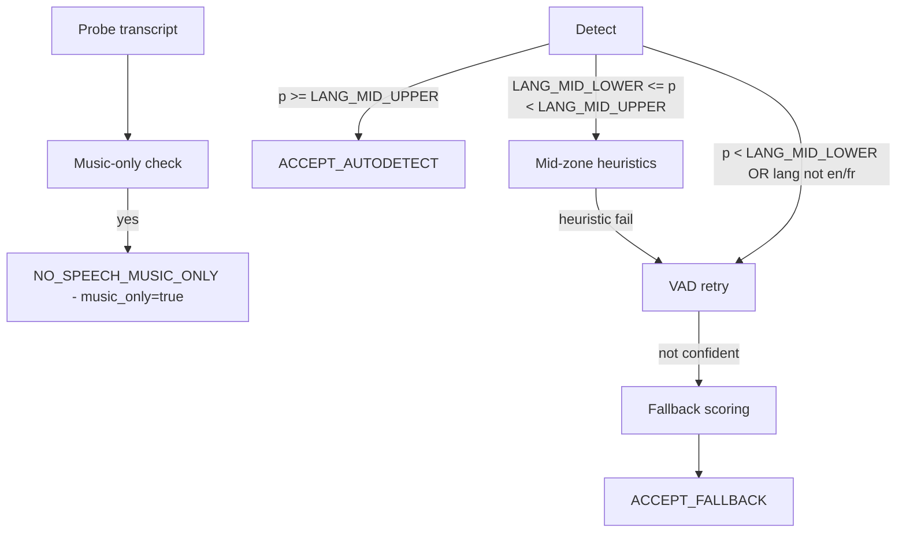

# LangID Service - Technical README for Windows Server

## 1. Project Overview

The LangID Service is a high-performance, multithreaded microservice designed for language identification and optional transcription of audio files, optimized for deployment on **Windows Server**. It exposes a RESTful API for submitting audio clips, which are then processed by a pool of background workers leveraging the `faster-whisper` library.

**Core Purpose:**
1.  **Language Detection:** Quickly and accurately identify the spoken language in an audio file.
2.  **Transcription (Optional):** Provide a text transcription of the audio.

**Internal Modules:**
*   `app\main.py`: The FastAPI application entry point, defining API endpoints and the worker lifecycle.
*   `app\services\detector.py`: The core logic for interacting with the `faster-whisper` model.
*** Begin Unified README ***

# LangID Service — Unified README

## A. Overview

The LangID Service is a backend microservice that performs English vs French language detection and optional transcription for audio files. The service accepts audio via file upload or URL, runs a short probe autodetection pass using Whisper, applies a conservative EN/FR gate (including a music-only detector), optionally retries detection with a VAD-trimmed probe, and produces a structured JSON result persisted with the job record.

Supported languages: English (`en`) and French (`fr`) only. Non-EN/FR audio is either coerced via a fallback scorer or rejected when strict mode is enabled.

System boundaries:
- Audio ingestion: HTTP API uploads or URL fetch.
- Language detection: Whisper autodetect probe (first pass without VAD).
- Gate logic: high-confidence accept, mid-zone heuristics, VAD retry, fallback scoring, music-only short-circuit.
- Transcription: performed only when the gate accepts speech.
- Results: structured `result_json` persisted in DB and returned by API.

## B. Architecture

High-level components:
- API server: FastAPI application, job endpoints, health and metrics.
- Worker subsystem: background processes that perform detection and transcription.
- Whisper inference: `faster-whisper` used for autodetect and transcription.
- EN/FR language gate: encapsulates all language decision logic.
- Storage: local `STORAGE_DIR` for audio and artifacts.
- Database: SQLite default; used for job queue and persistence.

Mermaid architecture diagram:


## C. Full EN/FR Gate Pipeline

This section documents the gate behavior and configuration.

Autodetect probe
- The probe is a short audio window decoded and passed to Whisper with `vad_filter=False` for the initial detection.
- Whisper returns a transcript and a predicted language with probability.

Music-only detection (executed before acceptance checks)
- Normalization: lowercase, remove matching outer brackets ([], (), {}), trim whitespace.
- Replace musical Unicode markers (♪ ♫ ♩ ♬ ♭ ♯) with token `music`.
- Tokenize and remove filler tokens (examples: `intro`, `outro`, `playing`, `background`, `soft`, `de`, `fond`, `only`, `song`, `theme`, `jingle`, `play`).
- If remaining tokens contain only `music` or `musique` plus allowed fillers, short-circuit to `NO_SPEECH_MUSIC_ONLY` with `language = "none"`, `music_only = true`.

High-confidence accept
- If autodetect probability >= `LANG_MID_UPPER` and predicted language is `en` or `fr`, accept immediately without VAD.

Mid-zone logic
- If `LANG_MID_LOWER <= probability < LANG_MID_UPPER` and predicted language is `en` or `fr`, compute stopword ratios for EN and FR.
- Heuristic: require `token_count >= LANG_MIN_TOKENS` and `dominant_ratio - other_ratio >= LANG_STOPWORD_MARGIN` and `dominant_ratio >= LANG_MIN_STOPWORD_{EN|FR}` to accept mid-zone.

VAD retry
- If the mid-zone heuristic fails, or initial autodetect is below `LANG_MID_LOWER`, re-run detection using VAD-trimmed probe (`vad_filter=True`).

Fallback scoring
- If VAD retry is insufficient and `ENFR_STRICT_REJECT` is false, perform low-cost scoring/transcription for EN and FR and pick the better-scoring language (`method = fallback`). The fallback may not provide a calibrated probability.

Strict reject
- If `ENFR_STRICT_REJECT` is true and no path produced a confident EN/FR decision, return HTTP 400 / Reject.
Mermaid decision-tree diagram:



- `gate_decision` (enum), `gate_meta` (detailed metadata), `music_only` (bool), `use_vad` (bool).

## D. Whisper Model + GPU Details

`WHISPER_COMPUTE` controls precision: `int8`, `float16`, `float32`.

Notes for Windows:
- GPU support on Windows depends on drivers and the runtime (CTranslate2/ctranslate2 bindings). CPU-only operation is the most portable option on Windows Server.
- Very old GPUs (Pascal or earlier) may lack the required compute capability for optimized kernels.

Recommended configurations:

| Use Case | Model | Device | Compute |
|---|---:|---:|---:|
| Low-latency Linux GPU | `small`/`base` | `cuda` | `float16`/`int8` |
| CPU-only Linux/Windows | `base` | `cpu` | `int8` |
| Highest accuracy | `large-v3` | `cuda` | `float16` |

If GPU is unsupported, set `WHISPER_DEVICE=cpu` and use `WHISPER_COMPUTE=int8` where CPU quantization is supported.

## E. Worker System

Worker behavior:
- Each worker process polls the DB for queued jobs, claims a job, sets `status=processing`, and runs detection/transcription.
- Concurrency settings: `MAX_WORKERS` controls process count; `MAX_CONCURRENT_JOBS` controls per-worker parallelism.

Job claim/update notes:
- Use transactional DB updates to claim and update jobs. Prefer SQLite WAL mode for better concurrency.
- Persist `result_json` atomically to avoid partial writes.

  API[API Server] --> DB[SQLite DB]
  Worker[Worker Process] --> DB
  Worker --> Model[Whisper Model]
  Worker --> Storage[Audio Storage]
  Worker --> DBResult[Persist result_json]
  DBResult --> API
```

## F. Configuration (.env)

Important environment variables and recommended defaults:

| Variable | Default | Description |
|---|---|---|
| `LOG_DIR` | `./logs` | Log output directory |
| `STORAGE_DIR` | `./storage` | Audio storage directory |
| `DB_URL` | `sqlite:///./langid.sqlite` | SQLAlchemy DB URL |
| `MAX_WORKERS` | `2` | Number of worker processes |
| `MAX_CONCURRENT_JOBS` | `1` | Jobs per worker process |
| `MAX_RETRIES` | `3` | Max retries per job |
| `WHISPER_MODEL_SIZE` | `base` | Model size |
| `WHISPER_DEVICE` | `auto` | `cpu` / `cuda` / `auto` |
| `WHISPER_COMPUTE` | `int8` | Compute precision |
| `LANG_MID_LOWER` | `0.60` | Mid-range lower bound |
| `LANG_MID_UPPER` | `0.79` | Mid-range upper bound |
| `LANG_MIN_STOPWORD_EN` | `0.15` | Min stopword ratio for EN in mid-zone |
| `LANG_MIN_STOPWORD_FR` | `0.15` | Min stopword ratio for FR in mid-zone |
| `LANG_STOPWORD_MARGIN` | `0.05` | Required margin between ratios |
| `LANG_MIN_TOKENS` | `10` | Min tokens for heuristics |
| `LANG_DETECT_MIN_PROB` | `0.60` | Min prob to accept VAD autodetect |
| `APP_HOST` | `0.0.0.0` | API host |
| `APP_PORT` | `8080` | API port |

Adjust these values in production according to CPU/GPU capacity and expected job volume.

## G. API Reference

Base URL: `http://<host>:<port>` (defaults to `http://0.0.0.0:8080`).

POST /jobs
- Upload audio file. Returns `EnqueueResponse` with `job_id`.

```bash
curl -X POST "http://localhost:8080/jobs" -F "file=@/path/to/audio.wav"
```

POST /jobs/by-url
- Submit audio by URL.

```bash
curl -X POST "http://localhost:8080/jobs/by-url" -H "Content-Type: application/json" -d '{"url":"https://example.com/audio.wav"}'
```

GET /jobs
- List recent jobs.

GET /jobs/{job_id}
- Get job status and metadata.

GET /jobs/{job_id}/result
  ## K. Environment & Pinned Versions

  The following lists the exact runtime and Python package versions captured from the project's virtual environment and the system Node.js install used while updating this README.

  - **Project virtualenv Python:** `Python 3.12.8`
  - **Node.js version:** `v22.13.1`

  Pinned Python packages (output of `.venv/bin/pip freeze`):

  ```text
  annotated-doc==0.0.4
  annotated-types==0.7.0
  anyio==4.11.0
  av==16.0.1
  certifi==2025.11.12
  cffi==2.0.0
  charset-normalizer==3.4.4
  click==8.3.1
  coloredlogs==15.0.1
  coverage==7.12.0
  ctranslate2==4.6.1
  dotenv==0.9.9
  fastapi==0.121.2
  faster-whisper==1.2.1
  filelock==3.20.0
  flatbuffers==25.9.23
  fsspec==2025.10.0
  h11==0.16.0
  hf-xet==1.2.0
  httpcore==1.0.9
  httpx==0.28.1
  huggingface-hub==0.36.0
  humanfriendly==10.0
  idna==3.11
  iniconfig==2.3.0
  Jinja2==3.1.6
  loguru==0.7.3
  MarkupSafe==3.0.3
  mpmath==1.3.0
  networkx==3.5
  numpy==2.3.5
  onnxruntime==1.23.2
  packaging==25.0
  pluggy==1.6.0
  prometheus_client==0.20.0
  protobuf==6.33.1
  pycparser==2.23
  pydantic==2.12.4
  pydantic_core==2.41.5
  Pygments==2.19.2
  pytest==9.0.1
  pytest-cov==7.0.0
  python-dotenv==1.2.1
  python-multipart==0.0.20
  PyYAML==6.0.3
  regex==2025.11.3
  requests==2.32.5
  safetensors==0.6.2
  sentencepiece==0.2.1
  setuptools==80.9.0
  sniffio==1.3.1
  soundfile==0.13.1
  SQLAlchemy==2.0.44
  starlette==0.49.3
  sympy==1.14.0
  tokenizers==0.22.1
  torch==2.9.1
  torchaudio==2.9.1
  tqdm==4.67.1
  transformers==4.57.1
  typing-inspection==0.4.2
  typing_extensions==4.15.0
  urllib3==2.5.0
  uvicorn==0.38.0
  ```

  If you'd prefer the frozen requirements in a separate file, I can add `requirements-frozen.txt` with the same content and reference it from this README.

  ````

GET /metrics
- Get service metrics.

GET /healthz
- Health check endpoint.

## H. Storage + DB Layout

Storage structure:
- `STORAGE_DIR/<job_id>/input.*` — uploaded or downloaded source audio.
- `STORAGE_DIR/<job_id>/probe.wav` — probe audio window.
- `STORAGE_DIR/<job_id>/result.json` — optional persisted copy of `result_json`.

SQLite job table fields (summary): `id`, `input_path`, `status`, `progress`, `result_json`, `created_at`, `updated_at`, `attempts`, `error`.

## I. Installation & Running

Linux quick start:

```bash
git clone https://github.com/<org>/LangId-mr.git /path/to/project
cd /path/to/project/langid_service
python -m venv .venv
source .venv/bin/activate
pip install --upgrade pip
pip install -r requirements.txt
export WHISPER_DEVICE=auto
export WHISPER_MODEL_SIZE=base
python -m uvicorn app.main:app --host 0.0.0.0 --port 8080
```

Production example with `gunicorn`:

```bash
gunicorn -w 4 -k uvicorn.workers.UvicornWorker "app.main:app" -b 0.0.0.0:8080
```

Windows Server (summary):
- Install Python 3.11 and Node 20.
- Create `.venv`, `pip install -r requirements.txt`.
- Build the dashboard (`cd dashboard && npm ci && npm run build`) and set `public/config.js` accordingly.
- Use NSSM or another service manager to register the API and optional static dashboard service.

## J. Examples

Good English output:

```json
{
  "job_id": "...",
  "language": "en",
  "probability": 0.98,
  "transcript_snippet": "Hello and welcome...",
  "gate_decision": "ACCEPT_AUTODETECT",
  "music_only": false
}
```

Music-only output example:

```json
{
  "job_id": "...",
  "language": "none",
  "gate_decision": "NO_SPEECH_MUSIC_ONLY",
  "music_only": true,
  "transcript_snippet": ""
}
```


## Troubleshooting and Notes

- For SQLite concurrency, enable WAL mode and tune `MAX_WORKERS` to match I/O capacity.

### SQLite WAL Mode

To improve concurrency when multiple worker processes update the jobs table:

1. **Enable WAL mode**
   SQLite journal mode can be enabled permanently by running:

   ```bash
   sqlite3 langid.sqlite "PRAGMA journal_mode=WAL;"
   ```

   Or ensure it is automatically applied in `_db_connect()`:

   ```python
   conn.execute("PRAGMA journal_mode=WAL;")
   conn.execute("PRAGMA busy_timeout = 5000;")
   ```

2. **Why WAL helps**
   - Readers no longer block writers.
   - Writers mostly do not block readers.
   - Greatly reduces `database is locked` errors under concurrent workers.

3. **Recommended worker tuning**
   - Keep `MAX_WORKERS` low unless running on fast SSD.
   - Typical stable config:
     - `MAX_WORKERS=2`
     - `MAX_CONCURRENT_JOBS=1`

- Use structured logs in `LOG_DIR` and expose Prometheus metrics for monitoring.


