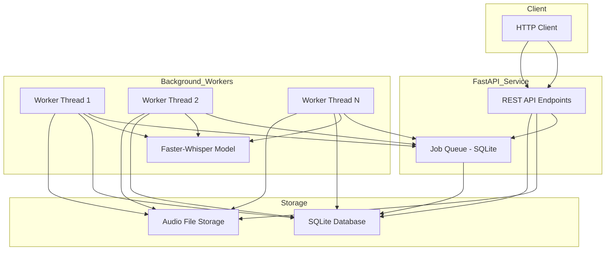

# LangID Service - Technical README for Windows Server

## 1. Project Overview

The LangID Service is a high-performance, multithreaded microservice designed for language identification and optional transcription of audio files, optimized for deployment on **Windows Server**. It exposes a RESTful API for submitting audio clips, which are then processed by a pool of background workers leveraging the `faster-whisper` library.

**Core Purpose:**
1.  **Language Detection:** Quickly and accurately identify the spoken language in an audio file.
2.  **Transcription (Optional):** Provide a text transcription of the audio.

**Internal Modules:**
*   `app\main.py`: The FastAPI application entry point, defining API endpoints and the worker lifecycle.
*   `app\services\detector.py`: The core logic for interacting with the `faster-whisper` model.
*   `app\worker\runner.py`: The background worker implementation that processes jobs from the queue.
*   `app\models\models.py`: The SQLAlchemy data models for the `jobs` table.

**Platform Support:**
While the service can run on macOS and Linux, this guide is optimized for **Windows Server**, using PowerShell and NSSM (Non-Sucking Service Manager) for robust, persistent deployments.

**Backend:**
The service uses a database-backed job queue, defaulting to **SQLite** for simplicity. The SQLAlchemy ORM allows for easy swapping to a more robust database like **PostgreSQL** with minimal configuration changes.

## 2. Architecture Diagram

The service operates on a simple, robust architecture designed for concurrency and reliability:



## 3. Environment & Configuration

The service is configured via environment variables. Create a `.env` file in the project root (e.g., `C:\langid_service\.env`) or set these variables in the NSSM service configuration.

**Sample `.env` file:**
```
# C:\langid_service\.env

# Whisper model size ('tiny', 'base', 'small', 'medium', 'large-v3')
WHISPER_MODEL_SIZE=base

# Device to run the model on ('cpu', 'cuda')
WHISPER_DEVICE=cpu

# Compute precision ('int8', 'float16', 'float32')
WHISPER_COMPUTE=int8

# Maximum allowed upload size in MB (default: 100)
MAX_FILE_SIZE_MB=100

# Number of concurrent background workers
MAX_WORKERS=4

# Logging verbosity ('debug', 'info', 'warning', 'error')
LOG_LEVEL=info

# Path to the SQLite database file
DB_PATH=C:\langid_service\langid.sqlite

# Directory to store uploaded audio files
STORAGE_DIR=C:\langid_service\storage
```

## 4. Installation and Setup on Windows Server

**Prerequisites:**
*   Python 3.10+ (64-bit) installed and on the system `PATH`.
*   `git` for Windows.

**Step-by-Step Instructions:**
1.  **Clone & Setup Virtual Environment (as Administrator):**
    ```powershell
    git clone https://github.com/<org>/langid_service.git C:\langid_service
    cd C:\langid_service
    python -m venv .venv
    .venv\Scripts\activate
    pip install -r requirements.txt
    ```
2.  **Run Locally for Testing:**
    ```powershell
    python -m uvicorn app.main:app --host 0.0.0.0 --port 8080
    ```
3.  **Install as a Persistent Windows Service (NSSM):**
    The provided PowerShell script automates the NSSM setup.
    ```powershell
    .\scripts\windows\nssm_install.ps1 -ServiceName LangIdAPI -AppDir C:\langid_service
    nssm start LangIdAPI
    ```
    To check the status of the service, use `nssm status LangIdAPI`.

**Model Cache Warm-up:**
The first time the service runs, it will download the specified `faster-whisper` model to the user profile's cache directory (e.g., `C:\Users\YourUser\.cache\ctranslate2\`). It is recommended to run the service once interactively to pre-warm the cache before deploying it as a persistent service.

## 5. Database Management

**Schema:**
The default SQLite database uses a single `jobs` table:
```sql
CREATE TABLE jobs (
    id TEXT PRIMARY KEY,
    input_path TEXT NOT NULL,
    status TEXT NOT NULL,
    progress INTEGER DEFAULT 0,
    result_json TEXT,
    created_at TIMESTAMP DEFAULT CURRENT_TIMESTAMP,
    updated_at TIMESTAMP DEFAULT CURRENT_TIMESTAMP
);
```

**Inspect Jobs:**
If you have the `sqlite3` command-line tool, you can query the database directly:
```powershell
sqlite3.exe C:\langid_service\langid.sqlite "SELECT id, status, updated_at FROM jobs ORDER BY updated_at DESC LIMIT 5;"
```

**Automated Purging with Windows Task Scheduler:**
A script is provided to purge old jobs. It's recommended to automate this with Task Scheduler.

1.  **Create a PowerShell script wrapper** (e.g., `C:\langid_service\scripts\run_purge.ps1`):
    ```powershell
    C:\langid_service\.venv\Scripts\python.exe C:\langid_service\app\maintenance\purge_db.py --keep-days 7 --purge-files
    ```
2.  **Create a new Basic Task** in Windows Task Scheduler.
3.  Set the **Trigger** to run daily (e.g., at 2:00 AM).
4.  Set the **Action** to "Start a program" and use the following settings:
    *   **Program/script:** `powershell.exe`
    *   **Add arguments (optional):** `-File "C:\langid_service\scripts\run_purge.ps1"`

## 6. Language Detection Path

The core language detection logic resides in `app\services\detector.py`. The service uses a deterministic, no-VAD (Voice Activity Detection) path for language detection. This is a critical design choice to ensure that the language detection is consistent and not affected by the presence or absence of speech in the audio.

**Why No-VAD for Language Detection?**

VAD is a technique used to identify and segment speech in an audio stream. While it is a valuable tool for transcription, it can be detrimental to language detection. The `faster-whisper` model's language detection is based on the analysis of the entire audio signal, including non-speech segments. By disabling VAD, we ensure that the model receives the full, unaltered audio signal, which leads to more accurate and consistent language identification.

**The Detection Pipeline:**

1.  **Audio Loading:** The audio file is loaded and resampled to 16kHz mono, 32-bit float.
2.  **Feature Extraction:** The audio is converted into a mel spectrogram.
3.  **Language Detection:** The `detect_language` method of the `WhisperModel` is used to identify the language with the highest probability. This method does not use VAD.

**Model Comparison:**

| Model      | VRAM (GB) | Speed (vs. large) |
|------------|-----------|-------------------|
| `tiny`     | ~1        | ~32x              |
| `base`     | ~1        | ~16x              |
| `small`    | ~2        | ~6x               |
| `medium`   | ~5        | ~2x               |
| `large-v3` | ~8        | 1x                |

### Gate Flow (EN / FR)

The service implements a conservative EN/FR gate to ensure downstream processing only proceeds on audio that is likely English or French. A lightweight “music-only” detector runs before any language checks so that background music does not masquerade as speech.

 0) **Music-only transcript detector:** if, after lowercasing and stripping outer brackets, the probe transcript contains only `music`/`musique` plus allowed filler words (for example `"Music"`, `"[music]"`, `"background music"`, `"musique de fond"`), we classify the job as `NO_SPEECH_MUSIC_ONLY`, set `music_only=true`, report `language="none"`, and skip all EN/FR heuristics.

Mermaid flow (simplified):

```mermaid
flowchart LR
    A[Probe transcript] -->|music keywords only| MUSIC[Flag music-only]
    MUSIC --> NO_SPEECH[NO_SPEECH_MUSIC_ONLY \n music_only=true]
    A -->|otherwise| DETECT[Whisper autodetect (vad_filter=false)]
    DETECT -->|p >= LANG_MID_UPPER AND lang in {en,fr}| ACCEPT_HIGH[Accept: autodetect]
    DETECT -->|LANG_MID_LOWER <= p < LANG_MID_UPPER| MID[Mid-zone heuristics]
    MID -->|heuristic passes| ACCEPT_MID[Accept: mid-zone]
    MID -->|heuristic fails| VAD[VAD retry (vad_filter=true)]
    DETECT -->|p < LANG_MID_LOWER OR lang not en/fr| VAD
    VAD -->|confident EN/FR| ACCEPT_VAD[Accept: autodetect-vad]
    VAD -->|still not confident| FALLBACK[Fallback scoring (en vs fr)]
    FALLBACK -->|choose en/fr| ACCEPT_FALLBACK[Accept: fallback]
    VAD -->|reject AND ENFR_STRICT_REJECT=true| REJECT[Reject HTTP 400]
```

Key environment variables (already in `.env.example`):

- `LANG_MID_LOWER` — lower bound for the mid confidence range (default 0.60)
- `LANG_MID_UPPER` — upper bound for the mid confidence range (default 0.79)
- `LANG_MIN_STOPWORD_EN` / `LANG_MIN_STOPWORD_FR` — minimum stopword ratio required to accept mid-zone as EN/FR (default 0.15)
- `LANG_STOPWORD_MARGIN` — minimum margin difference between stopword ratios to prefer one language (default 0.05)
- `LANG_MIN_TOKENS` — minimum token count in the probe transcript before heuristics apply (default 10)
- `LANG_DETECT_MIN_PROB` — probability threshold used to accept VAD-assisted autodetect (default 0.6)
- `ENFR_STRICT_REJECT` — when `true` the service will `HTTP 400` if a confident EN/FR decision cannot be made.

The API result JSON for a completed job now includes `gate_decision`, `gate_meta`, `music_only`, and `use_vad` fields so callers can inspect how the gate made its decision, whether the clip was flagged as background music, and which configuration values were in effect.

## 7. API Reference

**Endpoints:**

| Endpoint                | Method | Description                               |
|-------------------------|--------|-------------------------------------------|
| `/jobs`                 | `POST` | Upload an audio file for processing.      |
| `/jobs/by-url`          | `POST` | Submit a job from a URL.                  |
| `/jobs/{job_id}`        | `GET`  | Get job status.                           |
| `/jobs/{job_id}/result` | `GET`  | Get job result.                           |
| `/metrics/prometheus`   | `GET`  | Get Prometheus-formatted metrics.         |

**`POST /jobs`**
Uploads an audio file as `multipart/form-data`.
*   **`curl` Example (using PowerShell):**
    ```powershell
    curl.exe -X POST -F "file=@C:\path\to\audio.wav" http://localhost:8080/jobs
    ```

**`GET /jobs/{job_id}`**
Poll this endpoint to check job status.
*   **`curl` Example (using PowerShell):**
    ```powershell
    curl.exe http://localhost:8080/jobs/a1b2c3d4-e5f6-7890-1234-567890abcdef
    ```

## 8. Operations & Logging on Windows

**Log Locations:**
When running under NSSM, logs are typically directed to the `logs` folder within the application directory:
*   `C:\langid_service\logs\service.out.log`: Standard output.
*   `C:\langid_service\logs\service.err.log`: Standard error.

**Diagnosing Common Errors:**
*   **`InvalidAudioError`**: The audio file is likely corrupt or in an unsupported format.
*   **`No module named faster_whisper`**: The service is running outside of its virtual environment. Check the paths in your NSSM configuration to ensure it's using the Python executable from the `.venv` directory.

## 9. Future Work & Scaling

*   **Job Queue:** For higher throughput, replace the SQLite queue with a dedicated message broker like **Redis** or **RabbitMQ**.
*   **Containerization:** A `Dockerfile` could be created using a Windows container base image.
*   **Cloud Migration:** A potential cloud-native architecture would be: API Gateway → SQS Queue → Lambda Worker.
