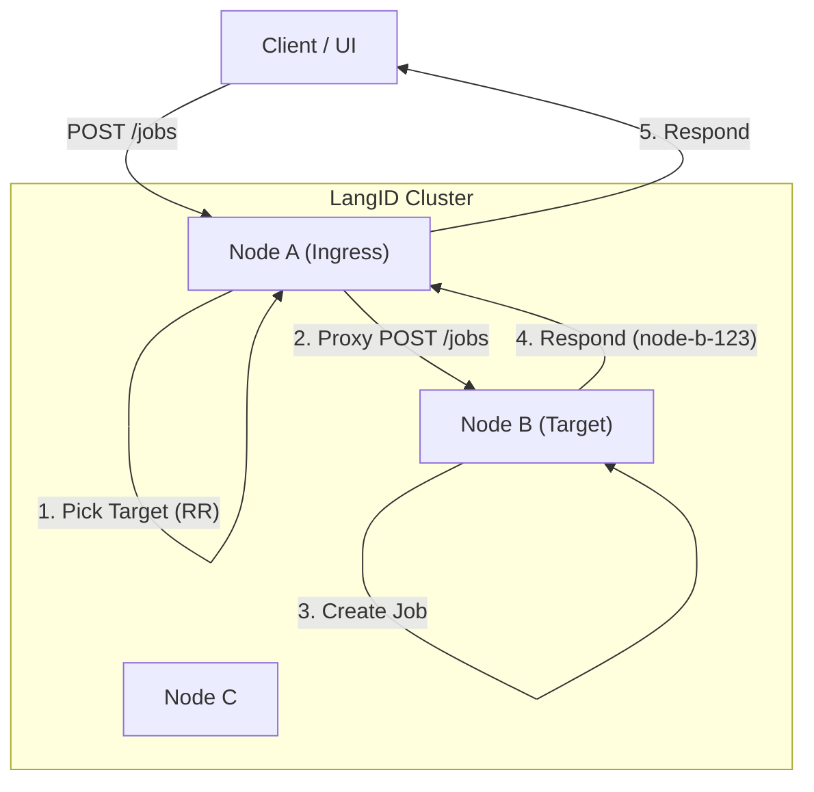
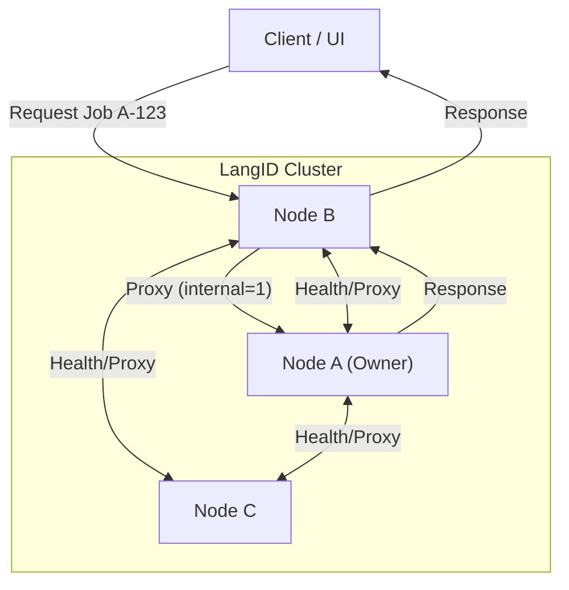

# Internal HA Cluster Architecture

This section documents the High Availability (HA) architecture of the LangID service, designed to run on Windows Server without external load balancers (e.g., F5, NGINX). The cluster uses a shared-nothing architecture with internal request proxying and a built-in **Internal Load Distribution Engine**.

## 1. Overview & Concepts

The LangID cluster provides a unified service interface across multiple nodes. Any node can accept any request, and the cluster ensures the request is handled by the appropriate "owner" node or distributed for load balancing.

**Key Concepts:**
- **No External Load Balancer:** The cluster does not rely on F5, NGINX, or Kubernetes Ingress.
- **Internal Load Distribution:** An internal round-robin scheduler distributes new job submissions across all healthy nodes.
- **Symmetric Nodes:** Each node runs the identical FastAPI service and worker logic.
- **Deterministic Routing:** Job ownership is determined by the job ID prefix (e.g., `node-a-uuid`).
- **Internal Proxying:** Any node can accept a request for any job; if the job belongs to another node, the request is transparently proxied internally.
- **Distributed Dashboard:** Cluster-wide status and job history are aggregated on-demand from all reachable nodes.

**Cluster Diagram (Load Distribution):**



**Cluster Diagram (Read/Status Flow):**



## 2. Cluster Configuration

Each node is configured via a JSON file specified by the `LANGID_CLUSTER_CONFIG_FILE` environment variable. If not set, it falls back to `cluster_config.json`.

**Example `cluster_config.json`:**

```json
{
  "self_name": "node-a",
  "nodes": {
    "node-a": "http://node-a.internal:8080",
    "node-b": "http://node-b.internal:8080",
    "node-c": "http://node-c.internal:8080"
  },
  "health_check_interval_seconds": 5,
  "internal_request_timeout_seconds": 5,
  "enable_round_robin": true,
  "rr_state_file": "/tmp/langid_rr_state.json",
  "rr_strategy": "global"
}
```

**Configuration Reference:**

| Field | Type | Description |
| :--- | :--- | :--- |
| `self_name` | string | **Required.** Unique identifier for this node (e.g., "node-a"). Must match a key in `nodes`. |
| `nodes` | dict | **Required.** Map of `node_name` -> `base_url`. Defines the cluster membership. |
| `health_check_interval_seconds` | int | Interval for background health checks (default: 30). |
| `internal_request_timeout_seconds` | int | Timeout for inter-node proxy requests (default: 10). |
| `enable_round_robin` | bool | Enable internal load distribution (default: false). |
| `rr_state_file` | string | (Optional) Path to persist the last-used round-robin index across restarts. |
| `rr_strategy` | string | "global" (all nodes share sequence) or "per-node" (independent rotation). Default: "global". |

## 3. Job ID Prefixing & Ownership

Job IDs are globally unique and encode the owner node's identity.

*   **Format:** `<node-name>-<uuid>`
*   **Example:** `node-a-550e8400-e29b-41d4-a716-446655440000`
*   **Logic:**
    *   When a node creates a job (locally or via proxy), it **must** prefix the ID with its own `self_name`.
    *   Any node receiving a request for a job ID parses the prefix to determine the owner.

## 4. Internal Request Routing & Proxy

The router intercepts requests to job-specific endpoints (`/jobs/{id}`, `/jobs/{id}/result`, `DELETE /jobs/{id}`).

**Routing Logic:**
1.  **Parse ID:** Extract `owner_node` from `job_id`.
2.  **Check Locality:**
    *   If `owner_node == self_name`: Handle request locally.
    *   If `owner_node != self_name`: Proxy request to `owner_node`.
3.  **Proxying:**
    *   Uses `httpx.AsyncClient`.
    *   Appends `?internal=1` to query params to prevent infinite recursion loops.
    *   Forwards method, headers (excluding host), and body.
    *   **Timeout:** Returns `503 Service Unavailable` if the owner node is unreachable or times out.

**Proxy Failure Strategy:**
- If the **Target Node** for a new job (`POST /jobs`) is unreachable, the Ingress Node will **retry with the next healthy node** in the rotation.
- If an **Owner Node** for an existing job is unreachable, the request fails with `503`.

## 5. Round-Robin Load Distribution

The cluster implements an **Internal Round-Robin Scheduler** to distribute load without an external balancer.

### Scheduler Behavior
- **Deterministic Rotation:** The scheduler cycles through the list of nodes (sorted alphabetically by name) in a predictable order.
- **Ingress Agnostic:** A client can send `POST /jobs` to *any* node. That node (the "Ingress Node") is responsible for assigning the job to a target node.
- **Health Awareness:** If a target node is detected as unhealthy (via background health checks), the scheduler temporarily skips it and picks the next healthy node.
- **Persistence:** If `rr_state_file` is configured, the current rotation index is saved to disk, ensuring distribution continuity across service restarts.

### Job Creation Flow (`POST /jobs`)

1.  **Client Request:** Client sends `POST /jobs` to `Node A`.
2.  **Target Selection:** `Node A`'s scheduler calculates the next target (e.g., `Node B`).
3.  **Local vs. Remote:**
    *   If **Target == Self**: `Node A` creates the job locally.
    *   If **Target != Self**: `Node A` proxies the request to `Node B` with `?internal=1`.
4.  **Execution:** `Node B` creates the job, assigning ID `node-b-<uuid>`.
5.  **Response:** `Node B` responds to `Node A`, which forwards the response to the Client.

**Sequence Diagram:**

```
Client       Node A (Ingress)      Node B (Target)
  |                 |                     |
  |--- POST /jobs ->|                     |
  |                 |-- Next Target?      |
  |                 |   (Node B)          |
  |                 |                     |
  |                 |--- POST /jobs ----->|
  |                 |   (internal=1)      |
  |                 |                     |
  |                 |                     |-- Create Job --|
  |                 |                     | ID: node-b-123 |
  |                 |                     |----------------|
  |                 |                     |
  |                 |<-- 200 OK ----------|
  |                 |   (node-b-123)      |
  |<-- 200 OK ------|                     |
  |   (node-b-123)  |                     |
```

## 6. Local Admin Endpoints

To support cluster management and the dashboard, nodes expose "local-only" endpoints.

*   `GET /admin/jobs`: Returns **only** jobs stored on this specific node.
    *   **Note:** Round-robin distribution does not affect this. Jobs are always owned by the node that executed them.
    *   Supports filtering by `status` (queued, processing, completed, failed) and `since` (timestamp).

## 7. Cluster-Wide Dashboard

The dashboard aggregates data from the entire cluster.

*   `GET /cluster/jobs`:
    1.  **Fan-out:** Sends parallel async requests to `GET /admin/jobs` on **all** nodes defined in config.
    2.  **Aggregate:** Collects all jobs into a single list.
    3.  **Sort:** Sorts by `created_at` descending.
    4.  **Status Report:** Includes a summary of which nodes were reachable.

*   **Response Structure:**
    ```json
    {
      "items": [ ... mixed jobs from all nodes ... ],
      "nodes": [
        { "name": "node-a", "reachable": true, "job_count": 12 },
        { "name": "node-b", "reachable": false, "job_count": 0 }
      ]
    }
    ```

## 8. Cluster Health & Node Status

*   `GET /health`: Returns `{ "status": "ok", "node": "node-a" }`. Used for internal checks.
*   `GET /cluster/nodes`: Returns the health status of all nodes in the cluster.
    *   Probes each node's `/health` endpoint.
    *   Returns `last_seen` timestamp for each node.
    *   Used by the Load Distribution Engine to skip unhealthy nodes.

## 9. Startup Guide

**Prerequisites:**
- Python 3.10+ installed.
- Network connectivity between nodes on port 8080 (or configured port).
- Firewall rules allowing internal traffic.

**Startup Procedure (Windows Server):**

1.  **Deploy Code:** Copy the application code to `C:\LangID` on all servers.
2.  **Configure:** Create `C:\LangID\cluster_config.json` on each server. Ensure `nodes` list is identical on all servers.
3.  **Start Node A:**
    ```powershell
    $env:LANGID_CLUSTER_CONFIG_FILE="C:\LangID\cluster_config.json"
    cd C:\LangID
    # Run from the parent directory of langid_service or ensure it is in PYTHONPATH
    # It is recommended to run from the root of the repository/deployment
    .\.venv\Scripts\python.exe -m uvicorn langid_service.app.main:app --host 0.0.0.0 --port 8080
    ```
4.  **Start Node B & C:** Repeat step 3 on other nodes.
5.  **Verify:**
    Open `http://node-a:8080/cluster/nodes` to confirm all nodes are "up".

**Startup Procedure (macOS/Linux):**

1.  **Deploy Code:** Clone repo or copy files.
2.  **Configure:** Create/edit `cluster_config.json`.
3.  **Start Node:**
    ```bash
    export LANGID_CLUSTER_CONFIG_FILE="/path/to/cluster_config.json"
    # Run from the root of the repository
    ./langid_service/.venv/bin/python -m uvicorn langid_service.app.main:app --host 0.0.0.0 --port 8080
    ```
    Or inline:
    ```bash
    LANGID_CLUSTER_CONFIG_FILE=./cluster_config.json ./langid_service/.venv/bin/python -m uvicorn langid_service.app.main:app --host 0.0.0.0 --port 8080
    ```

4.  **Start Node B & C:** Repeat step 3 on other nodes.
5.  **Verify:**
    Open `http://node-a:8080/cluster/nodes` to confirm all nodes are "up".

## 10. Monitoring & Operations

*   **Logs:** Check standard output/error for proxy failures or connection errors.
*   **Dashboard:** Use `/cluster/jobs` to monitor overall cluster activity.
*   **Node Failure:**
    *   If a node fails, its jobs become inaccessible (`503`).
    *   The Round-Robin Scheduler will automatically skip the failed node for *new* jobs.
    *   Other nodes continue to function.
*   **Recovery:**
    *   Restart the failed node.
    *   It will automatically rejoin the cluster (other nodes will see it as "healthy" again).
*   **Upgrades:**
    *   Perform rolling restarts.
    *   The scheduler will route around the node being upgraded.

## 11. Edge Cases & Failure Modes

| Scenario | Behavior |
| :--- | :--- |
| **Node Offline (Owner)** | Requests for jobs owned by this node return `503 Service Unavailable`. |
| **Node Offline (Target)** | `POST /jobs` retries with the next healthy node. |
| **Network Partition** | Nodes can only see/proxy to nodes in their partition. Dashboard shows partial results. |
| **Config Mismatch** | If `nodes` lists differ, routing loops or 404s may occur. Ensure config consistency. |
| **Recursion Limit** | The `internal=1` flag prevents infinite proxy loops. |

## 12. Appendix: Endpoint Reference

| Method | Endpoint | Description | Internal/External |
| :--- | :--- | :--- | :--- |
| `POST` | `/jobs` | Submit job (Distributed via Round-Robin) | External |
| `GET` | `/jobs/{id}` | Get status (Proxied to owner) | External |
| `GET` | `/jobs/{id}/result` | Get result (Proxied to owner) | External |
| `DELETE` | `/jobs/{id}` | Delete job (Proxied to owner) | External |
| `GET` | `/admin/jobs` | **Local** jobs only | Internal |
| `GET` | `/cluster/jobs` | Aggregated cluster jobs | External |
| `GET` | `/cluster/nodes` | Cluster node health status | External |
| `GET` | `/health` | Local node health | Internal/External |
