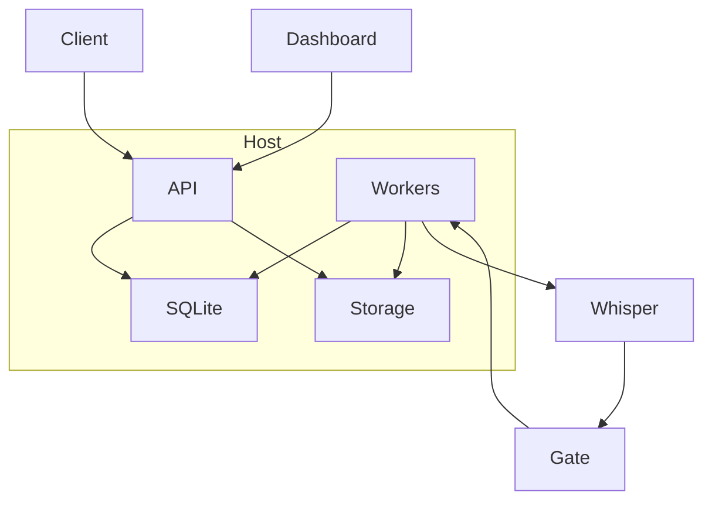
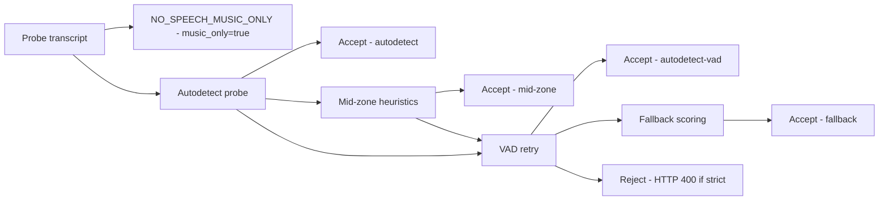

# **LangID Service — EN/FR Gated Language Detection with VAD Retry**
*FastAPI • Whisper • Background Workers • EN/FR Gate • VAD Retry • Windows Server Ready*

---

## **Overview**

**LangID-Service** is a production-ready microservice that performs **English vs French language detection** on audio files using:

- **FastAPI**
- **Faster-Whisper**
- **Custom EN/FR gating logic**
- **VAD-based retries**
- **Fallback scoring**
- **Background worker processes**
- **Storage + DB job tracking**
- **Windows Server–friendly deployment**
- **Dashboard UI**

This system is highly robust for:

- Streaming workflows (Telestream Vantage, etc.)
- Clear or noisy audio
- Silence handling
- Long/short clips
- Incorrect Whisper autodetections (e.g., Spanish, Portuguese, etc.)

---

# **📦 Architecture**

## **System Overview**



---

# **🎧 Audio Processing Pipeline**

```mermaid
flowchart LR
  A[Receive Audio - Upload or URL] --> B[Save to storage]
  B --> C[Create Job in DB]
  C --> D[Worker Pulls Job]

  D --> E[Probe Audio Segment]

  E --> F1[Whisper Autodetect]
  F1 -->|en/fr & p >= threshold| G[Accept autodetect]

  F1 -->|not en/fr OR p < threshold| H[Reject -> VAD Retry]

  H --> F2[Whisper Autodetect (VAD-cut audio)]
  F2 -->|good| G

  F2 -->|still not en/fr| I[Fallback Scoring]
  I --> J[Pick EN or FR]

  G --> K[Transcription Snippet Extraction]
  J --> K
  K --> L[Store Result in DB]
  L --> M[API Returns Result]
```

---

# **📂 Repository Structure**

```
langid_service/
├── app/
│   ├── main.py
│   ├── worker/
│   ├── services/
│   ├── lang_gate.py
│   ├── models/
│   ├── maintenance/
│   ├── utils.py
│   ├── metrics.py
│   └── ...
├── dashboard/
├── .env.example
├── requirements.txt
└── run_server.py
```

---

# **⚙️ Components**

## **FastAPI Application (`app/main.py`)**

Handles:

- job submission (upload + URL)
- job querying
- result retrieval
- worker process startup

---

## **Worker (`app/worker/runner.py`)**

Each worker:

- pulls jobs
- loads Whisper model (cached)
- runs EN/FR detection pipeline
- stores results in SQLite

---

## **Detector (`services/detector.py`)**

Responsible for:

- Faster-Whisper inference
- transcript extraction
- autodetected language
- VAD support
- metadata reporting

---

## **EN/FR Gate (`lang_gate.py`)**

Core logic and gate flow:

0. **Music-only probe detection** — before any language thresholds are applied, the probe transcript is normalised (lowercased, outer brackets removed, filler words pruned). If the remaining tokens are just `music` / `musique` plus allowed fillers such as `background`, `only`, or the French `de` / `fond`, the gate immediately returns `NO_SPEECH_MUSIC_ONLY` with `music_only=true`, bypassing all EN/FR heuristics and VAD retries.

1. **Autodetect probe (no VAD)** — a short probe (first ~30s) is sent to the model with `vad_filter=False` and cheap decoding settings. The model returns an autodetected language and a probability.

2. **High-confidence accept** — if the autodetect probability >= `LANG_MID_UPPER` and the detected language is `en` or `fr`, the gate accepts immediately and processing continues.

3. **Mid-zone heuristics** — if the autodetect probability falls in the mid-range `[LANG_MID_LOWER, LANG_MID_UPPER)`, and the detected language is `en` or `fr`, the gate applies a lightweight stopword-ratio heuristic on the probe transcript (counts of common English vs French stopwords). If the heuristic indicates the predicted language dominates (and the token count is above `LANG_MIN_TOKENS`), the gate accepts without running VAD.

4. **VAD retry** — if the probe is below the mid-zone thresholds or the mid-zone heuristic fails, the gate retries autodetection using a VAD-trimmed probe (`vad_filter=True`) which can improve detection when silence/noise is present.

5. **Fallback scoring** — if VAD retry still doesn't produce a confident EN/FR result and `ENFR_STRICT_REJECT` is `false`, the system runs a cheap scoring pass that transcribes the probe as `en` and `fr` with low-cost settings and picks the language with the better average log-probability.

6. **Strict reject** — if `ENFR_STRICT_REJECT=true` and no confident EN/FR decision is available after the above steps, the service returns HTTP 400 and rejects the clip.

Mermaid flow (compact):



Runtime metadata: the gate returns a structured `gate_meta` object (and top-level `gate_decision` / `use_vad`) that includes:

- `mid_zone`: whether the probe probability fell into the mid-range
- `language`: chosen language (`en`, `fr`, or `none` when music-only)
- `probability`: the raw probability from autodetect (or `null` for fallback)
- `stopword_ratio_en` / `stopword_ratio_fr`: heuristics used for mid-zone decisions
- `token_count`: number of tokens in the probe transcript used for heuristics
- `vad_used`: whether the VAD retry was used
- `music_only`: whether the music-only detector short-circuited the gate
- `config`: echo of the key gate configuration values (the `LANG_*` env vars used at runtime)

Note: the mid-zone and stopword heuristics are intentionally conservative — their purpose is to avoid unnecessary VAD/transcription work when the probe already shows clear language-signals, while still allowing a robust fallback path when uncertain.

Audio loader robustness

Parallel to the gate logic, the service now prefers `libsndfile` (via the Python `soundfile` binding) for decoding uploaded audio. This improves support for PCM variants such as 24-bit WAV files that previously caused worker crashes (`Unsupported sample width: 3`). When `soundfile` is not available the loader falls back to the stdlib `wave` reader (with explicit 24-bit handling) and then to `PyAV` as a last resort. This ordering reduces decoding failures and surfaces the original decoder error when all fallbacks fail.

The worker stores `music_only` alongside `gate_decision`, so API consumers can display or filter out clips that contain only background music. When `music_only=true`, the worker skips snippet transcription and translation, returns `language="none"`, and notes the condition under `raw.info.note`.

---

## **Storage (`storage/`)**

Holds uploaded or downloaded audio files.

---

## **SQLite DB**

Tracks job states:

- queued
- processing
- done
- failed

File:  
```
langid.sqlite
```

---

# **🧪 API Endpoints**

## **Submit File**

```bash
curl -F "file=@audio.wav" http://localhost:8080/jobs
```

---

## **Submit URL**

```bash
curl -X POST http://localhost:8080/jobs/by-url \
  -H "Content-Type: application/json" \
  -d '{"url":"https://example.com/audio.mp3"}'
```

---

## **Check Job**

```bash
curl http://localhost:8080/jobs/<id>
```

---

## **Get Result**

```bash
curl http://localhost:8080/jobs/<id>/result
```

Response payload includes `detection_method` so you can distinguish
between straight autodetect (`autodetect`), VAD-assisted autodetect
(`autodetect-vad`), and the EN/FR scoring fallback path (`fallback`).

---

# **🗄 Environment Variables (.env.example)**

| Variable | Description |
|----------|-------------|
| `WHISPER_MODEL_SIZE` | tiny/base/small/medium/large-v3 |
| `WHISPER_DEVICE` | cpu / cuda |
| `WHISPER_COMPUTE` | float32 / float16 / int8 |
| `MAX_UPLOAD_BYTES` | upload limit |
| `MAX_WORKERS` | number of worker processes |
| `DB_URL` | SQLite or external DSN |
| `STORAGE_DIR` | audio storage directory |
| `LANG_DETECT_MIN_PROB` | min autodetection probability |
| `ENFR_STRICT_REJECT` | restrict only EN/FR if true |

---

# **💠 Windows Server Installation**

This project is fully optimized for **Windows Server 2016/2019/2022**.

---

## **1. Install Python 3.12**

Download from:  
https://www.python.org/downloads/windows/

Enable during install:

- Add to PATH  
- Install pip  
- Disable path length limit  

---

## **2. Create virtual environment**

```powershell
cd C:\LangId
python -m venv .venv
.venv\Scripts\activate
pip install --upgrade pip
pip install -r requirements.txt
```

---

## **3. Install FFmpeg**

```powershell
choco install ffmpeg -y
```

Or install manually and add to PATH.

---

## **4. Install NSSM**

Place `nssm.exe` in:

```
C:\Tools\nssm\nssm.exe
```

Add to PATH:

```powershell
setx PATH "$env:PATH;C:\Tools\nssm" -m
```

---

## **5. Install LangID API as a Windows service**

```powershell
nssm install LangIdAPI "C:\LangId\.venv\Scripts\python.exe" "C:\LangId\run_server.py"
nssm set LangIdAPI AppDirectory "C:\LangId"
nssm start LangIdAPI
```

---

# **♻️ Scheduled Maintenance Tasks (Windows Task Scheduler)**

The project includes:

- DB purge script  
- Storage purge capability  

---

## **1. Purge Storage Script** (`purge-storage.ps1`)

```powershell
$storage = "C:\LangId\storage"
Get-ChildItem $storage -Recurse | Remove-Item -Force -Recurse
```

---

## **2. Purge Database**

```powershell
python C:\LangId\langid_service\app\maintenance\purge_db.py
```

---

## **3. Register Daily Cleanup Task**

```powershell
$action = New-ScheduledTaskAction -Execute "powershell.exe" -Argument "C:\LangId\purge-storage.ps1"
$trigger = New-ScheduledTaskTrigger -Daily -At 3am
Register-ScheduledTask -TaskName "PurgeLangIDStorage" -Action $action -Trigger $trigger -RunLevel Highest
```

---

# **🧹 Manual Cleanup**

## **Purge Storage Directory**

```bash
rm -rf storage/*
```

## **Purge Database**

```bash
python langid_service/app/maintenance/purge_db.py
```

---

# **📊 Metrics**

Located in:

```
app/metrics.py
```

Exposes:

- job counters  
- average worker latency  
- VAD retries  
- fallback gate activations  

---

# **🌐 Dashboard**

Located in:

```
dashboard/
```

Build:

```bash
npm install
npm run build
```

---

# **🔧 Development**

## **Start API with Hot Reload**

```bash
python -m uvicorn langid_service.app.main:app --reload --host 0.0.0.0 --port 8080
```

---

# **🐛 Troubleshooting**

### **Whisper returns wrong language**
Check:

- audio length
- noise
- foreign language → fallback will override

### **Empty transcript**
Likely:

- VAD removed entire signal  
- Silence in audio  
- Corrupt MP3  

### **Workers not running**
Check:

```bash
python -m uvicorn langid_service.app.main:app
```

Look for logs related to:

- FFmpeg missing  
- Missing Python modules  
- Permission issues  

---

# **🚀 Conclusion**

This README provides:

- complete architecture  
- full processing pipeline  
- EN/FR gating logic + VAD retry  
- Windows Server deployment  
- service installation  
- scheduled maintenance  
- API documentation  
- developer workflows  
- troubleshooting  

Your LangID service is now fully documented and production-ready.

