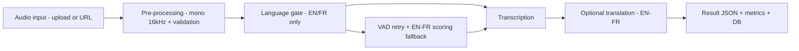
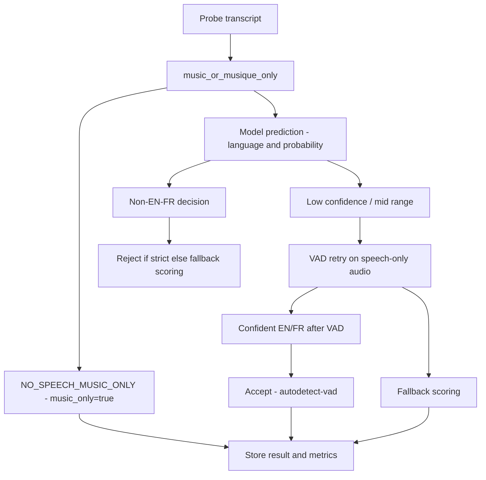

# LangID Audio Processing Pipeline

This document explains how an audio job flows through the LangID service, from upload to the final JSON result used by the dashboard. It also shows how each field in the result maps back to a specific stage in the pipeline.

---

## 1. High-level overview

At a high level, each job goes through these stages:

1. **Input** – Client uploads an audio file or provides a URL.
2. **Pre-processing** – Audio is decoded and normalized to mono 16 kHz.
3. **Language gate (EN/FR only)** – We detect English/French speech, short-circuit music-only transcripts, and then apply voice activity detection (VAD) retries plus scoring fallback when needed.
4. **Transcription** – We generate a transcript of the speech.
5. **Translation (optional)** – If enabled, we translate between EN and FR.
6. **Result packaging & metrics** – We build the final JSON, store it with the job, and update metrics.

### 1.1 Top-level pipeline diagram



---

## 2. Stages in more detail

### 2.1 Input

**Code touchpoints:**
- `POST /jobs` (file upload) in `langid_service/app/main.py`
- `POST /jobs/by-url` (URL fetch) in `langid_service/app/main.py`

**What happens:**

- The client sends an audio file or a public URL.
- We validate the input (size, extension, basic sanity checks).
- We persist a `Job` row with:
  - `id` (UUID)
  - `status = queued`
  - `input_path` (where the file is stored)
  - `original_filename` (what the client called the file)
  - timestamps and other metadata.

### 2.2 Pre-processing
  }
}
```

**Line-by-line explanation:**

- `job_id` – UUID stored in the Jobs table. Use it with `/jobs/{id}`.
- `language` – The gate’s final EN/FR decision (fallback chooses the "least-wrong" language, here English).
- `probability` – Zero because the scoring fallback does not emit a calibrated probability.
- `music_only` – `false`, so the rest of the pipeline (VAD, transcription, optional translation) runs as normal.
- `detection_method` – Explicitly shows this result came from the fallback branch.
- `transcript_snippet` – First ~10 words of the Whisper transcript of the snippet window.
- `processing_ms` – End-to-end processing time. It is zero in this sample because we have not yet wired runtime timing into the worker.
- `original_filename` – Mirrors the upload filename (`langid_ja_sample.wav`).
- `raw.language` – Same EN/FR decision seen by the rest of the app, prior to packaging.
- `raw.probability` – Same as top-level `probability` for backward compatibility.
- `raw.music_only` – Mirrors the top-level flag for debugging.
- `raw.text` – Full snippet text (same as `transcript_snippet` here because the sample is short).
- `raw.detection_method` – Duplicate field for clients that only consume the `raw` blob.
- `raw.raw.text` – Full snippet again (legacy field retained for compatibility with older dashboards).
- `raw.raw.info` – Whisper metadata:
  - `language` / `language_probability` – The speech model believes the transcript text is English after decoding, even though the original speech was Japanese.
  - `duration` / `duration_after_vad` – Audio was 5.47 s and VAD did not trim any frames.
- `raw.raw.info.all_language_probs` – `null` because we did not request the full probability distribution.
- `raw.raw.info.vad_options` – Parameters used when VAD filtering is enabled.
- `raw.raw.lang_gate.language` – The EN/FR scorer picked English.
- `raw.raw.lang_gate.probability` – `null` because fallback does not compute a probability, only a relative score.
- `raw.raw.lang_gate.method` – Confirms fallback was executed inside the gate.
- `raw.raw.lang_gate.music_only` – `false`, confirming the fallback happened for speech, not the music-only detector.
- `raw.translated` – `false` because no EN↔FR translation was requested.

### 5.6 Music-only background bed

**Scenario:**

- Short bumper that contains only background music with no spoken words.
- The probe transcript from Whisper is `"[music]"`.

**Flow:**

1. The music-only detector normalises the transcript (lowercase, strip brackets, ignore filler words like `background` / `de` / `fond`) and recognises it as a music-only phrase, returning `gate_decision="NO_SPEECH_MUSIC_ONLY"`.
2. `music_only=true`, `language="none"`, and no VAD retry, transcription, or translation takes place.

**Result excerpt:**

```json
{
  "job_id": "0e5fd3b4-3ec7-46c5-9c3c-80d4c0f2c0ab",
  "language": "none",
  "probability": 0.94,
  "music_only": true,
  "detection_method": "autodetect",
  "gate_decision": "NO_SPEECH_MUSIC_ONLY",
  "transcript_snippet": "",
  "raw": {
    "text": "",
    "info": {
      "language": "none",
      "language_probability": 0.94,
      "note": "music-only clip (no transcription run)"
    },
    "lang_gate": {
      "language": "none",
      "probability": 0.94,
      "method": "autodetect",
      "gate_decision": "NO_SPEECH_MUSIC_ONLY",
      "music_only": true
    }
  },
  "translated": false
}
```

**Line-by-line explanation:**

- `job_id` – UUID stored in the Jobs table.
- `language` – `"none"` indicates the clip was flagged as music-only.
- `probability` – Confidence reported by the initial autodetect pass (before the gate overrode the language).
- `music_only` – `true`, so downstream steps skip VAD retry, transcription, and translation.
- `detection_method` / `gate_decision` – Document the branch that short-circuited the gate.
- `transcript_snippet` – Empty because no transcription runs.
- `raw.info.note` – Explains why the snippet is empty and that no transcription was attempted.
- `raw.lang_gate.music_only` – Mirrors the flag inside the gate metadata for debugging.
- `translated` – Always `false` for music-only clips.

In deployments where translation is enabled:

- If target language differs from detected language, we call a translation function.
- The JSON field `translated` indicates whether a translation step was applied.
- If `translated = false`, you are seeing the original language transcript.

(At the moment, the reference deployment may always set `translated` to `false`; this field is kept for future expansion.)

### 2.6 Result packaging & metrics

After language detection, transcription, and optional translation, we build the final JSON:

- Top-level fields:
  - `job_id`
  - `language`
  - `probability`
  - `transcript_snippet` / `text`
  - `processing_ms`
  - `original_filename`
  - `translated`
- Nested under `raw`:
  - `text` (full transcript)
  - `info` (model details, durations, VAD options, etc.)

This JSON is stored in the `Job.result_json` column and served by `GET /jobs/{job_id}/result`.

Metrics are derived from job records to power the dashboard and monitoring:

- Total jobs, queued/running/succeeded/failed.
- Jobs completed in the last 5 minutes.
- Average processing time for the last N jobs.

---

## 3. Language gate decision tree

The following decision tree shows how the EN/FR gate handles different cases.



The exact thresholds and configuration can be tuned, but the structure remains the same:

- Confident EN/FR → accept directly.
- Uncertain or non-EN/FR → VAD retry and/or scoring fallback.
- Strict mode → reject non-EN/FR early.

---

## 4. Mapping JSON fields to pipeline stages

This table shows where each field in the result JSON comes from.

| Field                           | Type        | Stage                      | Meaning                                                                 |
|---------------------------------|-------------|---------------------------|-------------------------------------------------------------------------|
| `job_id`                        | string      | Result packaging          | Unique identifier of the job.                                          |
| `language`                      | string      | Language gate             | Final chosen language code for the audio (e.g. `"en"`, `"fr"`, or `"none"` for music-only clips). |
| `probability`                   | float [0–1] | Language gate             | Confidence that `language` is correct.                                  |
| `detection_method`              | enum        | Language gate             | Which branch accepted the audio: `autodetect`, `autodetect-vad`, `fallback`. |
| `text` / `transcript_snippet`   | string      | Transcription             | Human-readable snippet of the transcript.                               |
| `processing_ms`                 | integer     | Result packaging          | End-to-end processing time for this job in milliseconds.                |
| `original_filename`             | string      | Input                     | Original filename provided by the client or URL basename.               |
| `translated`                    | bool        | Translation               | `true` if a translation step was applied, otherwise `false`.            |
| `music_only`                    | bool        | Language gate             | `true` when the probe matched the music-only detector (no speech, transcription skipped). |
| `raw.text`                      | string      | Transcription             | Full transcript returned by the speech model.                           |
| `raw.info.language`             | string      | Model internals           | Language predicted by the model before gate logic (or `"none"` for music-only clips where transcription is skipped). |
| `raw.info.language_probability` | float [0–1] | Model internals           | Confidence for `raw.info.language`.                                     |
| `raw.info.duration`             | float       | Pre-processing            | Original audio duration in seconds.                                     |
| `raw.info.duration_after_vad`   | float       | VAD                       | Duration of speech-only audio after VAD, in seconds.                    |
| `raw.info.all_language_probs`   | object/null | Model internals           | If present, full probability distribution over candidate languages.     |
| `raw.info.vad_options`          | object/null | VAD                       | Configuration used by the VAD module (thresholds, frame sizes, etc.).   |
| `raw.lang_gate.language`        | string      | Language gate             | EN/FR decision produced by the gate (after fallback logic).             |
| `raw.lang_gate.probability`     | float/null  | Language gate             | Gate confidence for the accepted language (may be `null` in fallback).  |
| `raw.lang_gate.method`          | enum        | Language gate             | Same as top-level `detection_method`, recorded before result packaging. |

---

## 5. Example flows

### 5.1 Clean English audio (happy path)

**Scenario:**

- 15-second English clip.
- Clear speech, minimal noise.
- No strict rejection and no translation target specified.

**Flow:**

1. Model predicts `language="en"`, `language_probability≈0.99`.
2. Language gate accepts immediately as EN with method `autodetect`.
3. Transcription runs once and produces a full transcript.
4. A snippet is returned as `text` / `transcript_snippet`.
5. `translated = false`.

**Result excerpt:**

```json
{
  "language": "en",
  "probability": 0.9941,
  "text": "So welcome back to the headspace journey, and today 21,",
  "raw": {
    "text": "So welcome back to the headspace journey, and today 21,",
    "info": {
      "language": "en",
      "language_probability": 1.0,
      "duration": 15.0,
      "duration_after_vad": 15.0,
      "all_language_probs": null,
      "vad_options": null
    }
  },
  "translated": false
}
```

### 5.2 Noisy French with VAD retry

**Scenario:**

- 60-second French clip.
- Long silences and background noise.

**Flow:**

1. First pass: model predicts `language="fr"`, `language_probability=0.65` (below threshold).
2. VAD removes silence; duration drops from ~60s to ~30s.
3. Second pass on speech-only audio: `language="fr"`, `language_probability=0.88`.
4. Gate accepts with method `autodetect-vad`.
5. Transcription runs; `duration_after_vad` in the JSON reflects the speech-only length.

### 5.3 Spanish audio when strict EN/FR gate is enabled

**Scenario:**

- Spanish clip.
- `ENFR_STRICT_REJECT = True`.

**Flow:**

1. Model predicts `language="es"`, `language_probability=0.42`.
2. Language gate sees non-EN/FR language.
3. Strict mode triggers an immediate HTTP 400:
   - "Only English/French audio supported".
4. The job ends in an error state and does not produce a transcript.

This behaviour explains the errors you may see in the dashboard when the input is not English or French.

### 5.4 Spanish audio that stays in autodetect

**Scenario:**

- Spanish text synthesized by the default macOS `say` voice (which often intersperses English phonemes).
- Strict mode is disabled, so the gate is allowed to coerce ambiguous inputs into EN/FR.
- The first autodetect pass returns `language="en"` with probability `0.885`, which is higher than `LANG_DETECT_MIN_PROB` (0.6).

**Result JSON (prettified):**

```json
{
  "job_id": "c809ab4a-e2ca-4cc5-85ba-388e5a631bfe",
  "language": "en",
  "probability": 0.8854513764381409,
  "music_only": false,
  "detection_method": "autodetect",
  "transcript_snippet": "Ola, STS Una Jemplo and Esponial Paraforza L-Fallback Del Detector",
  "processing_ms": 0,
  "original_filename": "langid_es_sample.wav",
  "raw": {
    "language": "en",
    "probability": 0.8854513764381409,
    "music_only": false,
    "text": "Ola, STS Una Jemplo and Esponial Paraforza L-Fallback Del Detector",
    "detection_method": "autodetect",
    "raw": {
      "text": "Ola, STS Una Jemplo and Esponial Paraforza L-Fallback Del Detector",
      "info": {
        "language": "en",
        "language_probability": 1,
        "duration": 4.9855625,
        "duration_after_vad": 4.9855625,
        "all_language_probs": null,
        "vad_options": null
      },
      "lang_gate": {
        "language": "en",
        "probability": 0.8854513764381409,
        "method": "autodetect",
        "music_only": false
      }
    },
    "translated": false
  }
}
```

**Why there was no fallback:**

1. The Whisper autodetect step listened to the synthesized audio and concluded the spoken content was English. Text-to-speech voices often include English numerals or phrases even when fed Spanish text, which biases the decoder toward EN.
2. The reported probability (~0.885) is comfortably above the configured `LANG_DETECT_MIN_PROB` threshold (0.6), so the gate treats this as a confident EN result.
3. Because the gate already has a confident EN/FR answer, it never triggers the VAD retry or the EN/FR scoring fallback. Those branches only run when confidence is low or the detected language is outside `{en, fr}`.
4. Consequently `detection_method` stays `autodetect`, and `raw.lang_gate.probability` reflects the 0.885 confidence from the first pass.

### 5.5 Japanese audio that triggers the EN/FR fallback

**Scenario:**

- Japanese sentence spoken by the macOS `say -v Kyoko` voice.
- `ENFR_STRICT_REJECT` is disabled, so non-EN/FR audio is forced through the fallback scorer.
- Gate returns `method = "fallback"` and `probability = null` because the scorer simply picks between EN and FR.

**Result JSON (prettified):**

```json
{
  "job_id": "d71d336b-b468-4a97-9742-5a4ac66c6722",
  "language": "en",
  "probability": 0.0,
  "music_only": false,
  "detection_method": "fallback",
  "transcript_snippet": "Hello, this is the sample for testing the default back",
  "processing_ms": 0,
  "original_filename": "langid_ja_sample.wav",
  "raw": {
    "language": "en",
    "probability": 0.0,
    "music_only": false,
    "text": "Hello, this is the sample for testing the default back",
    "detection_method": "fallback",
    "raw": {
      "text": "Hello, this is the sample for testing the default back",
      "info": {
        "language": "en",
        "language_probability": 1,
        "duration": 5.4751875,
        "duration_after_vad": 5.4751875,
        "all_language_probs": null,
        "vad_options": "VadOptions(threshold=0.5, neg_threshold=None, min_speech_duration_ms=0, max_speech_duration_s=inf, min_silence_duration_ms=2000, speech_pad_ms=400)"
      },
      "lang_gate": {
        "language": "en",
        "probability": null,
        "method": "fallback",
        "music_only": false
      }
    },
    "translated": false
  -
  ```

  ### 5.6 Music-only background bed

  **Scenario:**

  - Short bumper that contains only background music with no spoken words.
  - The probe transcript from Whisper is `"[music]"`.

  **Flow:**

  1. The music-only detector recognises the transcript (`music` keyword, single token) and returns `gate_decision="NO_SPEECH_MUSIC_ONLY"`.
  2. `music_only=true`, `language="none"`, and no VAD retry, transcription, or translation takes place.

  **Result excerpt:**

  ```json
  {
    "job_id": "0e5fd3b4-3ec7-46c5-9c3c-80d4c0f2c0ab",
    "language": "none",
    "probability": 0.94,
    "music_only": true,
    "detection_method": "autodetect",
    "gate_decision": "NO_SPEECH_MUSIC_ONLY",
    "transcript_snippet": "",
    "raw": {
      "text": "",
      "info": {
        "language": "none",
        "language_probability": 0.94,
        "note": "music-only clip (no transcription run)"
      },
      "lang_gate": {
        "language": "none",
        "probability": 0.94,
        "method": "autodetect",
        "gate_decision": "NO_SPEECH_MUSIC_ONLY",
        "music_only": true
      }
    },
    "translated": false
  }
```

**Line-by-line explanation:**

- `job_id` – UUID stored in the Jobs table. Use it with `/jobs/{id}`.
- `language` – The gate’s final EN/FR decision (fallback chooses the "least-wrong" language, here English).
- `probability` – Zero because the scoring fallback does not emit a calibrated probability.
- `detection_method` – Explicitly shows this result came from the fallback branch.
- `transcript_snippet` – First ~10 words of the Whisper transcript of the snippet window.
- `processing_ms` – End-to-end processing time. It is zero in this sample because we have not yet wired runtime timing into the worker.
- `original_filename` – Mirrors the upload filename (`langid_ja_sample.wav`).
- `raw.language` – Same EN/FR decision seen by the rest of the app, prior to packaging.
- `raw.probability` – Same as top-level `probability` for backward compatibility.
- `raw.text` – Full snippet text (same as `transcript_snippet` here because the sample is short).
- `raw.detection_method` – Duplicate field for clients that only consume the `raw` blob.
- `raw.raw.text` – Full snippet again (legacy field retained for compatibility with older dashboards).
- `raw.raw.info` – Whisper metadata:
  - `language` / `language_probability` – The speech model believes the transcript text is English after decoding, even though the original speech was Japanese.
  - `duration` / `duration_after_vad` – Audio was 5.47 s and VAD did not trim any frames.
- `raw.raw.info.all_language_probs` – `null` because we did not request the full probability distribution.
- `raw.raw.info.vad_options` – Parameters used when VAD filtering is enabled.
- `raw.raw.lang_gate.language` – The EN/FR scorer picked English.
- `raw.raw.lang_gate.probability` – `null` because fallback does not compute a probability, only a relative score.
- `raw.raw.lang_gate.method` – Confirms fallback was executed inside the gate.
- `raw.translated` – `false` because no EN↔FR translation was requested.

---

## 6. Where to go next

- For API shapes and schemas, see `langid_service/app/schemas.py`.
- For the actual worker logic, see `langid_service/app/worker/runner.py`.
- For the EN/FR gate implementation details, see `langid_service/app/lang_gate.py`.

This document is meant to stay stable even if internal details change; if you modify the gate, VAD logic, or translation behaviour, please update the diagrams and examples here to keep users and operators aligned with the implementation.
