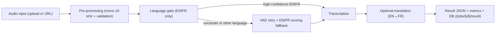
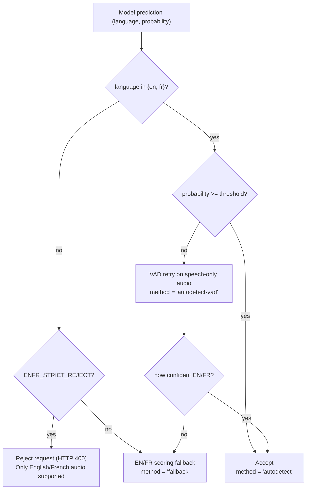

# LangID Audio Processing Pipeline

This document explains how an audio job flows through the LangID service, from upload to the final JSON result used by the dashboard. It also shows how each field in the result maps back to a specific stage in the pipeline.

---

## 1. High-level overview

At a high level, each job goes through these stages:

1. **Input** – Client uploads an audio file or provides a URL.
2. **Pre-processing** – Audio is decoded and normalized to mono 16 kHz.
3. **Language gate (EN/FR only)** – We decide whether the audio is English or French, using a combination of direct model output, voice activity detection (VAD) retry, and scoring fallback.
4. **Transcription** – We generate a transcript of the speech.
5. **Translation (optional)** – If enabled, we translate between EN and FR.
6. **Result packaging & metrics** – We build the final JSON, store it with the job, and update metrics.

### 1.1 Top-level pipeline diagram



---

## 2. Stages in more detail

### 2.1 Input

**Code touchpoints:**
- `POST /jobs` (file upload) in `langid_service/app/main.py`
- `POST /jobs/by-url` (URL fetch) in `langid_service/app/main.py`

**What happens:**

- The client sends an audio file or a public URL.
- We validate the input (size, extension, basic sanity checks).
- We persist a `Job` row with:
  - `id` (UUID)
  - `status = queued`
  - `input_path` (where the file is stored)
  - `original_filename` (what the client called the file)
  - timestamps and other metadata.

### 2.2 Pre-processing

**Code touchpoints:**
- `load_audio_mono_16k` in `langid_service/app/services/audio_io.py`

**What happens:**

- Audio is loaded and converted to a uniform format:
  - Mono channel
  - 16 kHz sample rate
  - Float32 samples
- We compute basic information such as total audio duration. This is exposed later as:
  - `raw.info.duration` (seconds)

This stage is mostly about making sure the downstream model sees a consistent audio format.

### 2.3 Language gate (EN/FR only)

The language gate ensures we only accept English/French content, and it tries to be robust to noise and ambiguous cases.

**Code touchpoints:**
- `langid_service/app/lang_gate.py`
- Language checks during job processing in `worker/runner.py`

**Main ideas:**

1. **Direct autodetect**
   - We run the model once on the pre-processed audio.
   - The model predicts a language code and a confidence:
     - `raw.info.language`
     - `raw.info.language_probability`
   - If the predicted language is in `{"en", "fr"}` and confidence is above a threshold (e.g. 0.8):
     - We accept it with method **`autodetect`**.

2. **Strict gate**
   - If `ENFR_STRICT_REJECT` is enabled and the model predicts a language outside EN/FR:
     - We reject the request with HTTP 400:
       - "Only English/French audio supported".

3. **VAD retry**
   - If the model is unsure (low confidence) or audio is noisy:
     - We run voice activity detection (VAD) to remove silence and non-speech segments.
     - We re-run the model on the speech-only audio.
     - If the result is now confident enough for EN/FR:
       - We accept with method **`autodetect-vad`**.
   - This is where `raw.info.duration_after_vad` comes from.

4. **EN/FR scoring fallback**
   - If we still cannot confidently categorize the audio or if the language is outside EN/FR but strict mode is off:
     - We run cheap EN vs FR "scoring" passes and pick the better of the two.
     - We record the decision as method **`fallback`**.

The *final* language that the service returns in the top-level JSON is the result of this gate, not necessarily the first guess from the model.

### 2.4 Transcription

Once the language is chosen, we run a transcription pass with the speech model.

- `raw.text`: the full transcript produced by the model.
- `text` / `transcript_snippet`: a snippet of that transcript, used in the API and dashboard for quick inspection.

Transcription happens once per job (we don't re-transcribe in the fallback path; that is handled internally by the gate module).

### 2.5 Optional translation

In deployments where translation is enabled:

- If target language differs from detected language, we call a translation function.
- The JSON field `translated` indicates whether a translation step was applied.
- If `translated = false`, you are seeing the original language transcript.

(At the moment, the reference deployment may always set `translated` to `false`; this field is kept for future expansion.)

### 2.6 Result packaging & metrics

After language detection, transcription, and optional translation, we build the final JSON:

- Top-level fields:
  - `job_id`
  - `language`
  - `probability`
  - `transcript_snippet` / `text`
  - `processing_ms`
  - `original_filename`
  - `translated`
- Nested under `raw`:
  - `text` (full transcript)
  - `info` (model details, durations, VAD options, etc.)

This JSON is stored in the `Job.result_json` column and served by `GET /jobs/{job_id}/result`.

Metrics are derived from job records to power the dashboard and monitoring:

- Total jobs, queued/running/succeeded/failed.
- Jobs completed in the last 5 minutes.
- Average processing time for the last N jobs.

---

## 3. Language gate decision tree

The following decision tree shows how the EN/FR gate handles different cases.



The exact thresholds and configuration can be tuned, but the structure remains the same:

- Confident EN/FR → accept directly.
- Uncertain or non-EN/FR → VAD retry and/or scoring fallback.
- Strict mode → reject non-EN/FR early.

---

## 4. Mapping JSON fields to pipeline stages

This table shows where each field in the result JSON comes from.

| Field                           | Type        | Stage                      | Meaning                                                                 |
|---------------------------------|-------------|---------------------------|-------------------------------------------------------------------------|
| `job_id`                        | string      | Result packaging          | Unique identifier of the job.                                          |
| `language`                      | string      | Language gate             | Final chosen language code for the audio (e.g. `"en"`, `"fr"`).       |
| `probability`                   | float [0–1] | Language gate             | Confidence that `language` is correct.                                  |
| `text` / `transcript_snippet`   | string      | Transcription             | Human-readable snippet of the transcript.                               |
| `processing_ms`                 | integer     | Result packaging          | End-to-end processing time for this job in milliseconds.                |
| `original_filename`             | string      | Input                     | Original filename provided by the client or URL basename.               |
| `translated`                    | bool        | Translation               | `true` if a translation step was applied, otherwise `false`.            |
| `raw.text`                      | string      | Transcription             | Full transcript returned by the speech model.                           |
| `raw.info.language`             | string      | Model internals           | Language predicted by the model before gate logic.                      |
| `raw.info.language_probability` | float [0–1] | Model internals           | Confidence for `raw.info.language`.                                     |
| `raw.info.duration`             | float       | Pre-processing            | Original audio duration in seconds.                                     |
| `raw.info.duration_after_vad`   | float       | VAD                       | Duration of speech-only audio after VAD, in seconds.                    |
| `raw.info.all_language_probs`   | object/null | Model internals           | If present, full probability distribution over candidate languages.     |
| `raw.info.vad_options`          | object/null | VAD                       | Configuration used by the VAD module (thresholds, frame sizes, etc.).   |

---

## 5. Example flows

### 5.1 Clean English audio (happy path)

**Scenario:**

- 15-second English clip.
- Clear speech, minimal noise.
- No strict rejection and no translation target specified.

**Flow:**

1. Model predicts `language="en"`, `language_probability≈0.99`.
2. Language gate accepts immediately as EN with method `autodetect`.
3. Transcription runs once and produces a full transcript.
4. A snippet is returned as `text` / `transcript_snippet`.
5. `translated = false`.

**Result excerpt:**

```json
{
  "language": "en",
  "probability": 0.9941,
  "text": "So welcome back to the headspace journey, and today 21,",
  "raw": {
    "text": "So welcome back to the headspace journey, and today 21,",
    "info": {
      "language": "en",
      "language_probability": 1.0,
      "duration": 15.0,
      "duration_after_vad": 15.0,
      "all_language_probs": null,
      "vad_options": null
    }
  },
  "translated": false
}
```

### 5.2 Noisy French with VAD retry

**Scenario:**

- 60-second French clip.
- Long silences and background noise.

**Flow:**

1. First pass: model predicts `language="fr"`, `language_probability=0.65` (below threshold).
2. VAD removes silence; duration drops from ~60s to ~30s.
3. Second pass on speech-only audio: `language="fr"`, `language_probability=0.88`.
4. Gate accepts with method `autodetect-vad`.
5. Transcription runs; `duration_after_vad` in the JSON reflects the speech-only length.

### 5.3 Spanish audio when strict EN/FR gate is enabled

**Scenario:**

- Spanish clip.
- `ENFR_STRICT_REJECT = True`.

**Flow:**

1. Model predicts `language="es"`, `language_probability=0.42`.
2. Language gate sees non-EN/FR language.
3. Strict mode triggers an immediate HTTP 400:
   - "Only English/French audio supported".
4. The job ends in an error state and does not produce a transcript.

This behaviour explains the errors you may see in the dashboard when the input is not English or French.

---

## 6. Where to go next

- For API shapes and schemas, see `langid_service/app/schemas.py`.
- For the actual worker logic, see `langid_service/app/worker/runner.py`.
- For the EN/FR gate implementation details, see `langid_service/app/lang_gate.py`.

This document is meant to stay stable even if internal details change; if you modify the gate, VAD logic, or translation behaviour, please update the diagrams and examples here to keep users and operators aligned with the implementation.
