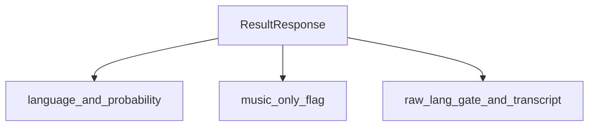

# Models

This document describes the Pydantic models used in the API.

## EnqueueResponse

| Name    | Type   | Description       |
| ------- | ------ | ----------------- |
| job_id  | string | The ID of the job. |
| status  | string | The status of the job. Always "queued". |

## JobStatusResponse

| Name        | Type   | Description       |
| ----------- | ------ | ----------------- |
| job_id      | string | The ID of the job. |
| status      | string | The status of the job. One of "queued", "running", "succeeded", or "failed". |
| progress    | int    | The progress of the job, from 0 to 100. |
| created_at  | string | The timestamp when the job was created. |
| updated_at  | string | The timestamp when the job was last updated. |
| attempts    | int    | The number of times the job has been attempted. |
| error       | string | The error message, if the job failed. |

## ResultResponse

| Name               | Type   | Description |
| ------------------ | ------ | ----------- |
| job_id             | string | The ID of the job. |
| language           | string | The identified language. `"en"`, `"fr"`, or `"none"` when the music-only detector fires. |
| probability        | float  | The probability of the identified language (as reported by the gate). |
| music_only         | bool   | `true` when the probe transcript matched the music-only detector (`NO_SPEECH_MUSIC_ONLY`). |
| transcript_snippet | string | A snippet of the transcript (empty for music-only clips). |
| processing_ms      | int    | The processing time in milliseconds. |
| raw                | dict   | The raw result from the language identification model, including `raw.lang_gate` and gate metadata. |

## SubmitByUrl

| Name | Type   | Description           |
| ---- | ------ | --------------------- |
| url  | string | The URL of the audio file to analyze. |
